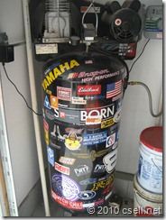
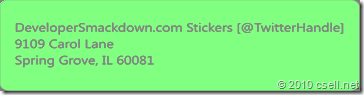
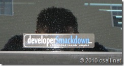

### YEP, WE GOT STICKERS.
    

&#160;

Over the years I have become quite a fan of stickers. Why? I really don't know. It's funny for about 10 years now every time I get a sticker it goes on my air compressor. 

&#160;

OK, back to the [DeveloperSmackdown.com](http://developersmackdown.com/) stickers.&#160; **We want you to have one.**&#160; If you see us, please ask.&#160; In fact we want everyone to have one, so please don't be shy.&#160; These stickers are 1" x 5" high grade vinyl indoor outdoor stickers.

I know everyone doesn't live where I am.&#160; In fact it's quite the opposite.&#160; Soooo.....

Simply **mail a Self-Addressed Stamped Envelope** to:
  > ****  

You don't have to include your twitter handle, but we would sure love to connect.

Do you run a **user group or company meeting? **If you do and would like a batch of stickers to provide at your next meeting, please send a short letter on company/group letterhead requesting stickers to the above address. Also indicate how many you're requesting.&#160; Please remember we make negative money on DeveloperSmackdown.com so while we have a stack we are also limited. If you ask for 500 you will not get it. Just being honest 

If you're **outside the United States**, an SASE is a bit tougher. You have two options here:

1.  Include US $1 in the envelope to cover international postage.2.  Include an [International Reply Coupon](http://en.wikipedia.org/wiki/International_reply_coupon) with your self-addressed envelope.  

Our very first batch of stickers was actually a misprint.&#160; We are missing the c in .com.&#160; You know someday these might be worth something on [eBay](http://ebay.com). Maybe even as much as they cost to print.&#160; If for some crazy reason you want one of those, feel free to ask.     

Want to show us where you put yours? Email a picture to [FansOf@DeveloperSmackdown.com](mailto:FansOf@DeveloperSmackdown.com), and we will compile everything and post it somewhere on the site.

Here is a little love on the back window of my truck!

&#160;

