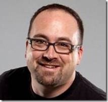

### OData Deep Dive with Chris Woodruff 

**Recommended Audiences:**

Solution Architects, Software Developers, Developers, Architects

**Abstract**

The Open Data Protocol (OData) is an open protocol for sharing data. It provides a way to break down data silos and increase the shared value of data by creating an ecosystem in which data consumers can interoperate with data producers in a way that is far more powerful than currently possible, enabling more applications to make sense of a broader set of data. Every producer and consumer of data that participates in this ecosystem increases its overall value.

OData is consistent with the way the Web works - it makes a deep commitment to URIs for resource identification and commits to an HTTP-based, uniform interface for interacting with those resources (just like the Web).&#160;&#160; This commitment to core Web principles allows OData to enable a new level of data integration and interoperability across a broad range of clients, servers, services, and tools.

OData is released under the [Open Specification Promise](http://www.microsoft.com/interop/osp/default.mspx) to allow anyone to freely interoperate with OData implementations.

In this talk Chris will provide an in depth knowledge to this protocol, how to consume a OData service and finally how to implement an OData service on Windows using the WCF Data Services product.

**Agenda**

**Dates, Times and Locations**
  > 1\. **Chicago, IL June 21**
> 
> *   a. 8:30 am - 12:00 pm
> *   b. Microsoft Offices, Downers Grove, IL
> *   c. [http://bit.ly/DownersOData1](http://bit.ly/DownersOData1)    
> 
> 2\. **Chicago June 21**
> 
> *   a. 1:00 pm - 4:30 pm
> *   b. Microsoft Offices, Downers Grove, IL
> *   c. [http://bit.ly/DownersOData2](http://bit.ly/DownersOData2)    
> 
> 3\. **June 22, 2010**
> 
> *   a. 8:30 am - 12:00 pm
> *   b. Microsoft MTC, Chicago IL
> *   c. [http://bit.ly/MTCOData1](http://bit.ly/MTCOData1)    
> 
> 4\. **June 22 2010**
> 
> *   a. 1:00 pm - 4:30 pm
> *   b. Microsoft MTC, Chicago IL
> *   c. [http://bit.ly/MTCOData2](http://bit.ly/MTCOData2)    
> 
> 5\. **July 7th 2010** 
> 
> *   a. 1 pm - 5 pm
> *   b. Herzing College, Madison WI
> *   c. [http://bit.ly/MadisonOdata](http://bit.ly/MadisonOdata)  

**Bio**

Chris Woodruff (or Woody as he is commonly known as) has a degree in Computer Science from Michigan State University's College of Engineering. Woody has been developing and architecting software solutions for almost 15 years and has worked in many different platforms and tools. He is a community leader, helping such events as Day of .NET Ann Arbor, West Michigan Day of .NET and CodeMash. He was also instrumental in bringing the popular Give Camp event to Western Michigan where technology professionals lend their time and development expertise to assist local non-profits. As a speaker and podcaster, Woody has spoken and discussed a variety of topics, including database design and open source. He is a Microsoft MVP in Data Platform Development. Woody works at RCM Technologies in Grand Rapids, MI as a Principal Consultant.

Woody is the co-host of the popular podcast "Deep Fried Bytes" and blogs at [www.chriswoodruff.com](http://www.chriswoodruff.com). He is the President of the West Michigan .NET User Group and also is a co-founder of the software architecture online portal nPlus1.org.

Woody has worked in many arenas throughout the years, including healthcare, manufacturing, publishing, promotion execution and the automotive industry. He has experience with starting and running new ventures, including past work with technology startups. Woody continues to develop his expertise by learning & developing new technologies to better meet the needs of his clients, while devoting his free time to improving the development community at large, and giving back to the community in which he lives.