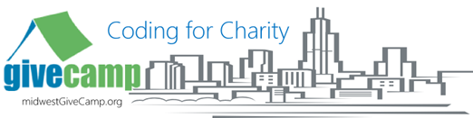

 

What is GiveCamp you ask?

GiveCamp is a weekend-long event where technology professionals from designers, developers and database administrators to marketers and web strategists, donate their time to provide solutions for non-profit organizations. Since its inception in 2007, the GiveCamp program has provided benefits to over 150 charities, with a value of developer and designer time exceeding $100,000 in services!

[Midwest GiveCamp](http://midwestgivecamp.org/) will be serving the following charities:

*   [Bear Necessities](http://www.bearnecessities.org/)
*   [Sit Stay Read](http://sitstayread.org/Welcome.aspx)
*   [Porchlight](http://www.porchlightinc.org/index.html)
*   [Dreams for Kids](http://dreamsforkids.org/)
*   [The Caregivers Connection](http://thecaregiverconnection.org/)
*   [Bridges to Digital Excellence](http://www.pointclickachieve.org/index.html)  

**My ask of each of you.**

We are still looking for volunteers, if you or someone you know is interested please forward this along.&#160; Our registration can be found here: [http://bit.ly/af9Vrj](http://bit.ly/af9Vrj)

If you would like to become a sponsor please contact me directly.