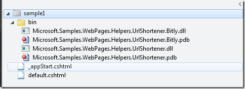

Let's just cut to the chase.&#160; 

The [Url Shortener WebMatrix helper](http://bit.ly/urlshortner) does what the names implies, make a long url, short. By now I am sure we have all used some sort of Url Shortener.&#160; The basic premise is you have a long url that you want to not only shrink but get some stats on.&#160; Here is a example using Bit.ly: before: [http://DeveloperSmackdown.com](http://DeveloperSmackdown.com), after: [http://bit.ly/acRAbT](http://bit.ly/acRAbT "http://bit.ly/acRAbT"). Currently we are supporting the simple bit.ly scenario but there is a lot in the works.

**Where can I get it? **Well on CodePlex of course: [http://bit.ly/wmurlshortener](http://bit.ly/wmurlshortener "http://bit.ly/urlshortner") 

**How do I use it?**

At this point it's nothing magical.&#160; Lets start with getting setup.&#160; There are two assemblies at this point, which need to be copied into your bin folder.

1.  Microsoft.Samples.WebPages.Helpers.UrlShortener.dll
        *   This is the "Helper".&#160; This assembly exposes the API's and settings you interact with.2.  Microsoft.Samples.WebPages.Helpers.UrlShortener.Bitly.dll
        *   This assembly is what I like to call the provider.&#160; There will be one of these for each URLShortener provider we choose to implement.  

Here is a very simple WebMatrix \ Razor solution structure sample:

With your assemblies copied into the bin folder lets look at where things start, _appStart.cshtml. AppStart is the place where we will configure the helper for usage throughout the site.&#160; Right now there are only two settings you have to configure, UserName and ApiKey.&#160; Of course down the road as we add more providers this might change based on the provider you're using.
  > @{      
> &#160;&#160;&#160; UrlShortener.Settings.UserName = "_YOUR BITLY USER NAME_";       
> &#160;&#160;&#160; UrlShortener.Settings.ApiKey = "_YOUR BITLY API KEY_";       
> &#160;&#160; }  

Simple enough.&#160; Now lets actually use it.&#160; In my default.cshtml I call the helper like so:
  > @UrlShortener.Shorten(@"http://DeveloperSmackdown.com")  

If I was in a code block it would look like the following:
  > @{ var dsShortLink = @UrlShortener.Shorten(@"[http://DeveloperSmackdown.com");](http://DeveloperSmackdown.com) }  

The result of each of those is the following string returned: [http://bit.ly/acRAbT](http://bit.ly/acRAbT "http://bit.ly/acRAbT").&#160; Of course if you take the same code and run it under your UserName and ApiKey it will yield a different result.

The sample described above you can find on our [CodePlex site.](http://bit.ly/wmurlshortener)

**Can you tell me something about the architecture? **I am to spare this post for the deeper nerdy details around this, but look for something to come in the near future.

**What features are currently in design\development?**

1.  Support bit.ly's oauth authentication so you can shorten on behalf of your users identity rather than yours2.  Support for bit.ly's pro account  

**What features are you thinking about thinking about?**
  > The core helper was designed to support all "flavors" of Url Shorteners in the market today, without having to change your web sites code.&#160; Given that, at some point we will take a poll on what other providers people use and start to implement them.