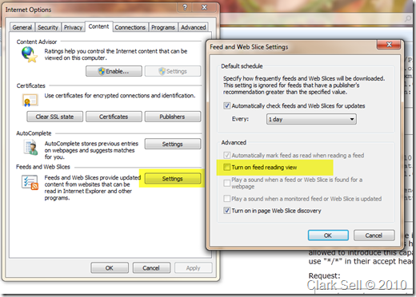
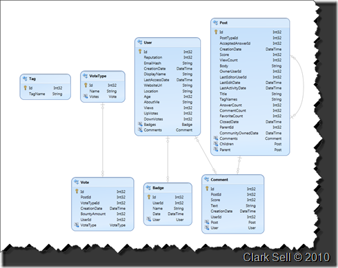
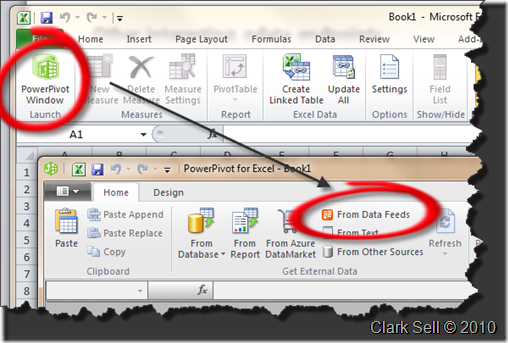
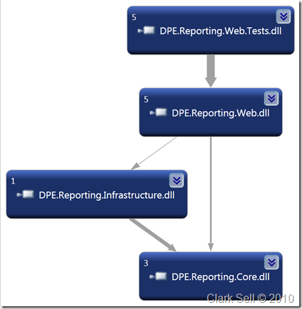
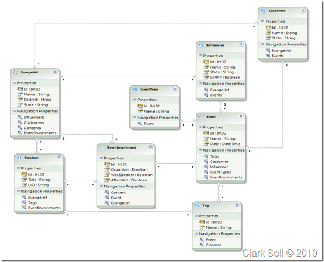

This past weekend I was able to attended and present at the [Chippewa Valley Code Camp](http://www.chippewavalleycodecamp.com/).&#160; This was the was my first time to CVCC.&#160; Just a great event and loads of great people there.&#160; I know it's no easy feat to pull off a free community event so a huge thanks to both Doug and Dan for all of their hard work.&#160; I also thought it was just awesome to see all of the students who attended.&#160; 

&#160;

Ok, OData.&#160; My session looked a little something like this:
  > **OData, it's like ATOM but with some extra stuff**  > You know Open Data Protocol or OData. It's a Web protocol for querying and updating data that provides a way to unlock your data and free it from silos that exist in applications today. OData does this by applying and building upon Web technologies such as [HTTP](http://www.w3.org/Protocols/), [Atom PublishingProtocol](http://www.ietf.org/rfc/rfc4287.txt) (AtomPub) and [JSON](http://json.org/) to provide access to information from a variety of applications, services, and stores.
> 
> We are going to explore how to publish and consume an OData services and have a little fun along the way.  

So what is OData?&#160; Well [OData.org](http://odata.org) defines it as such:
  > The **Open Data Protocol (OData)** is a Webprotocol for querying and updating data that provides a way to unlock your data and free it from silos that exist in applications today. OData does this by applying and building upon Web technologies such as [HTTP](http://www.w3.org/Protocols/), [Atom PublishingProtocol](http://www.ietf.org/rfc/rfc4287.txt) (AtomPub) and [JSON](http://json.org/) to provide access to information from a variety of applications,services, and stores. The protocol emerged from experiences implementing AtomPub clients and servers in a variety of products over the past several years.&#160; OData is being used to expose and access information from a variety of sources including, but not limited to, relational databases, file systems, content management systems and traditional Web sites.  

I find myself talking about OData a lot.&#160; Why?&#160; Well interesting enough it's not because of some hidden agenda, I'm just drawn to it.&#160; Every application I have been part of has had to deal with data in some fashion.&#160; I realize this isn't the case for *every* application, it's just my experience. For me, I think the draw comes down to this: 

*   Its simplicity*   I like REST*   I like that in .NET it's built on WCF*   I like the overall industry support around the protocol*   It takes what works very well, http and expands on existing success*   I like how you can easily use it with things like JQuery  

But enough about me...&#160; There are really two parts of OData or for that matter any web service really. Consuming and Producing or the client side vs. the server side.&#160; Let's start with consuming some OData.

**Consuming**

For the purposes of consumption, I am going to use [Fiddler](http://www.fiddler2.com/fiddler2/), [Internet Explorer 9](http://beautyoftheweb.com) and [StackOverflow](http://stackoverflow.com) and my own demo for these examples.&#160; You can find StackOverflow's OData services at [http://odata.stackexchange.com/](http://odata.stackexchange.com/ "http://odata.stackexchange.com/").&#160; Lets walk through a few queries against [StackOverflow](http://stackoverflow.com/).&#160; Another thing to point out.&#160; Since OData is built on ATOM when you query in the browser you will be show the Feed Reading view.&#160; You can actually disable that by going to **Tools -> Internet Options -> Content -> Feeds and WebSlices Settings -> Uncheck _Turn on feed reading view_**.

&#160;

&#160;

What Entities are available to consume? [http://odata.stackexchange.com/stackoverflow/atom/](http://odata.stackexchange.com/stackoverflow/atom/ "http://odata.stackexchange.com/stackoverflow/atom/").&#160; The result ( below ) will show you a couple of things.&#160; First it will show you the entities you can actually query ( highlighted ), and secondly the url of where that that entity exists ( the href attribute for the collection element ). 
  > <?xml version="1.0" encoding="utf-8" standalone="yes"?>      
> <service xml:base="[http://odata.stackexchange.com/stackoverflow/atom/"](http://odata.stackexchange.com/stackoverflow/atom/") xmlns:atom="[http://www.w3.org/2005/Atom"](http://www.w3.org/2005/Atom") xmlns:app="[http://www.w3.org/2007/app"](http://www.w3.org/2007/app") xmlns="[http://www.w3.org/2007/app"](http://www.w3.org/2007/app")>       
> &#160; <workspace>       
> &#160;&#160;&#160; <atom:title>Default</atom:title>       
> &#160;&#160;&#160; <collection href="Badges">       
> &#160;&#160;&#160;&#160;&#160; <atom:title>Badges</atom:title>       
> &#160;&#160;&#160; </collection>       
> &#160;&#160;&#160; <collection href="Comments">       
> &#160;&#160;&#160;&#160;&#160; <atom:title>Comments</atom:title>       
> &#160;&#160;&#160; </collection>       
> &#160;&#160;&#160; <collection href="Posts">       
> &#160;&#160;&#160;&#160;&#160; <atom:title>Posts</atom:title>       
> &#160;&#160;&#160; </collection>       
> &#160;&#160;&#160; <collection href="Tags">       
> &#160;&#160;&#160;&#160;&#160; <atom:title>Tags</atom:title>       
> &#160;&#160;&#160; </collection>       
> &#160;&#160;&#160; <collection href="Users">       
> &#160;&#160;&#160;&#160;&#160; <atom:title>Users</atom:title>       
> &#160;&#160;&#160; </collection>       
> &#160;&#160;&#160; <collection href="Votes">       
> &#160;&#160;&#160;&#160;&#160; <atom:title>Votes</atom:title>       
> &#160;&#160;&#160; </collection>       
> &#160;&#160;&#160; <collection href="VoteTypes">       
> &#160;&#160;&#160;&#160;&#160; <atom:title>VoteTypes</atom:title>       
> &#160;&#160;&#160; </collection>       
> &#160; </workspace>       
> </service>  

Next lets query the base service to find out what technical goo we can gleam.&#160; To do so I simple ask the service for _$metadata_ [http://odata.stackexchange.com/stackoverflow/atom/$metadata](http://odata.stackexchange.com/stackoverflow/atom/$metadata "http://odata.stackexchange.com/stackoverflow/atom/"). This returns all of the geeky details you were looking for in regards to those exposed entities.&#160; At this point you could also use the [OData Visualizer](http://visualstudiogallery.msdn.microsoft.com/en-us/f4ac856a-796e-4d78-9a3d-0120d8137722) in Visual Studio to get that graphical look of the service.&#160; After you add your service reference, just right click on it and select _View in Diagram_.

&#160;

&#160;

Querying an entity is as simple as navigating to the url that was provided to you.&#160; Let's query for the _Posts_: [http://odata.stackexchange.com/stackoverflow/atom/Posts.](http://odata.stackexchange.com/stackoverflow/atom/Posts. "http://odata.stackexchange.com/stackoverflow/atom/")&#160; *Note* the url is case sensitive so **p**osts will not work. One of my favorite parts about OData is the ability to just query it. Think about the web services of yester year.&#160; As the business changed we would be asked to refactor our services.&#160; Maybe we started with something simple like this:
  > public string GetCustomersByState( string state )  

Things were great, and a few months later someone wanted Active Customers by state.
  > public string GetActiveCustomerByState ( string state )  

Not a big deal right?&#160; Hell, we were most likely even calling into the same business services and just added some flag to now query all or by "status".&#160; Of course now, the business came back and said.&#160; I want to query customers by state and by status.&#160; Now you might be thinking:
  > public string GetCustomers ( string state, string status )  

But in fact you're really just frustrated. Maybe you could have been more creative with your services? Maybe more abstract? Of course now you have services out there that will be a huge deal to change. I mean it's in production and billions of customers are using it right?&#160; I have been there. Ok maybe not billions of customers but all it really takes it two to cause headaches.&#160; OData actually address this very scenario head on.&#160; You can now query your endpoint without the need of having predetermined operations. BOOYA!! Don't get me wrong, you will most likely still need some operations maybe even a lot, but what about that scenario above?&#160; As developers we are horrible at estimating.&#160; As humans it turns out we are just horrible at predicting the future.&#160; You could never predict the future of your web services or the users who want to consume them.&#160; Of course you still want agility and I am sure you had to have them last week, right.&#160; So let's query StackOverflow.

If this [http://odata.stackexchange.com/stackoverflow/atom/Posts](http://odata.stackexchange.com/stackoverflow/atom/Posts. "http://odata.stackexchange.com/stackoverflow/atom/") gives us all the posts. How can we get just Posts that are tagged with css? Or what if we wanted to know how many posts there were? Or the count on Posts tagged css? I am sure the ninjas at StackOverflow are worried about all the questions I have about their data.

*   Give me the count of all posts: [http://odata.stackexchange.com/stackoverflow/atom/Posts/$count](http://odata.stackexchange.com/stackoverflow/atom/Posts/$count "http://odata.stackexchange.com/stackoverflow/atom/Posts/$count")*   Give me the top 10 Posts: [http://odata.stackexchange.com/stackoverflow/atom/Posts?$top=10](http://odata.stackexchange.com/stackoverflow/atom/Posts?$top=10 "http://odata.stackexchange.com/stackoverflow/atom/Posts?$top=10")*   Give me the View Count and ID for the Top 10 Posts: [http://odata.stackexchange.com/stackoverflow/atom/Posts?$top=10&$select=ViewCount,Id](http://odata.stackexchange.com/stackoverflow/atom/Posts?$top=10&$select=ViewCount,Id "http://odata.stackexchange.com/stackoverflow/atom/Posts?$top=10&$select=ViewCount,Id")*   For a Post ( in this case the Post with ID 9 ) give me its TagNames: [http://odata.stackexchange.com/stackoverflow/atom/Posts(9)/TagNames](http://odata.stackexchange.com/stackoverflow/atom/Posts(9)/TagNames "http://odata.stackexchange.com/stackoverflow/atom/Posts(9)/TagNames")*   Give me the Posts which have a TagName including 'css': [http://odata.stackexchange.com/stackoverflow/atom/Posts?$filter=substringof('css', TagNames)](http://odata.stackexchange.com/stackoverflow/atom/Posts?$filter=substringof()&#160;*   Give me the Posts which have a TagName including 'css' and only select the TagNames: [http://odata.stackexchange.com/stackoverflow/atom/Posts?$select=TagNames&$filter=substringof('css', TagNames)](http://odata.stackexchange.com/stackoverflow/atom/Posts?$select=TagNames&$filter=substringof()  

That is pretty sick.&#160; 

&#160;

But now I want JSON. Simple. Now it might be different depending on the libraries your using. In .NET if you want JSON returned you modify your http header to include: **accept: application/json. **
  > [http://odata.stackexchange.com/stackoverflow/atom/Posts](http://odata.stackexchange.com/stackoverflow/atom/Posts "http://odata.stackexchange.com/stackoverflow/atom/Posts")
> 
> Host: odata.stackexchange.com      
> accept: application/json  

You can find more about JSON support in odata here: [http://www.odata.org/developers/protocols/json-format](http://www.odata.org/developers/protocols/json-format "http://www.odata.org/developers/protocols/json-format").&#160; After reading that you might also notice the _format_ parameter _$format=json_.&#160; At the time of writing this, that parameter isn't supported out of the box in .NET 4\. You have to change the accept header ( for out of box support ) or write some server side logic to support the parameter.

&#160;

But not all of my users are geeks.&#160; Good! Lets use Excel.&#160; Yea I said it.&#160; As it turns out Excel is actually a great place to consume OData services too. There is an add on to Excel called [PowerPivot](http://www.powerpivot.com/).&#160; 

&#160;

&#160;

Once you select _From Data Feeds.&#160; _You will be prompted with a dialog box asking you for the URL.&#160; After it inspects the endpoint it will give you the option of which entities from the service you want to import.&#160; After you've selected things it will create a worksheet per entity populated with data.&#160; From there you can get our your Excel ninja skills and have some fun.

&#160;

What about posting to the service?&#160; Posting to the services isn't very complicated.&#160; You will need to create an instance of _[DataServiceContext](http://msdn.microsoft.com/en-us/library/system.data.services.client.dataservicecontext.aspx) _found in _System.Data.Services.Client. _Once we create an instance of the context we set our merge options.&#160; Then we will need to create and populate the model.&#160; Since we used Visual Studio to add a service reference, it automatically created objects bases on the entities found from the service.&#160; One we have added the data to the object, we add it to the context and then save it.&#160; The save will result in posting it to the service.&#160; Here is a sample code snippet from the demo rather than StackOverflow.
  > <pre class="code">DataServiceContext context = new DataServiceContext (new Uri(@"http://localhost:9998/Services/Reporting.svc/"));
> 
> context.MergeOption = MergeOption.AppendOnly;
> 
> 
> Evangelist evangelist = new Evangelist();
> 
> evangelist.Name = "Clark Sell";
> 
> evangelist.District = "Midwest";
> 
> evangelist.State = "IL";
> 
> 
> context.AddObject("Evangelists", evangelist);
> 
> context.SaveChanges();</pre>

In a later post I will explore posting more complicated data structures.

**Producing**

Up to now we have seen how to query a service. Here is the funny part, that might be actually harder than creating the service itself.&#160; Let's start with just exposing an Entity Framework model as an OData endpoint.&#160; First we will need to create the Service itself.&#160; _Add New Item_, and Select a _WCF Data Service_.&#160; The result of that is your service:

> <pre class="code">public class blog : DataService< /* TODO: put your data source class name here */ >
> 
> 		{
> 
> 				// This method is called only once to initialize service-wide policies.
> 
> 				public static void InitializeService(DataServiceConfiguration config)
> 
> 				{
> 
> 						// TODO: set rules to indicate which entity sets and service operations are visible, updatable, etc.
> 
> 						// Examples:
> 
> 						// config.SetEntitySetAccessRule("MyEntityset", EntitySetRights.AllRead);
> 
> 						// config.SetServiceOperationAccessRule("MyServiceOperation", ServiceOperationRights.All);
> 
> 						config.DataServiceBehavior.MaxProtocolVersion = DataServiceProtocolVersion.V2;
> 
> 				}
> 
> 		}</pre>

Notice our service inherits from [DataService](http://msdn.microsoft.com/en-us/library/system.data.services.aspx). That [DataService](http://msdn.microsoft.com/en-us/library/system.data.services.aspx) also takes a generic which happens to either be our Entity Framework model or our own class. During InitializeService we have the change to setup things. This is where we can configure operations, entity rights and so on. You can set Entity Access on all '*' or each entity. You also set what can be done to it _[EntitySetRights](http://msdn.microsoft.com/en-us/library/system.data.services.entitysetrights.aspx)_. The rights are detailed here: [http://msdn.microsoft.com/en-us/library/system.data.services.entitysetrights.aspx](http://msdn.microsoft.com/en-us/library/system.data.services.entitysetrights.aspx).

&#160;

Next, Operations.&#160; If you need one, you have to tell the [DataService](http://msdn.microsoft.com/en-us/library/system.data.services.aspx) you have one.&#160; The [SetServiceOperationAccessRule](http://msdn.microsoft.com/en-us/library/system.data.services.idataserviceconfiguration.setserviceoperationaccessrule.aspx) is where you do so.&#160; Let's take my demo example.&#160; 

> <pre class="code">....
> 
> 
> 	config.SetServiceOperationAccessRule("SomeOperation", ServiceOperationRights.All);
> 
> ....</pre>

Now for our actual operation:

> <pre class="code">[WebGet]
> 
> public IQueryable<SnowAlert> SomeOperation(string state)
> 
> {
> 
>    var events = (from p in this.CurrentDataSource.WeatherAlerts
> 
>         where p.State == state
> 
> 				select p);
> 
> 
> 	 return events;
> 
> 
> 	}</pre>

&#160;

Of course you will most likely want to intercept the request.&#160; There are two interceptors. [QueryInterceptor](http://msdn.microsoft.com/en-us/library/system.data.services.queryinterceptorattribute.aspx) and [ChangeInterceptor](http://msdn.microsoft.com/en-us/library/system.data.services.changeinterceptorattribute.aspx).&#160; Let's look at both.&#160; On my Reporting Service I had both interceptors.&#160; While my implementation is hokey, it makes the point.&#160; My QueryInterceptor will only return Evangelists with the name Clark Sell.&#160; You could actually imagine a scenario where based on your security profile you filtered results.&#160;&#160; My ChangeInterceptor fires for the Evangelists Entity and looks at the change operation.&#160; If the Name being added is Clark Sell it throws an exception.

&#160;

> <pre class="code">[QueryInterceptor("Evangelists")]
> 
> public Expression<Func<Evangelist, bool>> FilterEvangelists()
> 
> {
> 
> 		return e => e.Name == "Clark Sell";
> 
> }</pre>

&#160;

> <pre class="code">[ChangeInterceptor("Evangelists")]
> 
> public void OnChangeEvangelists(Evangelist e, UpdateOperations operation)
> 
> {
> 
> 		if (operation == UpdateOperations.Add '' operation == UpdateOperations.Change)
> 
> 		{
> 
> 				if (e.Name == "Clark Sell")
> 
> 				{
> 
> 						throw new DataServiceException(400, "Sorry not allowed.");
> 
> 				}
> 
> 		}
> 
> }</pre>

&#160;

So I mentioned earlier, you don't have to expose your Entity framework but your own object. That is true, but on your object you will have to expose [IQueryable](http://msdn.microsoft.com/en-us/library/system.linq.iqueryable.aspx) and [IEditable](http://msdn.microsoft.com/en-us/library/system.componentmodel.ieditableobject.aspx). In my sample demo you can look at the WeatherAlertRepository.cs for a simple example.&#160; Of course this is a place where your implementation will vary drastically.

&#160;

**Removing the SVC extension.**

Extension in URLs are just so 2005.&#160; Luckily it's really not a big deal to get rid of with ASP.NET. On App_Start in our global.asax we can actually register a [Service Route](http://msdn.microsoft.com/en-us/library/system.servicemodel.activation.serviceroute.aspx).&#160; This will add support for extension-less base addresses.

> var factory = newDataServiceHostFactory(); 
> 
> 
> RouteTable.Routes.Add( 
> 
> 
> newServiceRoute("WeatherAlerts", factory, typeof(WeatherAlerts)));

PHEWWWW, what a whirlwind. Here are some great resources to check out:

*   [http://odata.org](http://odata.org)*   [http://odataPrimer.com](http://odataPrimer.com)*   [odata by example](http://msdn.microsoft.com/en-us/library/ff478141.aspx)*   [OData on Developer Smackdown](http://developersmackdown.com/Archives/SingleShow/23)*   [WCF Data Services on MSDN](http://msdn.microsoft.com/en-us/data/odata.aspx)*   [Data Market on Azure](https://datamarket.azure.com/)

&#160;

**My CVCC Demo Source:**

You can find my demo code at: [https://bitbucket.org/csell5/demos/src/tip/cvcc/](https://bitbucket.org/csell5/demos/src/tip/cvcc/).&#160; When I present I try to do three things.&#160; 

1.  _Limit the use of slides_.&#160; Why?&#160; Well PowerPoint just isn't what you live in.2.  _Keep it simple.&#160; _Solutions that are too "complicated" could dilute concepts.3.  _Make it more complicated than hello world._&#160; Hello world is great in a lot of examples but the devil is always in the details.&#160; I try to keep it real world.&#160;

My demo was based on something I have been thinking about a lot, reporting.&#160; Bottom line, this is a real world thing I am building.&#160; There are four projects:

1.  DPE.Reporting.Web.Tests, its my test project2.  DPE.Reporting.Web, all of the web assets.&#160; This will include the OData endpoints3.  DPE.Reporting.Infrastructure, glue in the middle4.  DPE.Reporting.Core, core stuff including the models.

&#160;

&#160;

At this point my data model is pretty incomplete but it's enough.&#160; In the demo we were dealing with the Evangelist Entity.

&#160;

&#160;

I also showed how you could just expose any type of object, not just an Entity Framework Model.&#160; Since it snowed that day I created a Weather Alerting Service.&#160; It just seemed appropriate. It was comprise of three things:

1.  SnowAlert.cs, found in Core and is the basic data model.2.  WeatherAlertsRepository.cs, found in Infrastructure.&#160; This is a very cheap repository like pattern to retrieve data. It's also the object that exposes the IQueryable for OData.3.  WeatherAlerts.svc, found in the web project. This is the OData endpoint.

&#160;

**What's next?**

Well for me, it's looking at the following:

*   Best practice's around JQuery integration*   PUT and POST techniques for complicated data structures