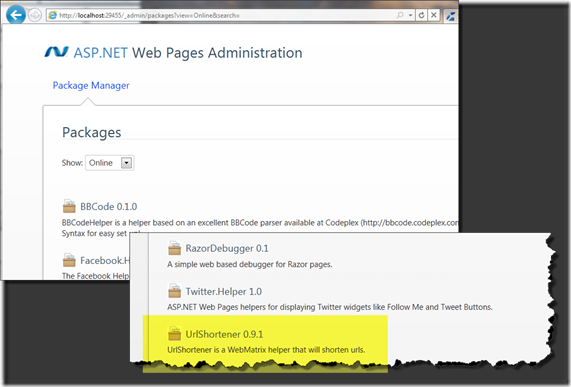

Last week I released a minor version of the [Url Shortener Helper](http://urlShortenerHelper.codeplex.com/).&#160; It also released with the [WebMatrix B3](http://web.ms/webmatrix).&#160; You can download the latest package on the [CodePlex Site](http://urlshortenerhelper.codeplex.com/).&#160; Four things were introduced with this release.

### **1\. Shorter Assembly Names.**

I think the assembly names are now final.&#160; The new assembly names are:

*   Microsoft.Web.Helpers.UrlShortener.dll
*   Microsoft.Web.Helpers.UrlShortener.Bitly.dll  

### **2\. Updated Namespaces.**

These now reflect the assembly names but I am still not satisfied.&#160; What I don't like right now is the helper class doesn't have a namespace.&#160; Nice from the user perspective but collisions will end up occurring at some point. Secondly if I was to namespace the static helper class I would create my own collision since the name of the class is the same as the namespace ( at least when it would be namespaced ).&#160; I honestly don't have the answer at this point.

### **3\. Added a NuGet package.**

I love [NuGet](http://nuget.codeplex.com). I am so excited this hit the streets.&#160; I have created a NuGet package for easier distribution and installation.&#160; This is the same package WebMatrix is already using.&#160; This means you can actually install the helper from within WebMatrix.&#160; I plan to also submit it to the real NuGet feed so you could use it in an MVC3 application as well.&#160; If you browse to _admin of your WebMatrix site ( example. [http://localhost:29455/_admin](http://localhost:29455/_admin "http://localhost:29455/_admin") ) you will be prompted to create a password.&#160; Once created you will see the Helpers listed in the official feed.&#160; Down at the bottom you will see UrlShortener Helper.

Once installed a two things will happen. You will see the two assemblies dropped into the bin folder.&#160; If a bin folder doesn't exist it will create one. Secondly it will drop a readme file at the root with the setting.&#160; This is just pure laziness so you can copy the code from the readme.txt and paste it where necessary.&#160; You can delete the file once your comfortable.

### **4\. Added an overload to Shorten.**

I realized that you might in fact want to override the Settings the helper was setup with at App_Start.&#160; Given that you can now pass in the Settings object to the shorten method.&#160; The current implementation works like this.

*   Add the following _using _statement, **@using Microsoft.Web.Helpers.UrlShortener.Core;**
*   Create the one off setting object.  > @{     
> &#160;&#160;&#160;&#160;&#160;&#160;&#160;&#160;&#160;&#160; dynamic settings = new Settings();      
> &#160;&#160;&#160;&#160;&#160;&#160;&#160;&#160;&#160;&#160; settings.UserName = "YOUR USER NAME";      
> &#160;&#160;&#160;&#160;&#160;&#160;&#160;&#160;&#160;&#160; settings.ApiKey = "YOUR API KEY";      
> }  

*   Call it.  > @UrlShortener.Shorten(@"[http://DeveloperSmackdown.com"](http://DeveloperSmackdown.com"), settings)