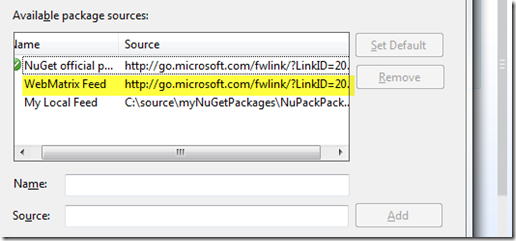
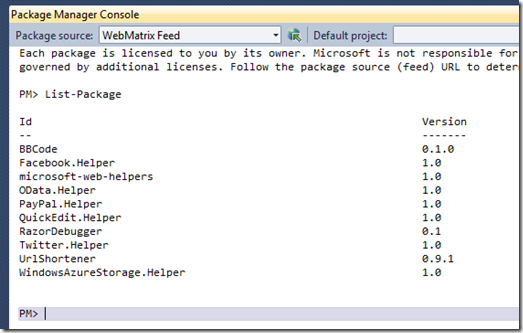
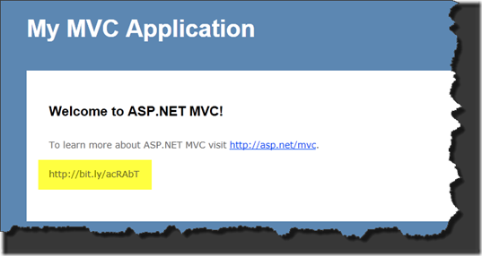

What do you get when you cross, [MVC3](http://asp.net/mvc), [NuGet](http://nuget.codeplex.com), and a [WebMatrix](http://asp.net/webmatrix) Helper? Well one big bag of awesomeness, of course. 

Did you know you can install the WebMatrix Helpers in a MVC3 Site with NuGet?&#160; It's a dirty little secret I know.&#160; We also know a WebMatrix is built on top of not only ASP.NET but supports the Visual Studio "Web Site" project type.&#160; Ironically that isn't really a "project" type since there isn't a "project file".&#160; For purposes of this conversation we are going to play around with my [Url Shortener Helper](http://urlshortenerhelper.codeplex.com/).&#160; At this time of writing this, the current release is 0.9.1.&#160; you can get more information about it here: [http://csell.net/2010/11/16/UrlShortenerV091Release.aspx](http://csell.net/2010/11/16/UrlShortenerV091Release.aspx)

My helper was actually included in this past release of [WebMatrix](http://asp.net/webmatrix) but what does that really mean?&#160; Well there is a NuGet feed that drives the selections seen when you browse to the _admin portion of a WebMatrix site.&#160; That right there is a whole pile of awesomeness.&#160; Originally I was a bit sad it didn't make it into the official NuGet feed.&#160; I realize my helper isn't anything complicated or even all that special but still everyone should get to use it.&#160; There is nothing technically that says you can't use it in MVC3 projects.

So I started to do some poking around. What if I could get that feed? Well as it turns out, you can.&#160; The current address is: [**http://go.microsoft.com/fwlink/?LinkID=205388**](http://go.microsoft.com/fwlink/?LinkID=205388 "http://go.microsoft.com/fwlink/?LinkID=205388").&#160; Of course that could change at a later date.

At this point if you don't' have [NuGet](http://nuget.codeplex.com) installed, look that puppy up in the Visual Studio Extension Manager or get it from CodePlex. Here is a great screen cast on using NuGet with MVC: [http://userinexperience.com/post/Mvc-Screencast-1-NuGet.aspx](http://userinexperience.com/post/Mvc-Screencast-1-NuGet.aspx).

With NuGet setup we can add that feed to the list of feeds we already have.

Now lets go to the _Package Manager _and call **_List-Package_** on that new source.&#160; You see we now have the WebMatrix Helpers.

Sweet! Now call **_install-Package UrlShortener _**on your MVC project.&#160; That will drop in the two assemblies into the bin folder and the readme.txt in the root. Just configure the helper and use it. 

