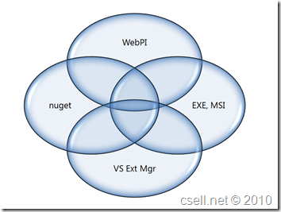
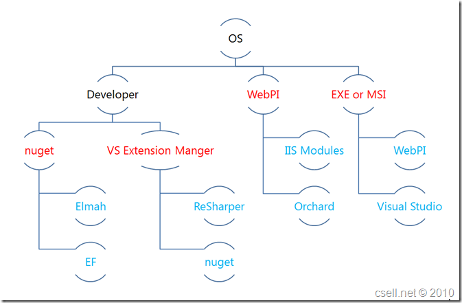

Unfamiliar with what [NuGet](http://nuget.codeplex.com/) is? Well this post is aimed at dispelling some of the myths out there. At the time of writing this, NuGet is in Beta and has not released V1\. 

Lets just start with what is [NuGet](http://nuget.codeplex.com/)? Well the [NuGet](http://nuget.codeplex.com/) team defines it like so:
  > "NuGet is a free, open source developer focused package management system for the .NET platform intent on simplifying the process of incorporating third party libraries into a .NET application during development. NuGet is a member of the ASP.NET Gallery in the <u>[Outercurve](http://outercurve.org/)</u><u></u><u>[Foundation](http://outercurve.org/)</u>."  

I have taken their definition and highlighted a few key areas.&#160; By far this isn't something new to .NET or even our industry.&#160; In fact this started as a [RubyGems](http://rubygems.org/) clone but before we dive into the details of NuGet, I want to address a bit of naming history.&#160; A long time ago like earlier this year, there were actually two efforts going on.&#160; A community effort called Nu or Nubular or and an internal Microsoft project called NPack.&#160; As some point worlds collided and both project joined forces.&#160; The result of that marriage was now called NuPack.&#160; Well, as it turns out "NuPack" was actually something already in development by some guys over at Caltech. They already have an effort called [NUPACK](http://nupack.org) otherwise known as the Nucleic Acid Project.&#160; Given that, the team opened up a naming vote to the community. And the winner was..... NuGet.

We've established NuGet as a package manager\framework\delivery mechanism.&#160; NuGet is targeted for the application developer either consuming or producing.&#160; It allows one to package their assets in something called a .nupack file ( zip file really ).&#160; That nupack file can then be found and installed over the web.&#160; To install NuGet you will need to visit the Visual Studio Extension Manager and install it right from there.&#160; That will create a new not only a new Project Reference Dialog but a Package Manager Console Window.&#160; Once installed go to the package manager window and type "_List-Package_".&#160; Find your package and type "_Install-Package { packageName }_". You can find more information on getting started here: [http://nuget.codeplex.com/documentation?title=Getting%20Started](http://nuget.codeplex.com/documentation?title=Getting%20Started "Getting%20Started")

But don't we have a number already? Why another? Right now ( for me and taking the eye of a developer ) there are really 4 different delivery methods that seem to stand tall:

*   WebPI or the WebPlatform Installer 
*   NuGet 
*   Visual Studio Extension Manager 
*   exe's, msi's, zip's etc&#160;   

I think in the coming years we will see things like "AppStores or Marketplaces" become a major leader too.&#160; So which one do you pick?&#160; Is there overlap?&#160; Interesting enough there really is overlap and in fact some even use each other.&#160; 

[](http://csell.net/content/binary/Windows-Live-Writer/NuGet-Nuggets_B7C1/image_2.png)

Is there only one choice?&#160; No of course not.&#160; It could depend on so many items. Do they have to install offline? Do they program against it? Do you have to be in multiple channel? Should you be in multiple channel? Just to name a few. I was putting together a NuGet presentation when I ran across this paraphrased quote:
  > ### **Choice is affected by context.**  > _Song-Oh Yoon and Itamar Simonson. "Choice Set Configuration as a Determinant of Preference Attribution and Strength" Journal of Consumer Research: August 2008._  

SPOT ON! This quote came from an article where they explored consumer buying decisions and how context was extremely important but of course "that context" is the tricky part. I guess that consultants response of "It just depends" has some validity. Stay with me now, take this photo for example: 
  > [](http://www.flickr.com/photos/pupski/42624981/)
> 
> [http://www.flickr.com/photos/pupski/42624981/](http://www.flickr.com/photos/pupski/42624981/ "http://www.flickr.com/photos/pupski/42624981/")  

Simple enough right?&#160; Maybe at first glance, but lets look closer:

*   Is 1901 a year or an address? 
*   Is SAM a person or a thing? 
*   Name of what, owner, person, builder, building name?   

So what does this all really have to do with Package and Distribution methods\frameworks? Well the context around where, why, when, how do you ship you're software "_just depends_" and will be different for each user, channel or application.

Let's break down each of those options listed above:

1.  .exe, .msi, .zip whatever... 
        *   Installed to Operating System 
    *   Lots of choices 
    *   Usually chained with other packages 
    *   Stands and installs by itself 
    *   No native distribution channel 
    *   No free marketing 
    *   Manual Updates, ie need another package and user input 
    *   Examples packages include: 
            *   WebPI 
        *   Visual Studio 
        *   Office&#160; 2.  WebPI</a></a> 
        *   Catalogue of products 
    *   Install stands on it's own 
    *   Packages install to operating system 
    *   Install through WebPI distribute channel 
    *   Installation Simplified 
    *   Drive by, Marketing 
    *   Example Packages include: 
            *   WebPI 
        *   MVC 
        *   IIS Modules 
        *   WordPress 3.  Visual Studio Extension Manager 
        *   Part of Visual Studio 
    *   Packages install into Visual Studio 
    *   Packages are targeted to augmenting the development experience 
    *   Automatic updating 
    *   Drive by marketing 
    *   Example packages include 
            *   nuget 
        *   Visual Studio Powertools 
        *   JetBrains Resharper 
        *   NuGet 4.  NuGet 
        *   Packages are usually "libraries" 
    *   Packages are meant to be developed against 
    *   Multiple hosting strategies 
    *   Channel = Web 
    *   Drive by marketing 
    *   Easy tooling integration with things like Visual Studio, [WebMatrix](http://asp.net/webmatrix) 
    *   Example packages include: 
            *   ELMAH 
        *   Entity Framework 
        *   SQL Compact 
        *   UrlShortenerHelper   

Of course those there are of course are plenty more one can add to the mix. Through that process though, what I realized is some dovetail on one another.&#160; NuGet and WebPI both use one mechanism to get install and provide yet another to something or someone else.

#### &#160;

#### [](http://csell.net/content/binary/Windows-Live-Writer/NuGet-Nuggets_B7C1/image9.png)

For me I like to think of them like this:

1.  EXE etc, Most control, you own your distribution, can install offline 
2.  WebPI, broad sweeping things that install into the OS.&#160; While Visual Studio might be able to be installed through WebPI it's most likely just to big and complicated for it. .NET and PHP runtimes are great examples. 
3.  Visual Studio Extension Manager - Things that augment your development experience in Visual Studio. Of course VS itself of #1 
4.  NuGet, Things you program against.&#160; They shouldn't need to be part of program files. They in fact should be part of your source control. Of course there is context that should go around that statement too.   

So the framework and mechanisms are all in place. Where does your software fit?&#160; As I am writing the [UrlShortenerHelper](http://urlshortenerhelper.codeplex.com/) for ASP.NET WebPages it sure is nice to just be able to type "install-package UrlShortener" and have the thing installed from either a public or private feed.

&#160;

NuGet, I can't speak for others but I am sure glad you're here.&#160; 