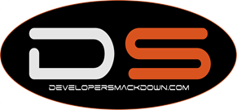

### 

Hang out with 1500 of your newest friends at a multi-track conference for software developers. We're calling it **that Conference.**

I personally feel like the landscape of conferences are changing. Things like [CodeMash](http://CodeMash.org), [MVCConf](http://mvcconf.com) and all of the local Code Camps are all great examples of the changing times.  I also feel that having that physical \ personal connection with people in your industry is *very* important. When you've actually meet someone face to face it carries so much more weight than just a 140char conversation over Twitter.  So how do you create something that try's to incorporate it all, I guess one bite at at time.

Before we started this adventure, we actually reached out to the [CodeMash](http://CodeMash.org) leadership team. I personally can't say enough awesome things about the guys who run [CodeMash](http://codemash.org). They have been a huge help to date an in partnership with them we have taken a lot of our inspiration from their successes.  We are clearly stealing their overall format, venue and whatnot but we're putting our own spin to it.

Yes we are currently in the planning stage, but let me say this; this is real. This will happen. This will be awesome. This isn't just a few guys and gals shooting the breeze over beers. The venue is locked in, contracts are signed and the wheel is turning.

### Current Random Ideas

So what will that Conference end up looking like?  Here are just a few ideas:

*   Multi-track conference for software developers. That means our focus will be SOLELY for developers
*   All technologies will be included and divided up by topic area. Web, Mobile, Cloud, etc.
*   Provide the right balance of technology "parts". This is something in which the [CodeMash](http://CodeMash.org) leadership does an outstanding job
*   Something for the families to participate in
*   Daily keynote from industry experts
*   Sessions recorded for viewing later
*   Live podcasting stages
*   Kids Camp
*   Student participation
*   GiveCamp
*   Hackathon
*   Open Spaces
*   Open Source \ Product launches with investors and media in the audience.
*   Highlight local community and businesses
I am not declaring all of these things will happen but these are just a few of the items we are throwing around.  We will continue to be transparent as things develop.  If you have an idea of something you think we should incorporate please shoot us an email at [contact@thatconference.com](mailto:contact@thatconference.com).

&nbsp;

### Details , Details, Details

August 13th - 15th of **2012** at the [Kalahari Resort in the Wisconsin Dells, WI](http://www.kalahariresorts.com/wi/).  You picked the middle of summer? Yes, and we have our reasons.  Finding a date to run a conference of this size is actually harder than one would think.  We landed at August 13th - 15th 2012 for the following reasons:

*   Opposite of CodeMash. They are in January, we will run in August. We don't want to compete with [CodeMash](http://CodeMash.org) but rather support them.
*   It's right before school is back to session. We would love to see not only students at the conference but your family too.  [CodeMash](http://CodeMash.org) has over 30% of it's attendees bring their family we are hoping for similar.
*   Outside of the mainstream conference season, at least at the time of writing this.
&nbsp;

### Sponsors and Media

Of course like any big conference, we couldn't pull it off without the help of our community and our sponsors. At this point I cannot announce anything but if you're interested in being part of that Conference, please email us at [contact@thatconference.com](mailto:contact@thatconference.com).

###

### Where Are We Today

It's has taken a great deal of work to where we are today. As you have already seen we have a date, venue, media assets and our temporary site. We are currently in the middle of:

*   Media Campaigns and advertising. You can hear our spot on [Developer Smackdown](http://developersmackdown.com/).
*   Sponsors, Media, Headliners
*   Sponsor and Media Packages
*   Mail Distribution
*   Full Scale Website
You can follow us on [Twitter](http://twitter.com/thatconference) or feel free to email us anytime at [contact@thatconference.com](mailto:contact@thatconference.com).

****

In full disclosure, I am one of the founding members of that Conference.
