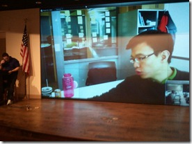

My March kicked off with one of the biggest [WebCamps](http://crWebCamps.ms) we've had to date.  It was in Austin Texas ( I guess everything is bigger in Texas ), and it was hosted by [Scott Hanselman](http://hanselman.com), Jonathan Carter, [Brandon Satrom](http://userInExperience.com) and myself.

It just so happened the week prior I sat down with Chewy and recorded an episode of [Developer Smackdown](http://developersmackdown.com/Archives/Show/43). Chewy not only managed to make me hungry but had a very fresh perspective around everything IE9 and browser related. Because of the humble pie Chewy served up, we really wanted to serve him up to our [WebCamp](http://crWebCamps.ms) audience.  Unfortunately travel was of course an issue.

The solution, Microsoft Lync. Shocking I know.  Ok, I am not selling any type of "remote X" but rather my list of things we did to make it successful to an audience of 300 on conference center WIFIs with limited GBs. To the right you can see Chewy on the big screen.

*   I had a lapel mic on that was hooked to the PA.
*   My computer had a [Polycom Speakerphone](http://www.polycom.com/products/voice/desktop_solutions/pc_speakerphones/index.html) setup.
*   Chewy could actually hear me through the Speakerphone just talking into the PA's mic. I was on the other side of the stage from the computer.
*   The computer had a lapel mic next to a speaker.  Not ideal, would have been nice if I could have just plugged the PC in but they didn't have a 3.5 mic jack at the podium.  Boy Scout motto -> BE PREPARED.
*   Video. Thanks to Scott one of the tricks I learned was to watch the amount of pixels you're trying to push.  When we went full screen with Chewys video steam it not only sucked up much more bandwidth but forced his computer to work substantially harder to send a video with the resolution that would support what I was asking for. That meant CH O O PY. The resolution was to shrink the Window and then zoom in with "Windows +".  This made it appear as if it was full screen but in fact the video was hardly that.  In doing so, things were buttery smooth.
*   Used one of the [Microsoft Life Cam's](http://www.microsoft.com/hardware/digitalcommunication/ProductDetails.aspx?pid=008) pointed at the audience such that Chewy could see who he was speaking to.
*   I played proctor to the audience.  We wanted Chewy to just focus on my voice ( since he couldn't see me ) as to who to expect queues and question from.
The result, success. We were able to effectively bridge our gap and people acted as if there was a real person on stage.

I would love to hear other tips or tricks people have implemented.