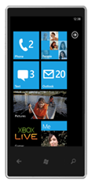

&nbsp;

_Do you have the next million dollar idea that you just can't find the time to finish?_ _Do you already have an app for Android and iPhone that you want to expand into new markets? _

_ _

It's time to turn your napkin sketches and leverage your hard work into real, sellable apps for Windows Phone in ONE WEEK!

The Central Region Evangelism team at Microsoft is hosting a week-long Windows Phone Accelerator Lab in [Dallas (week of May 9th)](http://www.microsoft.com/click/services/Redirect2.ashx?CR_CC=200039461&CR_EAC=300018830) and [Chicago (week of May 16th)](http://www.microsoft.com/click/services/Redirect2.ashx?CR_CC=200039461&CR_EAC=300018828). The purpose of the lab is to provide technical and design assistance to developers who are currently building Windows Phone apps and who need a little extra help in getting their apps into the Marketplace.

The event is a no-fee event (plan your own travel expenses) and all developers are eligible. Seating is limited and registration is not guaranteed. Priority registration will be based on:

*   *   Apps currently in development with a plan to completion by May 31st
    *   Developers who have apps on other platforms that are looking for assistance to port over to Windows Phone 7
    *   Someone who has a great idea and needs help in getting their project kicked off
    *   Application must be ready to submit to Marketplace by May 31st.

<table border="1" cellspacing="0" cellpadding="2" width="466">
<tbody>
<tr>
<td colspan="2" valign="middle">**Windows Phone Accelerator Labs**</td>
</tr>
<tr>
<td width="266" valign="top">[**Los Colinas, TX**](http://www.microsoft.com/click/services/Redirect2.ashx?CR_CC=200039461&CR_EAC=300018830)
Microsoft Technology Center
May 9-13, 2011

[Register](http://www.microsoft.com/click/services/Redirect2.ashx?CR_CC=200039461&CR_EAC=300018830)</td>
<td width="266" valign="top">**[Chicago, IL](http://www.microsoft.com/click/services/Redirect2.ashx?CR_CC=200039461&CR_EAC=300018828)**
Microsoft Technology Center
May 16-20, 2011

[Register](http://www.microsoft.com/click/services/Redirect2.ashx?CR_CC=200039461&CR_EAC=300018828)</td>
</tr>
</tbody>
</table>

