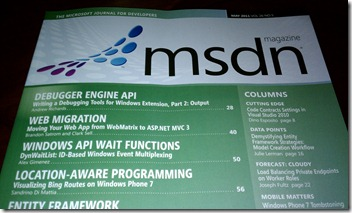

   

Meta:

*   You can find the official article here: [http://on.csell.net/jvzqiw](http://on.csell.net/jvzqiw "http://on.csell.net/jvzqiw")*   Article Source Code: [http://code.msdn.microsoft.com/mag201105ASPNET](http://code.msdn.microsoft.com/mag201105ASPNET "http://code.msdn.microsoft.com/mag201105ASPNET")*   Source Repository here: [https://bitbucket.org/csell5/wm2mvc/](https://bitbucket.org/csell5/wm2mvc/) We continue to play around with it from time to time.  

In this months MSDN Magazine, [Brandon Satrom](http://userinexperience.com) and I released an article around migrating and ASP.NET WebPages site to MVC. A few people have asked, why would we even tackle such a topic when "no one" ( at least at this stage ) would even be considering migrating ASP.NET WebPages to MVC. 

Honestly and foremost we believe it's important to understand the entire stack and how they relate to one another. When I talk about [WebMatrix](http://asp.net/webmatrix) I always tell people it's not different.&#160; While the Editor, RAZOR, and the page centric programming model are new, it's still built upon the same ASP.NET we have grown up with. Ok, like what?&#160; 

*   .NET ( of course )*   ASP.NET Runtime*   Project Structure, it's just an ASP.NET WebSite project type*   WebDeploy*   SQL Compact*   SEO tools  

[Scott Hanselman](http://www.hanselman.com) talks about getting the LEGO pieces the right size and shape, and our article is a perfect example of just that. Brandon and I were able to take an existing site and with minimal work actually convert it to MVC. Personally, I think that is a rather huge statement.&#160; That means the migration is more about switching your underlying design pattern. Sure we have to make some code changes to support that migration but the code changes are more of "infrastructure" changes than messing around with your business logic. Yes we physically move your business logic somewhere else but we don't change it's behavior. 

Having said all that awesome sauce, we kicked off the article talking about reasons on which you may or may not want to migrate.&#160; There isn't some underlying technical reason to migrate, it's really more about a cultural preference, TDD, wicked cool build processes, separation of duty, whatever. At the end of the day it's still all ASP.NET.

I personally learned a great deal about MVC in this process and some of the "how" behind it all, I hope you do as well.