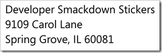

Just over two years ago I turned to [Mark](http://marknic.net/) and told him I had this crazy idea.&#160; "Yes?" he says... "Let's start a podcast." With the help of a great friend of mine, [Martin Woodward](http://woodwardweb.com) a few weeks later [Developer Smackdown](http://developersmackdown.com/) was born and we were off to the races. Over the past two years, we have put in a ton of hours, learned how to edit some podcasts, meet some great people and of course ..... drank a few beers in the process. 

## Why?

So why do we do this, what's our motive? When we started Developer Smackdown our goal was to have the honest conversation that you might have with your buddies at the bar or at breakfast when you just got finished working a 30 hour shift.&#160; We honestly don't have any motives. I guess if we had to pick one and be a bit selfish, I would love to see Developer Smackdown at the top of the podcast list. Not because I want to be a journalist ( not a career path what so ever ), but rather to know we mean that much to people and have built a nice size community around things.&#160; 

In the end we want to give developers voice who might not otherwise have one. 

**Lastly we want everyone to have fun.**

## Parental Advisory?

"Developer Smackdown is the [Richard Pryor](http://en.wikipedia.org/wiki/Pryor,_richard) of technical podcasts."

Seriously you're the only technical podcast marked explicit, why? Well clearly if you have listened to the show you know I have a bit of a mouth of me at times. Here's the thing, we want to have an adult conversation and if there is swearing involved I really don't care. I know there are some varying opinions on the matter but I haven't been on a development project yet where a developer didn't sear. Now having said that I have two kids and I know as a parent I wouldn't want them listening to this and because of that, it's marked explicit. 

Ironically I dream of the day where parental advisor becomes so much better.

## .com & .net

Yes we wrote our own site! I just didn't want some blog software to be our site, we wanted it to be unique. We wanted to become another extension of the community and that meant having a two way conversation.&#160; We're not there of course but we continue to try and improve things. Our site is ASP.NET MVC3 using Razor. It's been MVC since version 1 and has upgraded every step of the way. For our services we are using both the new [WCF Web API](http://wcf.codeplex.com/) and [OData](http://OData.org).&#160; Data is stored in SQL Express and our hosting is now provided by [Applied Innovations](http://www.appliedi.net/). 

We also wanted something outside of work that you could consider "production" that we could do whatever we wanted to with it. We have enough listeners that, "it's production" and when it goes down we hate it.

## The Numb3rs?

I am a firm believer in transparency. In the case of [Developer Smackdown](http://developersmackdown.com/) we really have nothing to hide either.&#160; At the end of 2 years I wish things were better than they were but we have seen positive growth ever since we've started.&#160; Everyone tells me consistency, and while I agree I think one of our biggest problems is consistency. Now honestly this isn't a numbers game for us. If we were to remain flat but increase the conversation with our listener base we would still continue to do it although at some point we will have to find some sponsors to keep the lights on. 

But YES, this year we will bring consistency to the table as well. Our current plan to ship shows every Wednesday, say 10 am? We just spent a great deal of time upgrading our site and the tooling around it to make that actually possible.

So here are the facts....

[Podtrac](http://podtrac.com) Stats, basically show downloads:

*   38,488k Overall Downloads
*   25,264k Unique Overall Downloads
*   ~26 countries  

Top 10 Shows By Unique Downloads as seen from Podtrac ( Show - Overall/Unique ):

1.  [#48](http://developersmackdown.com/Archives/show/48) HTML5 Labs with Craig Kitterman - 6199/3719
2.  [#23](http://developersmackdown.com/Archives/show/23) Intro to OData - 1003/719
3.  [#22](http://developersmackdown.com/Archives/show/22) Why Projects Fail?!? - 888/670
4.  [#24](http://developersmackdown.com/Archives/show/24) TFS Team Build - 878/630
5.  [#49](http://developersmackdown.com/Archives/show/49) SOLUS: Technology to help with peace of mind- 2102/621
6.  [#28](http://developersmackdown.com/Archives/show/28) HTML5 with Brian Hogan - 825/616
7.  [#25](http://developersmackdown.com/Archives/show/25) Multi-Touch with Travis Feirtag - 884/597
8.  [#13](http://developersmackdown.com/Archives/show/13) HomeServer and why we like it - 838/596
9.  [#27](http://developersmackdown.com/Archives/show/27) Application Architecture and Powershell with Steven Murawski - 1113/585
10.  [#30](http://developersmackdown.com/Archives/show/30) Taking a REST with Scott Seely - 882/566  

Web Site Stats ( since February 2011):

*   1,940 Visits
*   1,242 Absolute Unique Visitors
*   3,832 PageViews
*   73 Countries/Territories
*   42% Direct Traffic
*   40% Referral
*   17% Search  

*Couple of notes:

*   One factor in our non unique numbers increasing is implementing the audio tag on our site. When a page loads that actually looks like it's counting as a download.*   We switched from Woopra to Google analytics in February.  

## What's coming?

We are always trying to improve on what we are doing. Our site and the items around it are constantly under development. Our most recent site changes included a few of the following:

*   We finally have comments per show, YEA!!*   Tags. Search by and sort. While it's done it's not fully deployed. It should be deployed around the time this post releases.*   Overall SEO improvements*   CSS tweaks, more coming too.*   Show Requests  

Here is the current back log of features:

*   Badges. Place for you to get our image assets etc
*   Geekdom, This will be a place where you can start to interface with Developer Smackdown. We have a number of services already with more coming
*   Windows Phone Application
*   Outtakes*   Fix our album art
*   Fix how were listed in iTunes and Zune
*   MORE SEO. Based on some of the site stats, people just aren't finding us  

One of our goals for the next year will be to better support the overall development community. I have been thinking about how could we could help advertise on behalf of the community, at this point I don't have anything locked down but would love feedback. 

## Swag

Yes we are a little nuts. To date we've actually had both stickers and shirts. If you want a sticker simply **mail a Self-Addressed Stamped Envelope** to:

Do you run a user group or company meeting?** **If you do and would like a batch of stickers to provide at your next meeting, please send a short letter on company/group letterhead requesting stickers to the above address. Also indicate how many you're requesting.&#160; Please remember we make negative money on [Developer Smackdown](http://developersmackdown.com/) so while we have a stack we are also limited. If you ask for 500 you will not get it. Just being honest 

If you're **outside the United States**, an SASE is a bit tougher. You have two options here:

1.  Include US $1 in the envelope to cover international postage.2.  Include an [International Reply Coupon](http://en.wikipedia.org/wiki/International_reply_coupon) with your self-addressed envelope.  

## Thank You!

On behalf of [Mark](http://marknic.net) and I we would love to one again say thank you for the support.&#160; Feel free to reach us at [fans@developerSmackdown.com](mailto:fans@developerSmackdown.com) or comment here. We would love to hear from you.