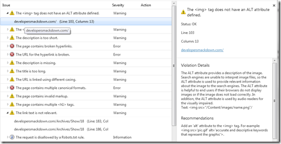

As a web developer [SEO or Search Engine Optimization](http://en.wikipedia.org/wiki/SEO) is a big deal especially for a public facing Web Site. Search engines today are clearly much more complicated than they were in days past. We can't just add a few meta tags and expect our site to get bumped to the top. In addition, we also want our sites to be "organically" found. Organically being, I was searching for the "content" and was presented your site as relevant to that topic area.

For [Developer Smackdown](http://developersmackdown.com/) SEO has become a huge focus for us. As you might know we wrote our own site and paying attention to a few simple details will go a long way. Over this past year we now have a much better understanding on how and where we're getting found. Unfortunately the results weren't something we expected but doing a little research and making a few simple changes can go a long way.

The following 5 tips are the first things we have tackled in our SEO journey. 

## 1\. Tools

Using tools to help with SEO might seem a bit obvious but when making changes like this, hopefully your doing them pragmatically with thought such that you can measure your impacts.&#160; if you don't have any analytics tools wired to your site, that would be the first place to start. I have personal experience with both [Woopra](http://woopra.com) and [Google Analytics](http://www.google.com/analytics/). They are both nice and offer free packages. These tools will tell you a great deal about your visitors and their behavior. It's not just about click counts but what and where they clicked, searched for, referrals and so much more. In Google Analytics there is a feature called In-Page Analytics which will overlay your site with where people are actually clicking, see image below.

With some analytical tools in place you can now start to analyze your site usage and plan your attack. Fear not, there are plenty of tools to aid us here too. Both Bing and Google offer a suite of Web Master tools and documentation. These tool are really great and they give you some insight to just how the engine is interacting with your Web Site. These include things like crawl errors, pages crawled, sitemaps, ranking and traffic stats and more.

*   [Bing WebMaster Tools](http://www.bing.com/toolbox/webmaster/)*   [Bing WebMaster Tools Help](http://onlinehelp.microsoft.com/en-us/bing/gg132923.aspx)*   [Google WebMaster Tools](http://www.google.com/webmasters/)*   [Google WebMaster Tools Help](http://www.google.com/support/webmasters/)*   [Google SEO Starter Guide](http://www.google.com/webmasters/docs/search-engine-optimization-starter-guide.pdf)  

But what if you wanted to take more of a proactive approach? Well Microsoft ( and I am sure others ) offers offer up a few few SEO tools specifically for site developers such as [WebMatrix](http://asp.net/webmatrix) and the [IIS Search Engine Optimization Toolkit](http://www.iis.net/download/SEOToolkit). WebMatrix at it's core is an IDE for web development it has SEO tooling built directly into its reporting features. That feature set is basically a subset of the IIS SEO toolkit.&#160; These toolkits are great. They allow us to plug in a URL ( local or remote ) and have it crawl the site just like a search engine reporting on the potential problematic areas and details about why. Below you will see an example report that I ran against [Developer Smackdown](http://developersmackdown.com/).

## 2\. Descriptive Titles

Title are important. In fact they might actually be more important than you think. If you have been trying to create titles that fit into your browsers tab, don't. A search engine will take that title text and not only evaluate it for keywords but that is what it will display in your search results. Below you will see I have searched for "**_[developer smackdown html5](http://www.bing.com/search?q=developer+smackdown+html5&go=&qs=n&sk=&form=QBLH)_**". Bing's second result was what I was looing for. 

That is much better than something like **_Developer Smackdown Show 48 _**or even worse **_Show 48_**. Make those titles descriptive and relevant to your users. Unfortunately "cute" titles don't work either. Developer Smackdown is unfortunately a great example of how to create all the wrong titles. For example, show 14 was titled "_**Is your robot looking at my hinie?**_" The following three very specific searches doesn't even put on the front page:

1.  [developer smackdown robot](http://www.bing.com/search?q=developer+smackdown+robot&go=&qs=n&sk=&sc=0-20&form=QBLH)2.  [developer smackdown home automation](http://www.bing.com/search?q=developer+smackdown+home+automation&qs=n&sk=&sc=1-35&form=QBRE)3.  [developer smackdown robot hinie](http://www.bing.com/search?q=developer+smackdown+robot+hinie&qs=n&sk=&form=QBRE)  

Of course there are other factors in it not being at the top BUT given those search query's you would at least expect it on the first page.&#160; Unfortunately that title just doesn't tell anyone anything, even if it is funny. 

[More about the HTML Title Element](http://www.w3.org/TR/html401/struct/global.html#h-7.4.2)

## 3\. Descriptive Descriptions

Just like titles, descriptions follow the same rules and are just as important. As you can see in the previous image our description will be the thing displayed just under the title. This means your description should be **set for each page rather than having a generic description for your entire site**. This will also give the search engine more information to integrate. 

This is something ( until recently ) that was overlooked in Developer Smackdown and the search engine had to guess. In the case of [show 48 about HTML5 labs](http://developersmackdown.com/Archives/Show/48) they did a great job inferring what it could be. I really shouldn't make it guess, especially for something so simple to fix. Unlike the title element, description is actually meta data on the page which isn't visually displayed with the structure of your page.
  > <head>
> 
> &#160; <meta name="description" content="your description here" />
> 
> ...  

[More about using descriptions as meta data.](http://www.w3.org/TR/html401/struct/global.html#h-7.4.4)

## 4\. URL's

URL's have become increasingly important over the years. Today we like human readable URLs that tell the user something of value that can be indexed by a search engine.&#160; Lets take the following examples:

1.  [http://csell.net/2011/07/05/developer-smackdown-update-2-years-and-50-shows-later/](http://csell.net/2011/07/05/developer-smackdown-update-2-years-and-50-shows-later/)2.  [http://developersmackdown.com/Archives/Show/51](http://developersmackdown.com/Archives/Show/51)3.  [http://stackoverflow.com/questions/tagged/webmatrix](http://stackoverflow.com/questions/tagged/webmatrix)4.  [http://stackoverflow.com/questions/6576791/webmatrix-pass-id-to-display-code](http://stackoverflow.com/questions/6576791/webmatrix-pass-id-to-display-code)  

Each of these should not only tell the user something of value but a search engine something as well. It should also describe the structure of your site. Looking at the first example, it's a pretty simple URL structure **site/year/month/day/title**. What's even better you can start to just delete segments of the URL effectively walking the stack of content. The other three examples work the same way and just by looking at the URL you will get a sense of the structure, content and keywords that will be indexed.

Maybe your site is built and your URL's are ugly. Don't loose hope. There are tools such as [IIS URL Rewrite](http://www.iis.net/download/URLRewrite) which allow you to create URLs that map to one another. This means you could create a nice human readable URL and map it back to your other one. Sure it's a level of abstraction on your site, but it may make for a better, more search friendly site.

## 5\. XML Sitemaps and robots.txt

As defined by [Sitemaps.org](http://sitemaps.org):
  > "Sitemaps are an easy way for webmasters to inform search engines about pages on their sites that are available for crawling. In its simplest form, a Sitemap is an XML file that lists URLs for a site along with additional metadata about each URL (when it was last updated, how often it usually changes, and how important it is, relative to other URLs in the site) so that search engines can more intelligently crawl the site.
> 
> Web crawlers usually discover pages from links within the site and from other sites. Sitemaps supplement this data to allow crawlers that support Sitemaps to pick up all URLs in the Sitemap and learn about those URLs using the associated metadata. Using the Sitemap [protocol](http://www.sitemaps.org/protocol.php) does not guarantee that web pages are included in search engines, but provides hints for web crawlers to do a better job of crawling your site."  

Essentially by your site providing a Sitemap we can help influence the process on how our site gets crawled. Sitemaps are simple xml files which are basically a collection of URLs and some metadata about them. Only two fields are required, loc and changefreq. Here is a simple example of what a subset of a Sitemap might look like for Developer Smackdown. 
    > <pre class="code"><?xml version="1.0" encoding="UTF-8"?>
> <urlset xmlns="http://www.sitemaps.org/schemas/sitemap/0.9">
>   <url>
>     <loc>http://www.DeveloperSmackdown.com/</loc>
>     <lastmod>2011-07-08</lastmod>
>     <changefreq>weekly</changefreq>
>     <priority>0.8</priority>
>   </url>
>   <url>
>     <loc>http://www.DeveloperSmackdown.com/archives</loc>
>     <changefreq>weekly</changefreq>
>   </url>
> </urlset>
> </pre>

&#160;

As you could imagine, your Sitemap will grow linearly as your site increases in pages. Given the potential on how large a Sitemap might get I would imagine you might just generate the file automatically. Be careful, if your sitemap is wrong a search engine will start to distrust you. Bing has a 1% tolerance rate. Bing will ping each URL and if it doesn't get an [HTTP Status Code](http://en.wikipedia.org/wiki/List_of_HTTP_status_codes) of 200 it will consider that in error, this is true for 301s, 302s and 404s. Make sure you have clean URLs so the search engines will continue to visit your site getting your latest content. Search engines **will not **automatically detect a sitemap file. There are two options, either submit manually or or list it in your robots.txt file. Both are very simple: 

*   Include this line in your robots.txt: Sitemap: [http://www.csell.net/sitemap.xml](http://www.csell.net/sitemap.xml)*   Send an http request to your search engine: [http://bing.com/ping?sitemap=http://csell.net/sitemap.gz](http://bing.com/ping?sitemap=http://csell.net/sitemap.gz "http://bing.com/ping?sitemap=http://csell.net/sitemap.gz")

Naturally this leads us to the robots.txt file. Including this file at the root of your website to control which directories or files the search engine is permitted to access. 

> User-agent: * 
> 
> Allow: / 
> 
> Disallow: /SomeFolder/ 
> 
> Disallow: /SomeOtherFolder/
> 
> Sitemap: [http://csell.net/sitemap.xml](http://csell.net/sitemap.xml)

A few resources:

*   [http://Sitemaps.org](http://Sitemaps.org)*   [Google Sitemaps](http://www.google.com/support/webmasters/bin/topic.py?hl=en&topic=8476)*   [Bing Sitemaps](http://onlinehelp.microsoft.com/en-us/bing/hh204492.aspx)*   [How to create a robots.txt on Bing](http://onlinehelp.microsoft.com/en-us/bing/hh204451.aspx)

## Conclusion

SEO isn't simple but it also doesn't have to be complicated. These 5 tips aren't anything earth shattering but there still essential and easy to implement. SEO is an ongoing task for Developer Smackdown and as we improve I will make sure to talk about our journey.

What tips or resources do you have?