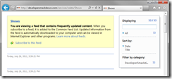
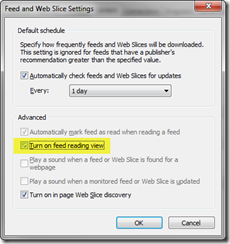
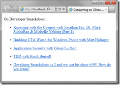
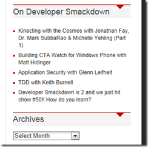

Years ago I worked on a team where we were charged to create a proper services based architecture to service the vast amount of internal and external customers we serviced. I worked for a large financial institution and some of our services were going to service over 500 different customers.&#160; As you can imagine the majority of our first release was a lot of underlying architecture goo.&#160; We had an initial set of operations we were going to ship with. When we shipped V1 everything worked really well. 

As the services started to grow in popularity we quickly realized we were being turned into the the "custom operation business" based on needs we couldn't predicted. The data was usually somewhat the same, maybe things changed with their authorization policy but all of the new requests were getting were just different pivots on the same thing. We were quickly headed down a rat hole we just didn't anticipate. It wasn't anything we did wrong or something we could have anticipated back then. In fact our customers were using it and wanting to use more of it. Our SOA dream was coming true but we couldn't scale just having releases of new operations. Of course no one on the team was ever going to create the mystical _JustDoItMethod_ that takes some magic string, and unleash a mess load of magic.

## Hello OData

OData actually helps solves this exact problem. I personally like to think about [OData](http://odata.org) as exposing the data in a way that your customers can just query it using REST. This means you can let the consumer make the decisions on how to consume your data. You decide what to expose, security, add operations, etc. It puts you in the business of exposing data and letting your customers choose what exactly they want. 

## The Setup and Producers

Before we dive into the code, let's take a moment and set some context. Since this post is more about the consumer than the producer I am just going to use an already OData service we have exposed on [Developer Smackdown](http://developersmackdown.com/). We decided to produce an OData service not only for ourselves but for the greater community. This is of course one of our programmatic interfaces into [Developer Smackdown](http://developersmackdown.com/). It affords us not to be in the business of producing one off endpoints for every new need we come up with. We've always wanted to&#160; expose the data but have no clue how people would end up using it. Having said that, it's no our only service endpoint, we do use [WCF WebAPI](http://wcf.codeplex.com/) too for a few things too.

Let's take a brief look at our service. You will find the root of our [Developer Smackdown](http://developersmackdown.com/) services here: [http://developerSmackdown.com/services/odata](http://developerSmackdown.com/services/odata) If you're using Internet Explorer, when you browse to an entity off that URL you might see the default Reading View experience.

You can change that to the raw view by going to **_Internet Options -> Content -> Feeds and Web Slices Settings -> Uncheck Feed Reading View_**&#160;

We basically have 3 entities hanging off that URL:

*   _Keywords _- These are the tags for the shows.*   _Podcast_ - Current list of podcasts, although we only have one at the moment.*   _Shows_ - Listing of shows per podcast.  

&#160;[OData.org has a number of producers listed](http://www.odata.org/producers) like Netflix listed for you to consume. These services are great especially when your learning how to consume an OData service. 

## The Basics of Consuming

On of the best parts about OData is how you consume it. I have a few different sites out there and I really wanted to have those sites showcase things like the latest show on Developer Smackdown.&#160; I have two scenarios that I want to explore today; consuming from WebMatrix and consuming from jQuery. [ClarkSell.info](clarksell.info) is just my generic landing page for informational things about me. On it, I would like to add the latest show somewhere and some links. [csell.net is my blog](http://csell.net) and I would like to list the last 5 shows and some links. 

Before we get there, let's explore the service by querying it just in a browser or something like [Fiddler](http://www.fiddler2.com/fiddler2/). So let's ask it questions:

*   Give me all shows: [http://developersmackdown.com/services/odata/Shows](http://developersmackdown.com/services/odata/Shows)*   Give me the count of all shows: [http://developersmackdown.com/services/odata/Shows/$count](http://developersmackdown.com/services/odata/Shows/$count)*   Give me a specific show ( in this case show 54 ): [http://developersmackdown.com/services/odata/Shows(PodcastId=1,ShowId=54)](http://developersmackdown.com/services/odata/Shows(PodcastId=1,ShowId=54) "http://developersmackdown.com/services/odata/Shows(PodcastId=1,ShowId=54)")*   Give me just the Title, Description and URI, for show 54:[http://developersmackdown.com/services/odata/Shows(PodcastId=1,ShowId=54)?$select=Title,Description,PublicUri](http://developersmackdown.com/services/odata/Shows(PodcastId=1,ShowId=54)?$select=Title,Description,PublicUri "http://developersmackdown.com/services/odata/Shows(PodcastId=1,ShowId=54)?$select=Title,Description,PublicUri")*   Give me the keywords for show 54: [http://developersmackdown.com/services/odata/Shows(PodcastId=1,ShowId=54)/Keywords](http://developersmackdown.com/services/odata/Shows(PodcastId=1,ShowId=54)/Keywords "http://developersmackdown.com/services/odata/Shows(PodcastId=1,ShowId=54)/Keywords")*   Give me all Keywords: [http://developersmackdown.com/services/odata/Keywords](http://developersmackdown.com/services/odata/Keywords "http://developersmackdown.com/services/odata/Keywords")*   Give me all shows for the Keyword Kinect: [http://developersmackdown.com/services/odata/Keywords(41)/Shows](http://developersmackdown.com/services/odata/Keywords(41)/Shows "http://developersmackdown.com/services/odata/Keywords(41)/Shows")*   Give me Only Show 54 including all of it's keywords: [http://developersmackdown.com/services/odata/Shows(PodcastId=1,ShowId=54)?$expand=Keywords](http://developersmackdown.com/services/odata/Shows(PodcastId=1,ShowId=54)?$expand=Keywords "http://developersmackdown.com/services/odata/Shows(PodcastId=1,ShowId=54)?$expand=Keywords")*   Give me the latest show: [http://developersmackdown.com/services/odata/Shows?$orderby=ShowId%20desc&$top=1](http://developersmackdown.com/services/odata/Shows?$orderby=ShowId%20desc&$top=1)*   Give me the latest 5 shows: [http://developersmackdown.com/services/odata/Shows?$orderby=ShowId%20desc&$top=5](http://developersmackdown.com/services/odata/Shows?$orderby=ShowId%20desc&$top=5 "http://developersmackdown.com/services/odata/Shows?$orderby=ShowId%20desc&$top=5")*   Give me a list of shows orderedby show id, take the top 1 and just give me the Title, Description and PublicUri:&#160; [http://developersmackdown.com/services/odata/Shows?$orderby=ShowId%20desc&$top=1&$select=Title,Description,PublicUri](http://developersmackdown.com/services/odata/Shows?$orderby=ShowId%20desc&$top=1&$select=Title,Description,PublicUri "http://developersmackdown.com/services/odata/Shows?$orderby=ShowId%20desc&$top=1&$select=Title,Description,PublicUri")  

I think you can start to get the idea.&#160; Now all of those results were XML but what if I wanted JSON. Let's open up Fiddler and add a new request header telling the server to accept JSON
  > [http://developersmackdown.com/services/odata/Shows(PodcastId=1,ShowId=54)](http://developersmackdown.com/services/odata/Shows(PodcastId=1,ShowId=54) "http://developersmackdown.com/services/odata/Shows(PodcastId=1,ShowId=54)")
> 
> User-Agent: Fiddler      
> Host: developersmackdown.com       
> accept: application/json  

That will easily give us a JSON result. Now there is another way to get JSON but it "could" be a bit more involved. The OData spec itself supports a JSONP format meaning rather than setting the accept header we should be able to add $format=json to the url be returned JSON without needing to change the request headers. Let's make a the same call this time also passing the format on the URL rather than the accept header.
  > [http://developersmackdown.com/services/odata/Shows(PodcastId=1,ShowId=54)?$format=json](http://developersmackdown.com/services/odata/Shows(PodcastId=1,ShowId=54)?$format=json)  

* If you hitting another .NET OData Service and $format didn't work,it's because JSONP wasn't enabled. More on this in a bit.

## Consuming from jQuery 

Let's take what we've talked about so far and start to apply this to my blog. What I would like to do is actually have a little section on the aside that will display the last 5 shows on Developer Smackdown. Nothing special just a bit of jQuery and some links. First let's build a simple query. I just need the ShowId, Title and URI for the past 5 shows. I also want the return to be in JSON. 
  > [http://developersmackdown.com/services/odata/Shows?$select=ShowId,Title,PublicUri&$orderby=ShowId%20desc&$top=5&$format=json](http://developersmackdown.com/services/odata/Shows?$select=ShowId,Title,PublicUri&$orderby=ShowId%20desc&$top=5&$format=json)  

Now that we have the right query, let's make the actual call and create some markup. While doing this in jQuery is rather easy it will take a bit of prep work. Since this will end up being a cross domain call, I needed to setup JSONP on my OData service. To do so, I would suggest checking out these two resources:

*   [Adding support for JSONP and URL-controlled format to ADO.NET Data Services](http://blogs.msdn.com/b/pablo/archive/2009/02/25/adding-support-for-jsonp-and-url-controlled-format-to-ado-net-data-services.aspx)*   [JSONP and URL-controlled format support for ADO.NET Data Services](http://archive.msdn.microsoft.com/DataServicesJSONP) <!--EndFragment-->  

Making the call we will use the standard [AJAX utility method jQuery provides out of box](http://api.jquery.com/jQuery.ajax/).
  >   

<Markup/>. This is made really easy by using a [jQuery plugin called Templates](http://api.jquery.com/category/plugins/templates/). I'm not going to cover jQuery Templates here but you can refer to my post [Simple JSON WebService in WebMatrix and JQuery Templates](http://csell.net/2011/06/13/simple-json-webservice-in-webmatrix-and-jquery-templates/) for more detail.&#160; Basically on the callback from the service I am going to take the defined template and merge it with the JSON that was returned. This is what the template definition looks like and the markup:
  >   

The result, is an unordered list of links.

&#160; 

Nothing too fancy but now let's take that same code and integrate directly into an area of the aside on [my blog](http://csell.net/).

## Consuming from WebMatrix

While you could do exactly the same thing in WebMatrix there is an easier way. One of the best parts about [WebMatrix](http://asp.net/webmatrix) is this idea of "Helpers". Helpers are these reusable bytes of code that you can either build for your own consumption or publish as part of the larger community for others to use. You can find these helpers on [NuGet](http://nuget.org/) and were going to use the [OData.Helper](http://nuget.org/List/Packages/OData.Helper). 
  > _"The OData Helper makes it easy to write queries against OData-enabled services with the minimum amount of code."_  

For this example were going to add a section to [ClarkSell.info](http://clarksell.info/) that has the details of the latest Developer Smackdown show.&#160; Like such:

Not really much different than our jQuery example, but this time we're going to use the OData.Helper to facilitate the call. For our query, lets just query for the latest show and grab all the details:
  > [http://developersmackdown.com/services/odata/Shows?$orderby=ShowId%20desc&$top=1&](http://developersmackdown.com/services/odata/Shows?$orderby=ShowId%20desc&$top=1& "http://developersmackdown.com/services/odata/Shows?$orderby=ShowId%20desc&$top=1&$select=Title,Description,PublicUri")  

To make the call we are going to pass that query along to the _Get _method OData.Helper. It will return a List of dynamic objects representing the List of "Shows" in our case. Once we have the show we can then use it in our markup. I decided to create a helper to wrap the functionality to make the call, so it could be reused somewhere else in the site.
  >   

To invoke my helper, I have the call ( @DeveloperSmackdown.GetLatestShow() ) in correct place in my markup. This helper will not only call a function getting the data but it will emit markup to later be placed in the page.
  >   

As a side note, since I have deeper control of the call I actually didn't need to have JSONP enabled on the server for the cross domain call.&#160; It's just treated as a standard web service.

## Summary 

If you've made it this far, hopefully you've gotten a glimpse as to just how flexible a OData service can be. I just had to exposing my data and enabling JSONP. There were no custom operations and as a consumer I got to decide what I wanted rather than be told. We had two calls, one AJAX call using jQuery returning JSON while the other leverage a WebMatrix Helper returning XML. Not only were those two implementations vastly different but we also managed to query the service a number of different ways along this journey.&#160; 

## Resources

*   [WebMatrix Download](http://web.ms/webmatrix)*   [OData.org](http://odata.org)*   [Developer Smackdown OData Services](http://developersmackdown.com/services/odata)*   [Fiddler](http://www.fiddler2.com/fiddler2/)*   [OData protocol by example](http://msdn.microsoft.com/en-us/data/ff478141.aspx)*   [Stephen Walther, Netflix, jQuery, JSONP and OData](http://stephenwalther.com/blog/archive/2010/04/01/netflix-jquery-jsonp-and-odata.aspx)&#160;*   [Adding support for JSONP and URL-controlled format to ADO.NET Data Services](http://blogs.msdn.com/b/pablo/archive/2009/02/25/adding-support-for-jsonp-and-url-controlled-format-to-ado-net-data-services.aspx)*   [JSONP and URL-controlled format support for ADO.NET Data Services](http://archive.msdn.microsoft.com/DataServicesJSONP)*   [jQuery Templates](http://api.jquery.com/category/plugins/templates/)*   [WebMatrix on ASP.NET](http://asp.net/webmatrix)*   [Consuming an OData Service from WebMatrix Gist](https://gist.github.com/1111636)
*   [Consuming an OData Service from jQuery Gist](https://gist.github.com/1111427)