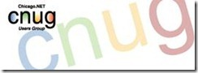

Chicago .NET Users' Group or CNUG is the original User Groups dedicated to the Microsoft .NET Framework and related technologies. Nearly every month since April 2001 .NET developers, architects and simply people interested in the technologie(s) have gotten together to explore .NET. topic. We start each evening with food, beverages and some socializing/networking and then explore various topics for 1 to 2 hours. 

**You can find more at: **[**http://www.cnug.org**](http://www.cnug.org)

## When:
  > Every 3rd Wednesday of the month.  

## Where:
  > Microsoft Downers Grove
> 
> 3025 Highland Parkway     
> Downers Grove, IL 60515  

## Who:

Keith Franklin ' [http://www.linkedin.com/in/keithfranklin](http://www.linkedin.com/in/keithfranklin)

Keith is a Software Architect dedicated to Microsoft technologies based in Illinois. Since 1995 when Keith attended a number of post graduate programs at DePaul University he has been dedicated to consulting companies using Microsoft technologies and sharing with the developer communities. He started as one of the co-founders of Empowered Software Solutions which later became the Chicago office of Magenic Technologies. Both firms 100% committed to Microsoft development platforms. When .NET was just in beta he authored one of the earliest books on .NET as well as contributed articles for various publications. He started CNUG in April 2001 and soon after was one of the founding board members of INETA. He has assisted many companies with .NET related initiatives bringing the technology and the business together. Keith is very proud that when Bill Gates launched the very 1st version of .NET back 10 years ago the customer slide included one of Empowered Software Solutions and Keith's clients.