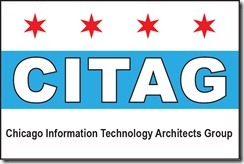

The Chicago Information Technology Architects Group was founded with the goal to unite various technical architecture competencies into a community for collaboration and knowledge sharing. The group is for people to meet their peers and share some stories and ideas. Information technology architects and those aspiring to understand information technology architecture better will enjoy the group.

**You can find more at: **[**http://chicagoinformationtechnologyarchitectsgroup.com**](http://chicagoinformationtechnologyarchitectsgroup.com)** **

## When:
  > Every 3rd Tuesday of the month.  

## Where:
  > TechNexus
> 
> 200 S Wacker Dr., Suite 1500      
> Chicago, IL 60606  

## Who:

### Tim Murphy ' [http://geekswithblogs.net/tmurphy](http://geekswithblogs.net/tmurphy)

Tim is a Solution Architect for PSC Group, LLC where he builds systems for clients using a variety of Microsoft technologies. Having a father who had been in IT since the late 1960's destined him to the life of code and IT shenanigans. Keeping up with as many new products as possible, blogging and speaking takes up most of his spare time when not enjoying spending time with his wife and two boys. Once in a while though he does manage to fit a little time in for photography.&#160; Recent technologies obsessions include Windows Phone and SharePoint.

### Carl Franklin

Carl is an accomplished Microsoft based solution architect with several years of Java based experience and co-founder of Triton-Tek, a Chicago based consulting group with offices in Chicago and Chandigarh, India. With 16 years of hands on development experience he brings a diverse technical background to provide balanced architecture and application design. Carl has spoken for the Illinois Technology Association and nominated for an ITA award in 2003\. Current interests involve how to bring multi-platform mobile to the enterprise and incorporating cloud services to increase IT efficiency. Carl is a co-founder of the Chicago IT Architects Group and a member of IASA, the software architect's professional organization.