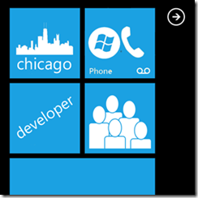

We are a group of professionals and students, residing in the Chicago area, who develop or plan to develop apps for Windows Phone 7\. If you are or would like to develop for the Windows Phone Marketplace then this is the group for you.
The group provides knowledge sharing, an exchange of ideas, and professional networking at monthly meetings. Most meeting will have both structured and unstructured elements. The structured portion will usually consist of presentations and technical demonstrations. The unstructured elements provide time for individual and group discussions, personal networking, as well as show-and- tell of your latest or favorite app.

**You can find more at: **[**http://www.meetup.com/Chicago-Windows-Phone-Developers**](http://www.meetup.com/Chicago-Windows-Phone-Developers)

## When:

> First Thursday of every Month

## Where:

> TextNexus
> 
> 
> 200 S Wacker
> 
> 
> 15th Floor
> 
> 
> Chicago, IL 60606

## Who:

**Lawrence Delby**

Larry is an independent software developer with 35 years of experience. His company Logic Development, Inc. is now 100% focused on developing applications for the Windows Phone 7 Marketplace.

&nbsp;

**Henry Schwenk ' http://triton-tek.com**

Henry is a Partner & Technology Consultant at Triton-Tek, Inc.

&nbsp;

**Matt Hidinger ' **[**http://matthidinger.com**](http://matthidinger.com)** ' **[**@MattHidinger**](http://twitter.com/matthidinger)

Matt is a software developer, speaker, blogger, and open source lover. He works at [Clarity Consulting](http://claritycon.com/) currently focusing on ASP.NET MVC, Silverlight, and Windows Phone. He can be found on twitter [@MattHidinger](http://twitter.com/matthidinger), blogging at [http://matthidinger.com](http://matthidinger.com), working on various [open source projects](http://www.matthidinger.com/articles/projects.aspx#opensource), and [participating in the local community](http://www.matthidinger.com/articles/community.aspx). In his free time he has enjoyed building two apps for the Windows Phone Marketplace: [CTA Watch](http://www.matthidinger.com/articles/projects.aspx#apps) and [Transit Directions](http://www.matthidinger.com/articles/projects.aspx#apps), and is a Microsoft MVP in Windows Phone Development.