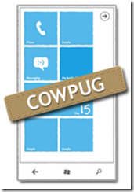

  

The Central Ohio Windows Phone User Group (COWPUG) has been established to nurture knowledge base and collaboration among Windows Phone developers & enthusiasts. While we are primarily based in Columbus OH, developers from all around Ohio, neighboring states and just about anybody who has interest in Windows Phone is most welcome.

With all that's happening in the Windows Phone ecosystem, we needed a dedicated forum to talk about upcoming technologies, architectures & development paradigms around working on the Windows Phone platform. Our focus is both Silverlight & XNA development, so that we appeal to all kinds of Windows Phone developers. We are recognized by INETA & collaborate with other similar User Groups to have some of the best speakers/experts in the Windows Phone space. In all, a great group of passionate Windows Phone developers, geeking out over latest technology & sharing experiences.

**You can find more at: ****<u>http://cowpug.org/</u>**** **

## When:
  > Every 3rd Monday of the month.  

## Where:
  > TechColumbus     
> 1275 Kinnear Road       
> Columbus, OH 43212.  

## Who:

**Samidip Basu** ' [http://samidipbasu.com](http://samidipbasu.com)

Samidip Basu ([@samidip](http://twitter.com/#!/samidip)) is a technologist & gadget-lover working as a Manager & Solutions Lead for Sogeti out of the Columbus Unit. Having worked on WP7 since CTP days, he now spends much of his time in spreading the word to discover the full potential of the Windows Phone platform & cloud-based mobile solutions in general. He passionately runs the Central Ohio Windows Phone User Group ([http://cowpug.org/](http://cowpug.org/)), labors in M3 Conf ([http://m3conf.com/](http://m3conf.com/)/) organization and can be found with at-least a couple of hobbyist projects at any time. His spare times call for travel and culinary adventures with the wife. Find out more at [http://samidipbasu.com/](http://samidipbasu.com/)[.](http://samidipbasu.com/)