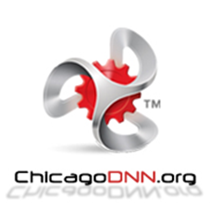

We are the Chicago Area DotNetNuke Users Group and we promote DotNetNuke within the Chicagoland area. If you develop websites or work with website technology then you should know about us.

DotNetNuke is a very powerful Content Management System for developing websites. Great websites in fact...

Our Hosting Sponsor PowerDNN provides food and drink for the evening and we generally have a great discussion about all things web related. You are welcome to attend this free event, contribute to the discussion, ask questions and take off if the conversation no longer is relevant to you.

**You can find more at: **[**http://ChicagoDNN.org**](http://ChicagoDNN.org)

Where you will find links to [Facebook](http://www.facebook.com/group.php?gid=126932446746&ref=ts), [Twitter](http://www.Twitter.com/ChicagoDNN), [LinkedIn](http://www.linkedin.com/groups?mostPopular=&gid=2230575), [Meetup.com](http://www.Meetup.com/ChicagoDNN) and [The DotNetNuke Users Group](http://www.dotnetnuke.com/Community/UserGroups/tabid/1074/view/1/id/798/Default.aspx)

## When:
  > The first Tuesday of the month.  

## Where:
  > We are taking the show on the road this year and plan to rotate venues around the city. Because of member requests, we are going to hold one meeting in Downtown Chicago, one meeting in the North Suburbs, and then one out in the Southwest Suburbs. Then we will do it all over again starting back downtown. Locations are being determined so check the website for more information.
> 
> Please check the website for current information on when and where the next meeting will be held in 2012.  

## Who:

**Don Gingold** ' [http://SprocketWebsites.com/About](http://www.sprocketwebsites.com/About/tabid/185/Default.aspx)

Don launched Gnu Ventures Company in 1996 to help organizations and businesses initiate and improve their Internet presence. Along with partner Kate Gingold, Gnu Ventures puts a creative spin on their combined skills in programming, graphic arts, copywriting and marketing.

Don and Kate are members of the Naperville Area Chamber of Commerce and between them have served as past chairs or board members of numerous committees. Currently they involved with the Ambassadors, the Business Resource Network and several leads groups. Don has over 25 years experience in applying computers and network technology to business, including pioneering work on the Internet with an international corporation.

**James Nagy** ' [http://SprocketWebsites.com/About](http://www.sprocketwebsites.com/About/tabid/185/Default.aspx)

Jim started developing website solutions with the DotNetNuke® Content Management framework for a national automotive services corporation. For the past few years, Jim and his partner Susan Nagy have been helping companies compete in the global marketplace as J&S Tech Designs, LLC.

James and Susan are members of the Bakersfield Chamber of Commerce as well as the Naperville Area Chamber of Commerce and are involved in several committees including the Ambassadors, the Business Resource Network and several leads groups. He has over 20 years of experience in information technology, software design, user experience programming and executive management.

**Phil Wegrzyn**

Phil Wegrzyn has been a professional developer for over 22 years, progressing from a mainframe assembler programmer to a web developer and technical consultant with a Chicagoland fortune 50 company.

For the past 5+ years he has been working almost exclusively with DotNetNuke®, deploying, administering, and developing DotNetNuke® sites to handle a wide array of complex functionality on intranet, extranet and internet-facing DNN sites. Phil has also provided training, technical guidance and development services to organizations implementing DotNetNuke® as their CMS.