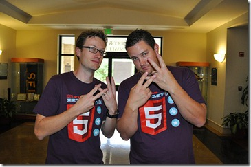

I've now been at Microsoft almost 7 years. When I started, I honestly didn't think I would even make it 5\. I've meet a lot of great people, traveled to some cool and not so cool places. I've meet Bill Gates, Steve Ballmer hugged me and I have made a number of *very* close friends. Like most, I have a few "war" buddies who share a few of the same "battle" scares.

2 year's ago I meet this hipster from Austin by the name of Brandon Satrom. If you know us, then you know for the past two years we've worked pretty damn close together. We've had a lot of fun and meet some awesome people. We've covered most of the central region telling bad jokes and trying to spread some web love. From creating a few open source projects, writing articles, speaking, to even throwing our own conferences. We've managed to accomplish a few things in such a short amount of time. Together, I even think we've managed to change Microsoft to be just a little better than it was two years ago.
  > Today was his last day at Microsoft.&#160;  

Yea that sucks... I would be lying if I said it didn't bother me, cause it damn sure does. It's not because he made the choice to move on. I get it. If I we're in his position, it would have been a very difficult for myself. For the past couple of months now ( or so it seems ), Brandon's confided in me, as he worked through this. We spent many many hours talking about jobs, careers, job attributes and so on. It feels like it's been a long two months.&#160; 
  > Why do I say this?  

The past two months have reminded me to look at oneself and run the chkdsk. WTF are you doing? Why are you doing it? Is it aligned with you? Are you having fun? Etc. For me ( and I know Brandon too ) there are a few common threads which help keep one grounded. I wanted to share:

*   **Family and health are first.**  > I have worked my ass off, and at times at the cost of my family. **I will not do it anymore.** Does that mean I will not work hard, no, not at all. But it does mean, **family and health are always first** and I will say no without feeling bad. When I first started at Microsoft ( week one ) I got put in a position with my wife. I will never forget a teammate of mine, Ben told me, **"There are things you can do one time, anytime, and things you can do one time, and one time *only*."** I don't think he meant to be inspirational but rather help me make a decision but damn it stuck and stuck hard. 
> 
> Your daughter will never have another first birthday, your son will only have one first goal in soccer. They will never forget that you were not there to be part of that achievement.  

*   **Follow your passion.**  > I have done a lot of different things over my career. Sometimes the thing I was doing, wasn't really good for my career. I was good at it but it wasn't what I was really passionate about it. Sure we may have succeeded as a team but it was at the cost of me. Don't feel bad for being greedy. Stay true to who you are and if you don't know, start doing some soul searching.  

*   **Manage your career.**  > Look if you don't, then someone else will. Don't look back and regret it. No joke, Scott Guthrie many many moons ago ( before I came to Microsoft ) asked me to join the ASP.NET team. I turned him down, I regret not at least exploring the offer. I doubt I would have gotten he job, **but you fail at 100% of what you don't even bother trying**.  

*   **Lastly, have fun... **  > If you're not having fun, it's time for a change. Life is to short to wake up every morning and be miserable. There is so much negativity in our career already, why have more.  

Yours may be different but have you run chkdsk lately? Are you caught up in the grind? 
  > Back to Brandon...  

He might be leaving Microsoft, but we're still going to work together. Your career is bigger than the job you're currently in. I wish him the best of luck in his new role and ironically he will be working with Chris Sells. 

Since I don't live in Austin, and can't take him out for a beer, we had a virtual one over Skype. Ok we really drank beer just not alone. We decided to hit the ole record button too. You can find us rapping about career stuff on [Developer Smackdown](developersmackdown.com/Archives/Show/64).

**Brandon, thank you for pushing me, thank you for listening to me bitch, and thanks for the laughs. We're still just getting started. **