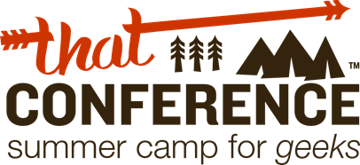

After over a year of planning, tickets finally go on sale tomorrow for That Conference. I wanted to just take a quick moment and answer some potential questions you might have before tomorrow.

## Tickets

Tickets will be on sale tomorrow at **8:13am CST for $349\. **We're not doing any early birds, discounts, blaa, blaa, blaa. That $349 covers you for breakfast, lunch, swag and a few other things that we will announce later on. You will purchase tickets through EventBrite at [http://thatconference2012.eventbrite.com/](http://thatconference2012.eventbrite.com/). There is also a link on our home page that will redirect later on tonight.

We expect to sell out rather fast so don't delay. We have a waitlist setup, so if you don't get in, you never know we might just open up more. Our goal is to include everyone assuming we have the staff to handle it.

## Hotel

We have a block rate setup with the Kalahari. You can find more details about it at: [http://thatconference.com/Resources/Travel](http://thatconference.com/Resources/Travel) The discount is a rolling discount so if you desire a different room that is ok, we have you covered. The block is first come first serve. The Kalahari is awesome you can see more about it at [http://www.kalahariresorts.com/wi/](http://www.kalahariresorts.com/wi/).

## Sessions and Speakers Counselors

All of our sessions have been posted to: [http://thatconference.com/Sessions](http://thatconference.com/Sessions). If that wasn't awesome enough we have a few more tricks up our sleeve. We also have our speakers bio's here: [http://thatconference.com/Speakers](http://thatconference.com/Speakers) but we're still setting up that tent in camp. Soon we will have some high res head shoots of our counselors.

## The Schedule

Coming. Honestly we've been so busy getting things ramped up and settled for tomorrow we're just not there. You will not be at a loss for things to do, just start to practice your cannon balls and laser tag skills.

## The Pre-Parties

I am hoping you know by know we're having a number of pre-events going on leading up to the actual conference and they are all free.

### A Date with 8

Are you What's Next? Have you been waiting to dig into Windows 8? Need a little help? Well that time is now. Why not take a little date with 8 and maybe even with a prize along the way? This Thursday and Friday we're having a mini-hackathon leading into [Chicago Code Camp](http://chicagocodecamp.com/).

More details and registration here: [http://adatewith8.eventbrite.com](http://adatewith8.eventbrite.com)

### That Hack ( June and July )

In partnership with [Hackatopia](http://hackatopia.com/) we are running a series of 'American Idol' style hackathons.  Win your city, head off to That Conference and convince the audience you have what it takes to win it all.

*   Chicago - sold out - [http://thatconferencehackchicago.eventbrite.com/](http://thatconferencehackchicago.eventbrite.com/ "http://thatconferencehackchicago.eventbrite.com/")
*   Milwaukee -  [http://thatconferencehackmke.eventbrite.com/](http://thatconferencehackmke.eventbrite.com/ "http://thatconferencehackmke.eventbrite.com/")
*   Madison - coming...
*   Minneapolis - [http://thatconferencehackmsp.eventbrite.com/](http://thatconferencehackmsp.eventbrite.com/ "http://thatconferencehackmsp.eventbrite.com/")

### Midwest Give Camp ( Aug 11th & 12th )

Want to use your awesome tech skills to help a little girl change the world? Check out the Give Camp we are putting on the Saturday and Sunday leading into That Conference. [http://thatconference.com/givecamp](http://thatconference.com/givecamp)

## Stay in The Know

Join our newsletter, signup is right on the front page at [http://thatConference.com](http://thatConference.com).

## Make some noise!

Help us spread the word. We have been using #[thatConference](http://thatconference.com/) as the hashtag on [twitter](http://twitter.com) but that isn't the only way to get involved. We have a Google Group, Facebook and more are all listed here: [http://thatconference.com/Resources/GettingInvolved](http://thatconference.com/Resources/GettingInvolved)

## Sponsors and Partners

Please check out our [partners and sponsors](http://thatconference.com/sponsors). We have been working over the past year to really do something different here in the Midwest. We couldn't do it without the help of everyone.

Are you interested in sponsoring? We're still looking for great partners, all of the details you can find here: [http://thatconference.com/Sponsorship/](http://thatconference.com/Sponsorship/)