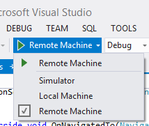
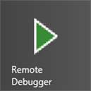
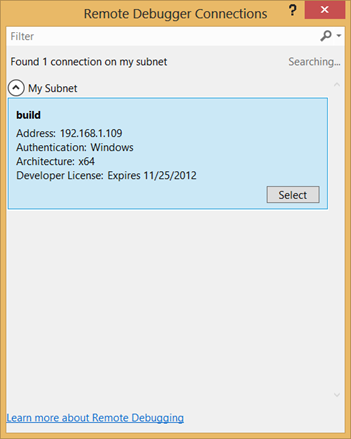
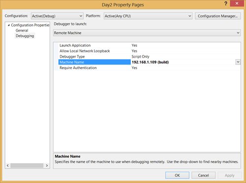
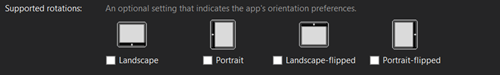
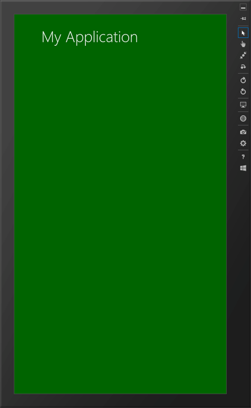
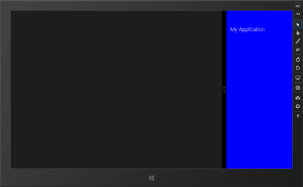
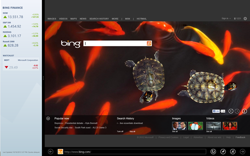

This article is Day #2 in a series called [31 Days of Windows 8](http://31daysofwindows8.com/).  Each of the articles in this series will be published for both [HTML5/JS](http://csell.net/category/windows-8/31-days/) and [XAML/C#](http://www.jeffblankenburg.com/category/31-days-of-windows-8/). You can find all of the resources, tools and source code on our [Website](http://31daysofwindows8.com/).

<figure class="text-center">
    
</figure>

****

# Getting Started

Today we are going to talk about screen sizes, and why they are important to Windows 8 development.  In the first part of this article, we will discuss orientation, and some simple ways we can make our application more useful based on the way our user holds their device.  In the second part, we're going to look at our application in a "snapped" state, and how we might change our interface to accommodate a much smaller screen size.

**Orientation and snap are important because if you don't consider them in your app, your app won't be approved for the Windows Store.**

If you look in the [Windows 8 app certification requirements, in section 3.6](http://msdn.microsoft.com/en-us/library/windows/apps/hh694083.aspx), it reads:

> Your app must support a snapped layout. In landscape orientation, your app's functions must be fully accessible when the app's display size is 1024 x 768\. Your app must remain functional when the customer snaps and unsnaps the app.
What this says is that our application already needs to support three visual states, at a minimum:

* **1024 x 768**(minimum screen resolution & filled state)
* **320 x 768**(snapped)
* Your default resolution that you are planning for, generally **1366 x 768**.
Here's an example of a full screen application moving to a snapped state:

You can see that in this case, we have re-arranged our content to better suit the smaller snapped state.  There is also the opportunity to move your application to a "filled" state, which is represented by the light gray block to the right of our snapped view.

Thankfully, there are some simple ways to recognize which state our application is in, and the rest of this article will be dedicated to showing exactly how this is done.

# Running and Debugging

Before getting started with supporting rotation and snapping lets talk about how we run and debug our apps. Now, if you're anything like me, you like writing your code on a beefy quad-core desktop machine, maybe 8-12 GB of RAM, dual 27" monitors, mouse, keyboard, the whole 9 yards.  Unfortunately, these machines are unlikely to have things like an orientation sensor, and picking up your monitor to change the orientation just isn't going to work.  Thankfully there are three different ways to run your app; your local machine, a simulator ( included ) or a remote machine ( not included ).

**The local machine **option is most likely something you have already tried. Hit run, your application is built, deployed to your machine, and then the Visual Studio Debugger attaches itself and your off to the races. As we said before that option might have some limitations based on what type of hardware your developing on.

**The simulator**. It's exactly that, a **_simulator_**, not an _**emulator**_ like Windows Phone.  This means that it will only simulate the machine you're currently working on, not act as a completely different, fully capable device.  No orientation sensor?  You need another device. So why is it important? Well, as a developer you can do things like fake a touch input, rotate the device and play with different screen resolutions.

And my most favorite option, **the remote machine.** Thankfully, Microsoft has provided a way for us to make this happen on a remote secondary device, much like we do when building Windows Phone applications.  Here's the short story on how it works ([MSDN has the longer, more thorough story](http://msdn.microsoft.com/en-us/library/windows/apps/hh441469.aspx)): You will need install the Remote Debugging Tools on the secondary device.  We're  using a [Samsung Series 7 Slate](http://www.amazon.com/gp/product/B005OUQ9JC/ref=as_li_ss_tl?ie=UTF8&camp=1789&creative=390957&creativeASIN=B005OUQ9JC&linkCode=as2&tag=thomasworthin-20), but any Windows 8 device in a tablet form factor should suffice.  You can [download the Remote Debugging Tools here](http://www.microsoft.com/en-us/download/details.aspx?id=30674).  Make sure you choose the appropriate flavor, x86, x64, or ARM, depending on your device.  To enable Remote Debugging you will have to run the Remote Debugging Tools on the secondary device.  You'll see an icon that looks like this:

Once the Remote Debugger is running on your secondary device, go back to your primary machine and select "Remote Machine" as your target for deployment. When you choose "Remote Machine" for the first time, you will be presented with a dialog box that looks like the image below.  Remember, devices on your subnet will only appear if the Remote Debugger Tools have been installed and are currently running.

Later, when you want to switch devices, you're going to struggle to find where this option is stored.  I'm here, my dear readers, to save you that hassle.    Open up your project properties (Alt + Enter), and choose the Debug tab.  From there, you can change or remove your previous choice.  If you remove the choice, the next time you choose remote debugging, you'll get the dialog box from earlier.

I know what your thinking. There is no way this magic remote debugger will ever work between a domain joined machine and just a tablet you have laying around for testing. Well as it turns out, it works just fine, you will be promoted for your Microsoft Account credentials you have associated with that tablet.

# Supporting Rotation

To get started let's create our almost famous app from the blank template in Visual Studio 2012\. Once created hit run in either the simulator or on a remote machine ( assume for the rest of this article, assume I am running on a remote machine ). You will see your awesome blank app and if you rotate it, the app will in fact automatically rotate as well. Why, How?

By default, all templates in Visual Studio are setup to support all rotations. Remember that package.appxmanifest file? In the Application UI tab you will find a section called _Supported Rotations._ By checking one or more orientation preference you are selecting which orientations your app will support. Again by default we support all.

Depending on your use case, this may be something of value to your apps overall experience. For example, if you're building a game you might only want to support landscape mode.

# Display Orientation

Programmatically we can ask Windows what our current orientation is and even be notified about when it changes. We can do this through an API called [Windows.Graphics.Display.DisplayProperties](http://msdn.microsoft.com/en-us/library/windows/apps/windows.graphics.display.displayproperties.aspx). Below I have have created a very simple function which switches _currentOrientation_ updating an element in the DOM.
    
    function updateDisplayOrientation() {

        switch (Windows.Graphics.Display.DisplayProperties.currentOrientation) {

            case Windows.Graphics.Display.DisplayOrientations.landscape:
                results.innerText = "Landscape";
                break;

            case Windows.Graphics.Display.DisplayOrientations.portrait:
                results.innerText = "Portrait";
                break;

            case Windows.Graphics.Display.DisplayOrientations.landscapeFlipped:
                results.innerText = "Landscape (flipped)";
                break;

            case Windows.Graphics.Display.DisplayOrientations.portraitFlipped:
                results.innerText = "Portrait (flipped)";
                break;

            default:
                results.innerText = "Unknown";
                break;
        }
    }

While my _updateDisplayOrientation_ function is pretty much a foolish example it becomes a bit more useful if we we're to actually hook it up to an event listener. Once our page is "ready" lets add an that eventListener on the "_orientationchanged_" calling our _updateDisplayOrientation_ function.

    ....

    results = document.getElementById("resultText");

    var dispProp = Windows.Graphics.Display.DisplayProperties;
    dispProp.addEventListener("orientationchanged", updateDisplayOrientation, false);

    updateDisplayOrientation(); // call to set the inital state

    ....

Now when we rotate the device, our application should be updating an element on the screen with the state of our orientation.

# Orientation Sensor

Working with the _currentOrientation_ is pretty simple but also limiting to some regards. Devices these days have a multitude of supported sensors. This is also true for orientation and the Windows 8 SDK has provided us with the _SimpleOrientationSensor _found at _Windows.Devices.Sensors.SimpleOrientationSensor. _Unlike our our previous example, the _SimpleOrientationSensor _is an API over an actual hardware sensor so depending on your hardware the following may or may not work.

So, why another way? Great question and one I honestly scratched my head for a bit on this. I have come to my own conclusions it's to support the broadest set of hardware as well as fine grain control when you do have a sensor. Not every machine will have a physical sensor but the _currentOrientation_ will always work.  Now I know what you're thinking. Sure it does, one state, landscape. But that is actually not true. Depending on your graphic card you can actually rotate your monitor and have a different view. For example you could flip a monitor and have it in portrait mode. In this case the _currentOrientation_ would in fact tell you that.

Back to _SimpleOrientationSensor_. Much like before I have setup another switch statement to see what position the sensor is in.

    ....

    switch (e.orientation) {
        case Windows.Devices.Sensors.SimpleOrientation.notRotated:
            results.innerText = "Not Rotated";
            break;

        case Windows.Devices.Sensors.SimpleOrientation.rotated90DegreesCounterclockwise:
            results.innerText = "Rotated 90";
            break;

        case Windows.Devices.Sensors.SimpleOrientation.rotated180DegreesCounterclockwise:
            results.innerText = "Rotated 180";
            break;

        case Windows.Devices.Sensors.SimpleOrientation.rotated270DegreesCounterclockwise:
            results.innerText = "Rotated 270";
            break;

        case Windows.Devices.Sensors.SimpleOrientation.faceup:
            results.innerText = "Face Up";
            break;

        case Windows.Devices.Sensors.SimpleOrientation.facedown:
            results.innerText = "Face Down";
            break;

        default:
            results.innerText = "Undefined orientation " + e.orientation;
            break;
    }

    ....

And of course this is all find and dandy but much more useful if we can wire up to an event notifying us of a change. Like before we will wire up to the _orientationchanged_ event but on our sensor this time. Of course you will want to check just to make sure you in fact have a sensor to even wire up to.

    ....

    results = document.getElementById("resultText");

    var sensor = Windows.Devices.Sensors.SimpleOrientationSensor.getDefault();
    if ( sensor ) {
        sensor.addEventListener("orientationchanged", sensorOrientationChanged);
        results.innerText = "Sensor Found";
    }
    else {
        results.innerText = "No Sensor Found";
    }

    ....

# Snapping

At this point, we have an application that recognizes that device orientation has changed.  That's all well and good for when we want to do something specific _in code_ with orientation, but what if we just want to have our application re-orient itself to be readable/useable to our user?  The responsive web CSS3 have clearly impacted how we design our Windows Store Application layouts. Windows supports four layouts for our application to take advantage of; Landscape, Portrait, Filled and Snapped. We support each of these layouts with [CSS3 Media Queries](http://www.w3.org/TR/css3-mediaqueries/).

**Landscape View.** By default our application starts as landscape. This is maximum real-estate you have, it's your canvas.

    @media screen and (-ms-view-state: fullscreen-landscape)

**Portrait View.** Landscape on its side. What else?

    @media screen and (-ms-view-state: fullscreen-portrait)

**Snapped and Filled View.** Here is where things start to get interesting and creative. In the _simulator_ below on the left hand you see an app in the _filled state _and on the right you can see the application in the _snapped state. **Minimum screen resolution of 1366px x 768px required to support this.**_

    @media screen and (-ms-view-state: snapped)

    @media screen and (-ms-view-state: filled)

This means you can actually run two applications side by side. That also means you may want to reconsider your user experience especially in the snapped view.  Take a look at [Microsoft's Finance Application](http://apps.microsoft.com/webpdp/en-us/app/finance/ffc158e5-74d6-4878-8ace-8f0df45083c1). When your in snapped view, you get your favorites rather than the entire experience.

As I mentioned earlier we do this all through a [CSS3 Media Query](http://www.w3.org/TR/css3-mediaqueries/). In all of our views above you can see we're doing something simple like changing the background-color.

    @media screen and (-ms-view-state: snapped) {
        body {
            -ms-grid-columns: 20px 1fr 20px;

            background-color: blue;
            font-size: large;
        }

        header[role=banner] {
            -ms-grid-columns: 20px 1fr;
        }
    }

# Summary

Today, we took a look at how we can determine the orientation of a user's device, as well as how to use the new LayoutAwarePage item to manage the different visual states our app might encounter.  There are tons of great examples on the web related to orientation and snap, but if there is ONE lesson you take away from today's article, it's this:

**Your application MUST acknowledge the snapped state.  Make sure you accommodate it.**

Tomorrow, we're going to look at the Splash Screen.  You've likely seen something like this before. It's the first thing your users will experience so let's make sure we get it right. See you then. You can get the entire solution and the tools below.

