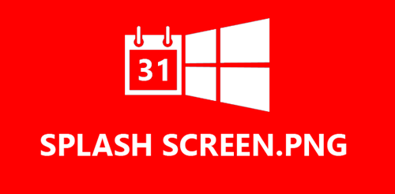
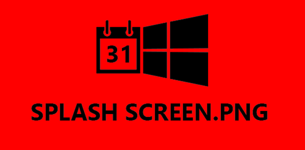
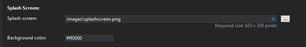

This article is Day #3 in a series called [31 Days of Windows 8](http://31daysofwindows8.com/).  Each of the articles in this series will be published for both [HTML5/JS](http://csell.net/category/windows-8/31-days/) and [XAML/C#](http://www.jeffblankenburg.com/category/31-days-of-windows-8/). You can find all of the resources, tools and source code on our [Website](http://31daysofwindows8.com/).

* * *

Today, we are going to talk about a small, but very important part of the application lifecycle: the splash screen.  Some of you will see this as a silly topic at first, but it's actually incredibly important from a user experience standpoint, and it's the first thing they see.

Let's say, as an example, that your application connects to the internet to collect some data.  Maybe you're a weather app.  Every time the user starts your app, they're going to want up-to-the-second data.  You know that this will generally take 2-3 seconds to grab the data, the appropriate images, and assemble them on your app's page.

What we see happen in many apps is that the app loads empty, almost to a broken-looking page, only to get populated 2-3 seconds later.  By utilizing the splash screen and its events, we can "extend" the splash screen experience, so that our users don't see our application until we're ready for that to happen.  A couple of extra seconds looking at a splash screen is _always _preferable to opening a broken-looking app or one that is just hung.

So, what we will be doing in this article is determining where the original splash screen image was positioned, and replacing it with our "placeholder" splash screen image until our application is appropriately populated.

## Getting Started

If you recall from our article on [Day #1](http://csell.net/2012/11/01/31-days-of-windows-8-day-1-the-blank-app/), the splash screen image is always 620 x 300 pixels.  For this example, we're going to provide you with two versions of this image.  The first is the original red one:

Additionally, we've created an identical version of the image in a but with red and black so that we can see the difference when they are swapped, while still being able to notice if the positioning of the text shifts at all.

Add these two images to your "Assets" folder in a new "blank" project.  If you run that project after replacing the images, you should see the red image for a second or two before your applications loads to our default.html page.

Now you should have noticed your image was presented on that dark grey background color yet our image was 620x300\. There is an easy fix, that's right,,,,,,, the appxmanifest file. Down at the bottom, right under where we set the image to be displayed we can also set the background color. Set it to #ff0000 and rerun.  As you can guess our splash screen logo should be painted over a sea of red. Clearly we're in need of a good designer.

It's also worthy to note, we might really want to use a transparent png here rather than one with a background. We didn't here, just to help illustrate what is all going on.

## Extending our Splash Screen

I guess we should start by asking ourselves, why do we even need to extend the splash screen in the first place? Why not just put that call to the [ESPN API](http://developer.espn.com/) and let the startup take longer? Simple, you won't pass the store certification. [Section 3.8 states](http://msdn.microsoft.com/en-us/library/windows/apps/hh694083.aspx#acr_3_8), that your app must launch in less than 5 seconds. We can get around this policy by "extending the splash screen", essentially fooling our users to think they are actually on the splash page when if fact they are on our landing page. Sneaky us.

We do this by basically showing and hiding a div on our default page. No really, that's all. Let's create a blank project to get started. The first thing we need to do is create that div. The only purpose for this element is to build up and control the resemblance of a splash screen but on our default page. Below I am creating that div, giving it an id and class that we can control later.
<pre class="prettyprint">

    

</pre>
You can see that our div has a reference to our second splash screen image in our case the red and black one.

## The JavaScript

Clearly we need some JavaScript to make this all happen. Essentially what we want to do is:

*   Hook into our app's activation
*   Grab the splash screen object, so we can to things like the location of it on the screen.
*   Show our image
*   Hook into a few events
We want to tie into our applications launch and even the blank template has our PLM or process lifecycle management code shelled out.  During launch, we're going to grab the splash screen object off the args passed in _args.detail.splashscreen_. Once we have that, then we can grab it's screen coordinates for later. Why? Well we need those coordinates so we can position our image exactly in the place as the old one. Once we have that we show the show the div, more on that in a second.
<pre class="prettyprint">var _splash,
    _coordinates = { x: 0, y: 0, width: 0, height: 0 };

app.onactivated = function (args) {

    if (args.detail.kind === activation.ActivationKind.launch) {

        _splash = args.detail.splashScreen;
        _coordinates = _splash.imageLocation;
        ExtendedSplash.show(_splash);

        window.addEventListener("resize", onResize, false);
        _splash.addEventListener("dismissed", onSplashScreenDismissed, false);

        args.setPromise(WinJS.UI.processAll());
    }
};</pre>
We also want to hook into at two different events, resize and dismissed. Resize addresses the scenario where the user of our application might actually snap the application during launch. If they do, we need to be aware of that, and grab the splash screens new coordinates. Secondly we might want to hook into the dismissed event as a way to either interact with the screen a bit more and/or well end our splash screen..

## - sidebar - Namespaces

Something I haven't covered yet is namespacing our objects in JavaScript. The JavaScript that we write for our apps is ECMA Script 5 compliment. We're also forced to use strict mode, aka pragma _'use strict'_. This is a good thing. strict mode helps us keep the rails on our JavaScript while setting us up for EcmaScript 6\. Because of this we need to namespace our function such that we can call them from other JavaScript objects while not polluting the global namespace.

To do this we can use WinJS. Below you will see I am exposing a public name to it's private function. In the code above, this is where ExtendedSplash came from.
<pre class="prettyprint">(function () {
    "use strict";

    WinJS.Namespace.define("ExtendedSplash", {
        show: show,
        [publicFunction]: [privateName],
        [publicFunction]: [privateName]
    });
})();</pre>
Get very used to typing that code above. You will be doing it a lot. Snippets FTW!!!

## Show Me

The ExtendedSplash splash object in which we referenced earlier is just a little helper object I created to use across my different projects. During activation we called it's show function and passed along the splash screen object.

As I mentioned earlier, we have to overlay our image over the splash screens image and we do this through some JavaScript manipulating the DOM's elements and their associated CSS. Simply put:

*   Get the element of our "extended splash screen"
*   Using CSS add set that elements top, left, height and with to what the splash image was originally set.
*   Remove our CSS class that was hiding the div in the first place
<pre class="prettyprint">function show(splash) {
    var extendedSplashImage = document.querySelector("#extendedSplashImage");
    position(extendedSplashImage, splash);

    WinJS.Utilities.removeClass(extendedSplashScreen, "hidden");
}

function position(element, splash) {
    element.style.top = splash.imageLocation.y + "px";
    element.style.left = splash.imageLocation.x + "px";
    element.style.height = splash.imageLocation.height + "px";
    element.style.width = splash.imageLocation.width + "px";
}</pre>
Now that we can show, we of course have to add the ability to remove ( like our starting state ) and update when things are snapped for example. To remove, we're just adding back our CSS class to hide.
<pre class="prettyprint">function remove() {
    if (isVisible()) {

        var extendedSplashScreen = document.querySelector("#extendedSplashScreen")
        WinJS.Utilities.addClass(extendedSplashScreen, "hidden");
    }
}

function isVisible() {
    var extendedSplashScreen = document.querySelector("#extendedSplashScreen");
    return !(WinJS.Utilities.hasClass(extendedSplashScreen, "hidden"));
}</pre>
Update is really nothing more than calling show again.

## Style It

I'm not going to walk through in detail the CSS but I do want to cover it at the high level. Nothing below should surprise you, we're going to hide the div and absolute position things from JavaScript as you have already seen. Simple enough.
<pre class="prettyprint">.extendedSplashScreen {
    background-color:#ff0000;
    height: 100%;
    width: 100%;

    position: absolute;
    top: 0px;
    left: 0px;
}

.extendedSplashScreen.hidden {
    display: none;
}

#extendedSplashImage {
    position: absolute;
}</pre>

## Class Splash Dismissed

Our next step is to subscribe to the event handler for when the Splash Screen is dismissed.  This allows us to hide our extended splash div and "start" our app. Now we already registered for the dismissed event when your app was activated.  Inside of dismissed we could just call our remove method and carry on our way.
<pre class="prettyprint">function onSplashScreenDismissed() {

    ExtendedSplash.remove();

}</pre>
But what fun is that? We should really show some awesome ad like this. Feel free to use it in your blog posts of course. Royalty free even!

To do so, we're just going to extend our original div just a bit to include that awesome image and let's add a button below it to continue on.
<pre class="prettyprint">

    
        
       
    <button class="action" id="learnMore">continue</button>

</pre>
Next we will update our _OnScreenDismissed_ function to account for the new "continue" button.
<pre class="prettyprint">function onSplashScreenDismissed() {

    document.querySelector("#learnMore").addEventListener(
        "click", ExtendedSplash.remove, false);

}</pre>
And like that, we have no created one of the worst looking extended splash screens. Why show this? It's your canvas, it's your features and customers. The hooks are there for you to be creative but use your creativity wisely. Forcing a user to click continue just to use your app is terrible. Telling your user your fetching a feed, might be welcoming.

## Summary

In short, the splash screen can be your friend and a very powerful tool.  It becomes a temporary veil to hide some of your applications startup work until it's ready.  It's a highly valuable piece of app real estate, and we definitely think it's something you should consider taking advantage of in every application.

Tomorrow, we're were diving into WinJS and some of the UX controls that it has to offer us. But that's tomorrow. To download the entire sample solution from this article, you can download it from below.

