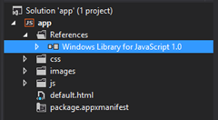
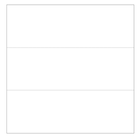
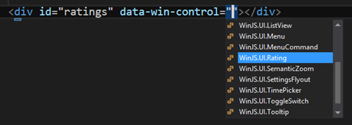
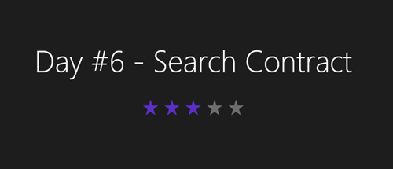
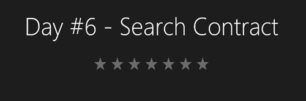
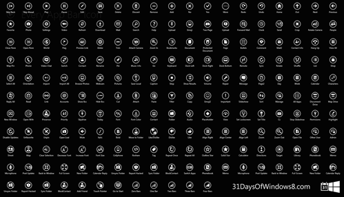

This article is Day #4 in a series called [31 Days of Windows 8](http://31daysofwindows8.com/).  Each of the articles in this series will be published for both [HTML5/JS](http://csell.net/category/windows-8/31-days/) and [XAML/C#](http://www.jeffblankenburg.com/category/31-days-of-windows-8/). You can find all of the resources, tools and source code on our [Website](http://31daysofwindows8.com/).

* * *

When [Jeff](http://jeffblankenburg.com) and I put together the list of topics for this series, today got picked as "controls". Now for those XAML lovers out there, this is something that makes complete sense but if you're a web guy like me the word controls isn't really a native word in our tribe. We talk in terms of elements in the DOM and now with html5, semantic elements.

Before we start exploring some of these so called controls, I really should back up and explore just how HTML5 fits into this new landscape. The last couple of days we've dipped out toe into things but we really haven't talked HTML5.

By now I am assuming you at least know, that now with Windows 8 you can write a "native" app for the Windows Store. I put native in quotes only because it's not running against the bare metal like C++ might. Our HTML5 apps actually run on the same JavaScript and rendering engines that IE10 does.

## HTML5 FTW

HTML5 is kind of a big deal today in the web space. HTML5 isn't by itself one thing it's really a reference something that amounts to more than 100 specs. Amongst all this are, things like:

*   New elements such as the new semantic tags; section, article, header and footer
*   New attribute schemes like data-
*   Awesome new features in CSS3 like media queries.
*   Strict Mode in ES5
Now I am just naming a few awesome features in what is really a huge toolbox of awesome. Windows 8 and furthermore the JavaScript and rendering engines for IE 10 have added an enormous support for features that make up what we call HTML5\. A great proof point of this, was seen in yesterday's article with media queries. It's the foundation for how we deal with our screen options in Windows 8.

As web developers, this is honestly very exciting. This means the skills you\me\we have built over the years are now applicable on a whole new platform. There is even opportunities to share your code between the different implementations.

Short story.  HTML5 rocks, it's now "native" to Windows 8 and we web developer can continue to rule the world. Make sure to tell your friends.

## - sidebar -

It's important to not that some HTML and DOM API's behavior different than when they are in the browser. You can find a detailed list of those difference [here](http://msdn.microsoft.com/en-us/library/windows/apps/Hh700404.aspx). HTML is an evolving specification and different parts are getting approved at different points in times. This means our browsers are moving as well. To effectively write cross browser\platform code we need to understand this notion of  feature detection. If your unfamiliar with feature detection I would highly suggest reading the following two articles:

*   [No Browser Left Behind: An HTML5 Adoption Strategy](http://msdn.microsoft.com/en-us/magazine/hh394148.aspx)
*   [Same Markup: Writing Cross-Browser Code](http://blogs.msdn.com/b/ie/archive/2010/04/14/same-markup-writing-cross-browser-code.aspx)

## Introducing WinRT and WinJS

Now we all know that Windows is clearly much more than just a browser. With the release of Windows 8 a new framework was also released called [WinRT](http://msdn.microsoft.com/en-us/library/windows/apps/br211377.aspx). In short [WinRT](http://msdn.microsoft.com/en-us/library/windows/apps/br211377.aspx) is a number of APIs who provide access to all of the core features of the platform. These API's are things like [devices sensors](http://msdn.microsoft.com/en-us/library/windows/apps/windows.devices.sensors.aspx) and [pickers](http://msdn.microsoft.com/en-us/library/windows/apps/windows.storage.pickers.aspx). These API's are exposed to C++, .NET and JavaScript. There is one set of API's across all and through something called the projection, they are exposed in a way that feels native to the language being used.

Next up, something called WinJS. Let's start with stealing a definition straight from Microsoft:
> The Windows Library for JavaScript is a library of CSS and JavaScript files. It contains JavaScript objects, organized into namespaces, designed to make developing Windows Store app using JavaScript easier. Windows Library for JavaScript includes objects that help you handle activation, access storage, and define your own classes and namespaces. It also includes a set of controls. [http://msdn.microsoft.com/en-us/library/windows/apps/hh465493.aspx](http://msdn.microsoft.com/en-us/library/windows/apps/hh465493.aspx)
When I got started with Windows 8, I struggled with why I even needed it. After all we have build some pretty amazing Websites for years with out some new library. In fact at first glance you might think of this as some jQuery replacement but really it's not that at all. In fact, you can freely use jQuery, jQuery UI, or my favorite Knockout.JS ( that's for you [Ryan N.](http://www.knockmeout.net/) ).

What WinJS is, is important. In fact, really important. Us web developers have been exposed to a new world with is mobile development. I am not talking trying to create a responsive page that adapts to a smaller screen size but an actual native app running on a mobile device. **Warning** it's different, yet scary familiar. There are things we need to account for in our apps, like the overall application lifecycle. Sure we have done this some with a web application but here we need to be mindful of how our apps get started, when they get killed and like you saw yesterday things like namespaces. WinJS is here for us.

WinJS also provides a set of UI "controls" and and style sheets that give us a consistent Metro Windows Store App theme. So you might be thinking, is Microsoft introducing some new elements into the DOM and playing games with the rendering engine. NO. I started this article by talking about the importance HTML5 has in our web and Windows world they implement these controls by taking advantage of an [HTML5 feature typically referred to as data-](http://www.w3.org/TR/2011/WD-html5-20110525/elements.html#custom-data-attribute). More on that later.

## Setup and Style

Every project HTML5\JavaScript Visual Studio template starts out already setup to use WinJS. This includes a "reference" to a version of WinJS, in our case 1.0\. Create a blank app and take a look in your Solution Explorer.

After creating your blank app, open Default.html. You will see right at the top, we (really) reference the WinJS libraries.
<pre class="prettyprint"><link href="//Microsoft.WinJS.1.0/css/ui-dark.css" rel="stylesheet" />

</pre>
By hitting run you should see a dark blank app. If dark isn't your deal then switch to light.
<pre class="prettyprint"><link href="//Microsoft.WinJS.1.0/css/ui-light.css" rel="stylesheet" /></pre>
Take note of the // in the reference.  This is a special syntax we use to reference built in libraries which are part of the core system and not in fact in our project structure.

## Layout

Before getting into a couple of controls, let's talk about layout. We have a number of different CSS layouts such as [multi-column](http://ie.microsoft.com/testdrive/Graphics/hands-on-css3/hands-on_multi-column.htm), [flexbox](http://ie.microsoft.com/testdrive/Graphics/hands-on-css3/hands-on_flex.htm), and [grid](http://ie.microsoft.com/testdrive/Graphics/hands-on-css3/hands-on_grid.htm). We could even use some open source frameworks like [Twitter's Bootstrap](http://twitter.github.com/bootstrap/) ( although I haven't tried that yet on Windows 8 ). Recently a new spec was added to HTML5 called [CSS Grid](http://www.w3.org/TR/css3-grid/). You can think of the CSS Grid as the ultimate table layout that we have been waiting for for years. In fact if you have done any XAML and worked with the Grid Control, this will feel similar.

The notion is simple, you define a series of columns and rows, both relative and\or fixed. Then you reference those rows accordingly. Let's create the *very* simple grid that you should have seen by now in my sample projects. In this case we're going to create a simple one column, 3 row layout. I want all rows\columns to be equally spaced. We define them using _grid-columns_ and supplying either our fixed or relative sizes.
<pre class="prettyprint">body {
    width: 100%;
    height: 100%;

    display: -ms-grid;
    -ms-grid-columns: 1fr;
    -ms-grid-rows: 1fr 1fr 1fr;
}</pre>
&nbsp;

This will produce the following grid layout.

With out grid defined, we can easily use CSS to select our elements and position them accordingly. Rows and Columns are 1 based so if we wanted to put our element of ID content in the middle, then we would select column 1 and row 2 as seen below.
<pre class="prettyprint">#content {
    -ms-grid-column: 1;
    -ms-grid-row: 2;

    text-align: center;
}</pre>
While the CSS Grid isn't _THE_ answer to your all of your layout needs, it's very powerful and easy to use. You can easily nest grids in grids and create some pretty complex yet awesome layout structures.

The IE team released released something called [Hands On CSS3](http://ie.microsoft.com/testdrive/Graphics/hands-on-css3/), which is a series of pages allowing you to easily mess around with the different CSS3 Specs like the [Grid](http://ie.microsoft.com/testdrive/Graphics/hands-on-css3/hands-on_grid.htm). They are a great way to play around live without messing up your own site or app.

## Our First Control

So far, I have tried to laid out how this all fits together for the web developer. Getting your head around some of this foundational stuff will take a bit, but it's time well spent. Earlier we very briefly introduced WinJS and what it offers. one of those things are these [user interface controls](http://msdn.microsoft.com/en-us/library/windows/apps/hh465453.aspx). We can use these controls by adding the appropriate _data-_ attribute. As you see below we're going to use the attribute _data-win-control_ and then set it to the the control we want to use. For simplicity sake lets add the rating control.

Our end result is adding a rating control under some header that we centered in the screen.
<pre class="prettyprint">

        <h1>Day #6 - Search Contract</h1>
          
        

    
</pre>

Controls can can also have options. These options are just another _data-_ attribute, _data-win-options_ to be exact. Below I am going to change the default star count of the rating control from 5 to 7.
<pre class="prettyprint">

</pre>

Now that we have created and configured a control, we of will want to interact with it. This is nothing different that any other control we've worked with in HTML. In short we will select the control and then attach our event handlers.

Having said that data-win-controls are slightly different. Remember they are just an attribute on an empty div. So in fact they are really "nothing" until we make them something. To make them something we need to call _WinJS.UI.processAll(). _processAll will inspect the DOM and start to populate it with the correct controls. If you tried to bind an event handler before processAll was called you would end up with null reference.
<pre class="prettyprint">args.setPromise(WinJS.UI.processAll()
    .done(function () {
        var ratingControl = document.querySelector("#ratings").winControl;
        ratingControl.addEventListener("change", changeRating);
    })
);</pre>
The solution is easy, we just bind our event handlers after processAll is called. As you would expect our function will fire, we can get access to the control and what the user selected.
<pre class="prettyprint">function changeRating(ev) {
        var ratingControl = ev.target.winControl;
        if (ratingControl) {

            if (ratingControl.userRating != 0) {

                var userRated = ratingControl.userRating

            } else {

            }
        }
    }</pre>

## Control.Next

That's basically it. All of the controls basically work the same but just do something different. Rather than walk through [all of the controls](http://msdn.microsoft.com/en-us/library/windows/apps/hh465453.aspx#s_section), I thought I would list out a few that I seem to use in almost all of my apps.

*   [App Bar](http://msdn.microsoft.com/en-us/library/windows/apps/hh465309.aspx) - you would use this for your contextual menu's at the bottom and top of the app.
*   [Semantic Zoom](http://msdn.microsoft.com/en-us/library/windows/apps/br229690.aspx) - an object allowing you to view data at different semantic levels
*   [Flyout](http://msdn.microsoft.com/en-us/library/windows/apps/hh465354.aspx) - a message that requires a visual interaction
*   [Grid View](http://msdn.microsoft.com/en-us/library/windows/apps/hh465496.aspx) - grid layout
*   [Html Control](http://msdn.microsoft.com/en-us/library/windows/apps/hh700625.aspx) - display content from a web page
*   [List View](http://msdn.microsoft.com/en-us/library/windows/apps/hh465496.aspx) - display a list of data
*   [Page Control](http://msdn.microsoft.com/en-us/library/windows/apps/hh452768.aspx) - custom control
*   [Progress Bar\Ring](http://msdn.microsoft.com/en-us/library/windows/apps/hh465487.aspx) - progress bar
*   [Setting Flyout](http://msdn.microsoft.com/en-us/library/windows/apps/hh701253.aspx) - the control used for displaying your apps setting

## AppBar Icon Awesome

When you start look into the App Bar control you will notice that you need icon's for your App Bar. Well you don't really "need" any artwork for the icons because they are included in Windows. Here's a HUGE image that shows all of the icons and their names available by default:

You can see below, that I have created a button which is defined in our app bar. The _icon_ property for the _data-win-options_ is set to the name of the icon you will find in the image above.
<pre class="prettyprint"><button 
	id="openAgenda" 
	data-win-control="WinJS.UI.AppBarCommand"     
	data-win-options="{
		label: 'Open', 
		icon: 'openfile', 
		tooltip: 'Open Existing Agenda.',
		section:'selection'}">
</button></pre>

## Summary

Creating a great user interface is hard. Not technically hard, but designing something that users want to use, and continue to use. We web developers our industry is just exploding. From the awesome open source projects like [Knockout.js](http://knockoutjs.com/) to the built in framework WinJS. It's here now.

There are a lot of [controls in WinJS](http://msdn.microsoft.com/en-us/library/windows/apps/hh465453.aspx). Today, I had one goal, hopefully help you understand the foundation on how all of these pieces fit together.

The code and tools you can find below.

Tomorrow, we're going to get started on a series of articles related to contracts, and Day #5 will focus specifically on Settings within your app.  See you then!