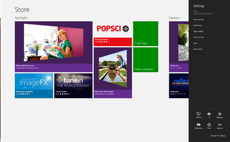

This article is Day #5 in a series called [31 Days of Windows 8](http://31daysofwindows8.com/).  Each of the articles in this series will be published for both [HTML5/JS](http://csell.net/category/windows-8/31-days/) and [XAML/C#](http://www.jeffblankenburg.com/category/31-days-of-windows-8/). You can find all of the resources, tools and source code on our [Website](http://31daysofwindows8.com/).

[![advertisementsample14[2]](advertisementsample1421.png "advertisementsample14[2]")](http://31DaysOfWindows8.com/?day=5)

* * *

Today we are kicking off a series of posts focused on contracts starting with application settings. The chances are pretty high that your app has them, and you know you hate them. For me, they have always been that thing we've just dealt with, without really a great way handle them, until now. Application settings are just one part of something bigger in Windows 8 called contracts.  Let's start our conversation on settings with a Microsoft definition of contracts:

> **Contracts** A contract is like an agreement between one or more apps. Contracts define the requirements that apps must meet to participate in these unique Windows interactions.
> 
> 
> For example, Windows lets users share content from one app to another. The app that shares content out supports a source contract by meeting specific requirements, while the app that receives the shared content supports a target contract by meeting a different set of requirements. Neither app needs to know anything about the other. Every app that participates in the sharing contract can be confident that the sharing workflow is completely supported, end-to-end, by Windows.
> 
> 
> via: [http://msdn.microsoft.com/en-us/library/windows/apps/hh464906.aspx](http://msdn.microsoft.com/en-us/library/windows/apps/hh464906.aspx)
Interesting, this really really sounds like a "managed interface" between an application and the Windows Operating System. There are 5 contracts available to our applications:

*   File Picker
*   Play To
*   Search
*   Settings
*   Share
Just like a typical programming interface, this means he\it who extends it is bolting on some type of functionality without the other actually knowing about it.

With Windows 8, this all actually feels like it happens at the user experience level. What do I mean? Well, let's take the share contract as an example.  Simply put, applications tell the operating system what they would like to sign up for. In the case of sharing, maybe it's accepting an image or sharing an image. Windows then will broker the rest.

Imagine a scenario where you find a great article while browsing the web in something like Internet Explorer. You want to share it to someone either in email or Twitter. Assuming you had an application installed that does email or Twitter, and they accepted sharing of an a URI, then Internet Explore could share to those. Better yet, those applications don't even have to be running to do so. Windows takes care of making all that awesomesauce happen.

Sounds like an typical programming interface doesn't it.

## Defining Settings

The Settings Contract is really just one control, aka the Setting Flyout or [WinJS.UI.SettingsFlyout](http://msdn.microsoft.com/en-us/library/windows/apps/Hh701253.aspx) which you will find in the WinJS library. Any application installed from the Microsoft Store will always have two default entry in the Settings Contract; Rate and Review, and Permissions. These are provided by the overall system and not something you will find in the template.

To activate our application settings we need to bring up the Charms menu and selected settings. You can do this a variety of ways, swipe in from the side ( left or right depending on your language ), Windows Key + C, or top \ bottom right hand side of the screen. Once activated select Settings at which point the settings flyout will be appear to float out from the side of the screen. Below is the settings flyout for the Microsoft Store and you can see there are multiple entry points for the store.

The first place to start with creating our own application settings is to tell Windows what in fact our entry points are going to be. We do that when our app starts up for the first time in an event called [onsettings](http://msdn.microsoft.com/en-us/library/windows/apps/Hh701593.aspx).  Below I am going to register two different entry points, "about" and "help".
<pre class="prettyprint">WinJS.Application.onsettings = function (e) {

    e.detail.applicationcommands = {
        "about": {
            href: "/pages/settings/aboutflyout.html",
            title: "About"
        },
        "help": {
            href: "/pages/settings/helpFlyout.html",
            title: "Help"
        }
    }

    WinJS.UI.SettingsFlyout.populateSettings(e);
};</pre>
An application can currently have** 7 entry points**, which will be alphabetically sorted by the property name you've created in the object. In our case, "_about"_ and "_help"_, **not the title**.

With just our entry points created you can actually run your application and see these listed in the Settings Charm. Of course clicking them, will lead you to an error of resource not found. Let's add our html pages that match the href's we've already defined.

## The Setting(s) UI

With our html pages added, now we have to actually create our user interface. Before you start creating those angle brackets, check out the [Windows application settings guidance](http://msdn.microsoft.com/en-US/library/windows/apps/hh770544).

I mentioned earlier that our settings was really just a control called the Settings Flyout. To create our most basic settings page we just need a valid page, an element with an id _id="[name here]"_ as well as the settings flyout _data-win-control="WinJS.UI.SettingsFlyout" _as seen below.
<pre class="prettyprint"><!DOCTYPE html>
<html>
<head>
    <meta charset="utf-8" />
</head>
<body>
    

        Hi.
    
  
</body>
</html></pre>
With this in place we can now navigate to that entry point and see _Hi_ in the top left hand side. Useful but useless. Clearly our next step is to add some meat and potatoes to our page.  Below we're going to:

*   Set the controls width to narrow. Two choices, narrow or wide.
*   Add a header including a back button to get the user back to the Settings Flyout.
*   Add some content.
*   And lastly add some CSS to pretty up a few things.
<pre class="prettyprint"><!DOCTYPE html>
<html>
<head>
    <meta charset="utf-8" />
    <title>help</title>
    <link href="/pages/settings/settings.css" rel="stylesheet" />
</head>
<body>
    

        
       
            

                <button onclick="WinJS.UI.SettingsFlyout.show()" class="win-backbutton">
                </button>
                Help Day #5
            

            <article class="SettingsContent">
                
Hi

            </article>
        

    

</body>
</html></pre>
That looks a bit more like what a user might expect.

## Getting Data

Now settings are all about "setting" something right. That of course means the user is going to do something in that settings page, maybe enter some account information, flip some switches or just personalize a theme. With our modern interface things like unnecessary buttons we need to get rid of, yet we still need to get at that data right. Thankfully there are a number of events which fire around the Settings Flyout, specifically:

*   onafterhide - Raised immediately after the **SettingsFlyout**is completely hidden.
*   onaftershow - Raised immediately after a **SettingsFlyout**is fully shown.
*   onbeforehide - Raised just before hiding a **SettingsFlyout**.
*   onbeforeshow - Raised just before showing a **SettingsFlyout**
To walk the pipes a bit. Let's add a simple input box to our settings UI.
<pre class="prettyprint">....

<input id="bacon" type="text" value="Bacon is Yummy" />

....</pre>

Since we're not going to add a button to our UI to "submit" the data somewhere, we need to hand the event _afterhide_. Here we're going to attach to that event wiring up our _afterSettingHide _function.

<pre class="prettyprint">....

    ready: function (element, options) {
        document.getElementById("about").addEventListener(
            "afterhide", afterSettingsHide, false);
    },
    unload: function () {
        document.getElementById("about").removeEventListener(
            "afterhide", afterSettingsHide);
    }

....</pre>
For brevity sake, the afterSettingsHide function will just dump the input box's value to the console.
<pre class="prettyprint">function afterSettingsHide() {
    console.log(document.getElementById("bacon").value);
};</pre>

## 

## Almost Finished

Having a consistent setting user experience is awesome but there is really one last thing you should do for your users, roam their settings. I know this is going to sound crazy, but there are users out there who have multiple machines. We may not want them to configure your app for every machine they use it on. I know as a user, I sure hate it. We will talk more about storage in another post to come.

## Summary

When I was first introduced to Windows 8 I kept hearing the phrase, "Win as 1". Win as 1 is one of the core tenants for  Windows. At first this just sounds like standard  marketing speak but actually it's really far from that. Having now worked with Windows 8 for some time, the contract are a great proof point of this tenant. Things like application settings are now a centralized for the user, our applications can now spend more time focusing on delivering their core features rather than dealing with things like settings. Furthermore, now that the settings are consistent across all applications, we only ever have to teach a user once to use settings across all applications.

"I only had to be taught how to open a door once and then I could open all doors." - I made that up.

Today, we took a look the Settings Contract, which is just one of many contracts you will find in Windows 8\. Just like a programming interface, contracts in Windows 8 offer your app a unique way to extend your application beyond the traditional definition of an "application process" while providing a consistent user interface to our users.

You can download the entire sample solution and tools below.

Tomorrow, we're going to look at the Search contract.  Search is something We'll dive head first into that tomorrow.

See you then!