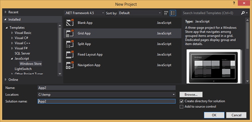
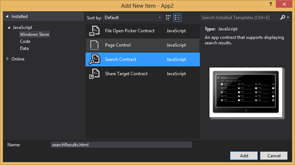
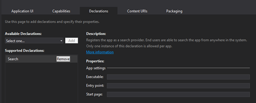
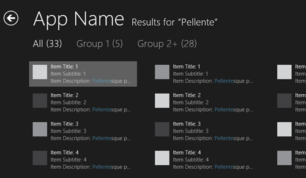

This article is Day #6 in a series called [31 Days of Windows 8](http://31daysofwindows8.com/).  Each of the articles in this series will be published for both [HTML5/JS](http://csell.net/category/windows-8/31-days/) and [XAML/C#](http://www.jeffblankenburg.com/category/31-days-of-windows-8/). You can find all of the resources, tools and source code on our [Website](http://31daysofwindows8.com/).

* * *

Yesterday we introduced Contracts by exploring how to add Settings to our applications. Today we're going to build upon that with Search, and tomorrow Share. Search and Share are two very interesting contracts because they bring life to your app even when it's not actually running. In the context of search this means your application can potentially expose itself to the user in a new manner.

For the past 10 years, "search" has typically been synonymous with search engines. A few year ago, search actually became mainstream in Windows and if you we're like me, you became very used to hitting the start button and just typing the name of your program rather than looking for it. Today in Windows 8 you can just type and those results are nicely displayed.

Better yet, Windows 8 is really extending how we think about search and bringing it right into our Windows Store Apps. Now it's not really any magic, we just wire up to a few events and display the right things to our users but it changes the typical "entry point" if you will into our applications. Now rather than our user opening our app, finding your command and then acting. They can hit search and be taken directly to the thing they we're looking for.

## Getting Setup

Unlike the past few articles where we've started with a blank app, today we're going to start with the Grid App Template. My reason for starting here rather than with a blank template is simply, hardcoded data. The grid template includes that out of the box and it's easy for you to use and play with. Once you have created a project you will find this "data" at /js/data.js.

After creating your app, just run it. The first thing you should notice is a sea of the new battle ship black and grey tiles of pointless data. If you click on one you get taken to the detail of that particular item. Cool, we have a running app with some data. Now, let's search it.

The easiest way to get started is to add a new "Search Contract". Visual Studio has a built in template and depending on your needs this might be a great place to start. To add a new Contract, let's first create a folder called _search_ in our _pages _folder. Then let's add a New Item, and select the Search Contract from the Windows Store menu.

What just happened?!?! Well:

*   Added _searchResults.html_( default name )
*   Added _searchResult.css_
*   Added _searchResult.js_
*   Added the Search declaration to your app's package.appxmanifest

With that added, we still have one more step. We need to add the searchResult script to our default page, default.html in our case.
<pre class="prettyprint"></pre>

## Hooking Up

I hope at this point you just scratched your head and said, "wait, why in the world are you adding this JavaScript file to our default page and not our seachResults.html page". Valid question. There are a few reasons but first we need to just get hooked up to the search contract. We do that by wiring up to onquerysubmitted and the application activation event, which is already written for you (at the bottom) in the searchResult.js file.

onquerysubmitted is fired when a user **is in your** application and hits the search menu. The Visual Studio Search Contract template has already done this work for you. You can see below we have a function that will grab the search query and pass it along to the searchResults.html page using the navigation framework (more on that later).

<pre class="prettyprint">    var search = Windows.ApplicationModel.Search;

    search.SearchPane.getForCurrentView().onquerysubmitted = function (args) {
        nav.navigate("/pages/search/searchResults.html", args);
    };</pre>

On the flip side, what if  your application isn't running? This is where we hook into [application lifecycle](http://msdn.microsoft.com/en-US/library/windows/apps/hh464925) of our app.  What we want to do is wire up to our activated event and act when a user is [activating us from the search](http://msdn.microsoft.com/en-us/library/windows/apps/windows.applicationmodel.activation.activationkind) contract.

<pre class="prettyprint">    WinJS.Application.addEventListener("activated", function (args) {
        if (args.detail.kind === appModel.Activation.ActivationKind.search) {
            args.setPromise(ui.processAll().then(function () {
                if (!nav.location) {
                    nav.history.current = {
                        location: Application.navigator.home,
                        initialState: {}
                    };
                }

                return nav.navigate(
                        "/pages/search/searchResults.html",
                        { queryText: args.detail.queryText } );
            }));
        }
    });</pre>

Once there it's just like before. Grab the args and pass them along to our searchResults.html page. To test this event in the debugger, we can simply run the debugger like we normally would. Browse to another application or something like the desktop and activate search. After typing your search term in and selecting your app to search, you will see that event fire.

## Show me the goods

At this point, we effectively finished and all wired up to the search contract. The remainder is just how you decide to filter the data and display it. The template choses to use the ListView control from WinJS and mark off the items where you search term matches.

## Hindsight is 20/20

Honestly I stumbled a few times writing this post, making thing honestly harder than they really needed to be. The template assumes you use the built the navigation framework (navigation.js) included with the Grid and Navigation Visual Studio templates. If you're using something like the Blank template then the call to [WinJS.Navigation.navigate](http://msdn.microsoft.com/en-us/library/windows/apps/br229837.aspx) just quietly completes and navigation never actually navigates. { scratches head here "}

Remember it's a template, not gold code.

Pull out those event handlers from the template. Your _default.html_ page should already be wired into the process activation, you should at least put the search activation handler there. Sure you could wire another function to that event, but why? It just a code smell and leads to maintainability issues down the road. I can see arguments for both sides of the story, but remember it's just a template. Make it your own.

## Summary

Today, we took took a very quick look into adding Search into your application. The Search contract provides a new way for your app to expose your application to it's users. Now, you just need to determine what exactly you want to expose. Getting yourself in front of your users ensures people are engage in your application. The more ways they use it, the better life is.

You can download the entire sample solution here here:

Tomorrow, we're going to the next step in our contracts exploration, Sharing.

See you then!