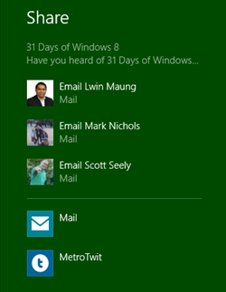
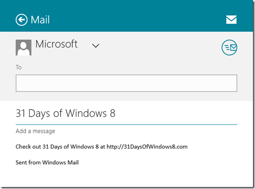
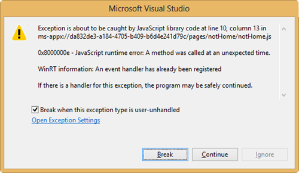
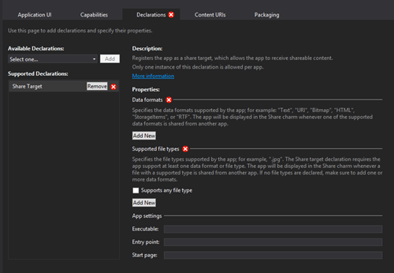
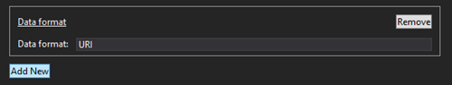
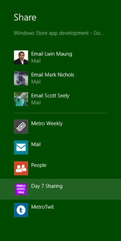
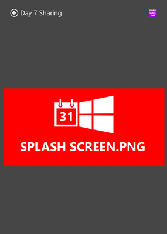

This article is Day #7 in a series called [31 Days of Windows 8](http://31daysofwindows8.com/).  Each of the articles in this series will be published for both [HTML5/JS](http://csell.net/category/windows-8/31-days/) and [XAML/C#](http://www.jeffblankenburg.com/category/31-days-of-windows-8/). You can find all of the resources, tools and source code on our [Website](http://31daysofwindows8.com/).

* * *

Over the past two days we've dived into this a new Windows feature loosely called contracts. We introduced this notion of contracts by exploring how to incorporate something called [Settings](http://csell.net/2012/11/05/31-days-of-windows-8-day-5-settings-contract/) into our applications. Then we explored extending our applications presence to users with [Search](http://csell.net/2012/11/06/31-days-of-windows-8-day-6-search-contract/). Today we're going to take the next step and explore one of the features that gets both Jeff and I really excited, Sharing.

I will just come out and say it, Sharing is a really cool feature. At its most basic principle, the premise is to take something a user found interesting and share it. Like the other contracts, the foundation of sharing isn't any different. Our application hooks into an "interface" and Windows takes care of the rest. But this feature is different.

For the most part, people are social beings. We talk to one another, share exciting stories and love being loved. Windows 8 feels alive, welcoming users and their apps to interact with other apps, or other people.

The Sharing contract is at the core of this experience. Today's application developers have a huge eco system to try and get plugged into. Email, Bit.ly, Facebook, Twitter, [insert your favorite this here], and it's endless and always growing. As a developer, trying to keep up with this can be crazy. What if there was a better way. Can you guess, yes, Sharing.

As you install applications on your Windows 8 machine, something starts to happen. Your applications can start becoming more feature rich. When applications implement the Sharing contract other applications start to become more alive with capabilities. Let's take something like the browser. I'm guessing anyone reading this has found a webpage that they wanted to share with someone. That could be either Twitter, Email or even something like a local app that keeps bookmarks. It's impossible for any app to try and keep up with that ever-changing eco system. Rather if we all implement the sharing contract for the types of data that we each can consume then suddenly the core features in our apps start to grow without us doing any work. For example when the user decides to install Twitter because it's what they like, and Twitter implements the Sharing contract then automatically it will show up in the list of things that accepts sharing.

This is a very powerful feature and one which adjusts to its users. If Twitter isn't there thing but Facebook is, chances are they don't have a Twitter app installed and it's not clogging up their list of apps to share to. Better yet, you never even had to write to any of that, but rather just program to the Share contract.

## Sharing Defined

Sharing happens two ways, _he_ who shares ( the source app )  and _he_ who receives ( the target app ). This happens through a broker.

Image via: [http://msdn.microsoft.com/en-us/library/windows/apps/hh758314.aspx](http://msdn.microsoft.com/en-us/library/windows/apps/hh758314.aspx)

So, what can you share? There are 7 different types of content you can share with the broker:

*   Unformatted Plain Text
*   Link
*   Formatted Content / HTML
*   File
*   Single Image
*   Multiple Files and Images
*   Custom Data Format
Data is shared through an object called the [DataPackage](http://msdn.microsoft.com/en-us/library/windows/apps/windows.applicationmodel.datatransfer.datapackage.aspx).

## Sharing

Let's start easy with sharing ( data flowing out of our app ). Today I want us to start with a different template, one called the [Navigation App](http://msdn.microsoft.com/en-us/library/windows/apps/hh758331.aspx). This app is very similar to the blank app template except for adding some plumbing in a navigation model. The best way to think about this navigation model would be just like a single page web site model for the web. Out of the box the _default.html_ page _can_ act like a container for the rest of the site. The reason for starting here, is to create a more complicated "application" for us to work through. Sharing is context sensitive so, if a user navigated to page A verses page B what they might or might not share could be different. I will cover app navigation in detail in an upcoming article.

With our template in place, let's just run. After your app is fired up, activate your Charms menu and select Share. Windows will tell you you that your app can't share. Of course not, we haven't really done anything.  To hook into the Share Charm we need to wire up to an event from the [DataTransfer object](http://msdn.microsoft.com/en-us/library/windows/apps/windows.applicationmodel.datatransfer.aspx).

<pre class="prettyprint">var dataTransferManager =
    Windows.ApplicationModel.DataTransfer.DataTransferManager.getForCurrentView();
dataTransferManager.addEventListener("datarequested", dataRequested);</pre>

Now when the user is in your app and activates the Share Charm the broker in Windows will fire off your handler. When your function is called, it passes along a [DataRequest](http://msdn.microsoft.com/en-us/library/windows/apps/windows.applicationmodel.datatransfer.datarequest.aspx) object for you to populate. Since we're starting simple were going to populate three properties; title, description and text.

<pre class="prettyprint">function dataRequested(e) {
    var request = e.request;

    request.data.properties.title =
        "31 Days of Windows 8";

    request.data.properties.description =
        "Have you heard of 31 Days of Windows 8?";

    request.data.setText(
        "Check out 31 Days of Windows 8 at [http://31DaysOfWindows8.com"); ](http://31DaysOfWindows8.com");)}</pre>

Now in the _dataRequested _handler above I am just hardcoding the data that we're exposing through sharing. In a real application we would probably select something relevant to what the user was doing in the application or maybe something they selected._ _Once your function returns, the broker and the share target will populate that data or item in the appropriate places. This includes the Share Charm itself and later the selected Share Target. As you can see from the image below, the  properties title and description are actually used at the top of the Share Charm.

Then we're presented with a list of applications ( aka the share targets ) who will accept that data were trying to share, in our case just plain text. Let's select the mail app from our list.

Now you can see that the mail application has been opened on behalf of Windows. Furthermore the mail application received access to that DataPackage we created earlier.

Now for any page in our application in which we wanted to share, we would repeat this process. ( or so I thought )

## Wait What?

So that last statement wasn't exactly true. I've always thought it was very important to share ones stumbling blocks along with everything else. So here goes my midnight fumble.

I started by using the _home.html_ to to implement sharing. Got it all wired up and things worked fine. So then it was time to move onto adding sharing to another page. As you would expect I added _notHome.html_ to the project, and like any good design went back to_ home.html _and added that anchor link to redirect.

Since we started with the navigation template project, I then decided to be a good citizen and wired up the a click handler to our anchor tag so I could use the navigation framework.

<pre class="prettyprint">WinJS.Utilities.query("a").listen("click",
    function (eventInfo) {
        eventInfo.preventDefault();
        var link = eventInfo.target;
        WinJS.Navigation.navigate(link.href);
    }, false);</pre>

Simple enough and things worked as expected. Next up, add sharing to that page right? After adding sharing I saw the following:

Already wired, Huh? On yea, the [navigation framework](http://msdn.microsoft.com/en-US/library/windows/apps/hh452768). It's important to understand the navigation model and its effects your pages and\or the API's that you might be using. In this scenario we're just swapping the page in an outer page and WinRT didn't like that.

Solution? Well, I guess it really depends. It could depend on your page model. It could depend on how you structured your markup and how you select it, it could just depend on what you want to share.

In this case, lets assume you want to share something different on the two different pages. Since we're in this single page navigation model then our solution ( or "a" solution ) is to just remove our event handlers when the page unloads an recreate them on the next page.

<pre class="prettyprint">var dtm = Windows.ApplicationModel.DataTransfer.DataTransferManager;

WinJS.UI.Pages.define("/pages/notHome/notHome.html", {
    ready: function (element, options) {
        var dataTransferManager = dtm.getForCurrentView();
        dataTransferManager.addEventListener("datarequested", dataRequested);
    },
    unload: function () {
        var dataTransferManager = dtm.getForCurrentView();
        dataTransferManager.removeEventListener("datarequested", dataRequested);
    }
});</pre>
Simple enough but again, it just depends on your situation. Unloading items such as your event handlers is something you should keep a close eye on throughout any application you're building.

## - random tip -

Next time you are running your app and make a little change like update some CSS. Hit _**"CTRL + Shift + R"**_ which will refresh it in place. It's a nice way to work in your source code and not have to restart debuggers and whatnot. Think of it like f5 in the browser.

## Share Target

On the flipside, the opposite of sharing is the share target, aka the thing being shared to. Just like the other contracts we need to declare that our app can in fact receive shared content from the broker. This is done through our ole buddy the appxmanifest.

After declaring the ability to receive content, we need to setup just what we're going to be signing up for, specifically the data formats and possibly the file types if we're in fact sharing files. This of course is telling the broker when to expose your application as a possible share target. For our conversation today, we're going to accept a URI. Of course you can accept more than one type as well.

At this point lets run our application. Fire up the browser, and select then select the Share Charm. You will see we're now listed as a possible choice. If we then select it you will see our [beautiful splash screen](http://csell.net/2012/11/03/31-days-of-windows-8-day-3-the-splash-screen/) appear before being taken to a blank page. Remember that little nugget on transparent PNGs and setting the background color appropriately?

That blank page we appear to see is actually nothing. We need to configure it. In that Share Target Declaration we just declared. At the bottom, you will find a section called _App Settings_. In there you will see a start page. This of course defines what page we want to fire when Share is invoked. Of course that means we have to create one, so I have created not only it, but the associated JavaScript and CSS files.

*   /pages/shareTarget/shareTarget.html
*   /pages/shareTarget/shareTarget.js
*   /pages/shareTarget/shareTarget.css
Now if you rerun you should be taken to your page. With our pipes flowing some awesome sauce, let's wire into the correct events and get our hands on that DataPackage object. We haven't talked yet about PLM or Process Lifecycle Management, I have mentioned it. It's exactly where where we're going to wire in our Share Target.

When our application launched we're going to inspect the ActivationKind looking for a shareTarget. You could put this logic your default.js page, but I have chosen to put it in my shareTarget.js file just to keep the logical things grouped together. ( best practice, ehh time will tell )  Let's get our basic structure together.
<pre class="prettyprint">(function () {
    'use strict';

    var _app = WinJS.Application,
        _activation = Windows.ApplicationModel.Activation;

    var _shareOperation,
        _dt = Windows.ApplicationModel.DataTransfer;

    _app.addEventListener("activated", function (args) {

        if (args.detail.kind === _activation.ActivationKind.shareTarget) {
            args.setPromise(WinJS.UI.processAll());

        }
    });

    WinJS.Application.start();

})();</pre>
The biggest difference here from what we have seen before is the usage of ActivationKind. With our structure now in place, during our activation we need to get our share operation and fire off an event async to handle the share. We do this async such that were not blocking the activation process.
<pre class="prettyprint">_shareOperation = args.detail.shareOperation;

WinJS.Application.addEventListener("shareready", shareReady, false);
WinJS.Application.queueEvent({ type: "shareready" });</pre>
Now let's implement our **shareready** function. This function will serve as the work horse to populate our screen with the information which came across.
<pre class="prettyprint">function shareReady(args) {
    if (_shareOperation.data.contains(_dt.StandardDataFormats.uri)) {
        _shareOperation.data.getUriAsync().done(function (uri) {
            document.querySelector("#results").innerText =
                "Uri: " + uri.absoluteUri;
        });
    }
}</pre>
Now our scenario is simple. Were just displaying some basic information on the screen. Once we're done doing whatever we want, we will need to call [reportCompleted](http://msdn.microsoft.com/en-us/library/windows/apps/br205982.aspx) on the [shareOperation](http://msdn.microsoft.com/en-us/library/windows/apps/windows.applicationmodel.datatransfer.sharetarget.shareoperation.aspx), telling the broker we're done. There are a number of different methods on the [shareOperation](http://msdn.microsoft.com/en-us/library/windows/apps/windows.applicationmodel.datatransfer.sharetarget.shareoperation.aspx) that we should interact with, especially with long running scenarios and errors. While I am not diving into them here, I have included links below.

## More than just display

At this point we have successfully shared and been shared to. The rest is really up to you. That "little" share window could serve as a big feature in your application. If you're a company like [Twitter](http://twitter.com) or [Facebook](http://facebook.com) this could be a window into pushing updates to your social graph.

Also don't forget how we kicked off this notion of contracts, settings. Again if you're a company like [Twitter](http://twitter.com), then persisting that user profile so when they do share they don't have to enter their handles, URL shorteners etc. will give your users a very seamless experience. Better yet, roam it so when they get on another machine it's already setup. We will talk about roaming and storage tomorrow.

## What's next?

Today, we took took a look into at another contract called Sharing. The Share contract provides an amazing new way for your app to expose itself to its users. Now, you just need to determine what exactly you want to either share or accept. Getting yourself in front of your users ensures people are engage with your application. The more ways they use it, the better.

As I mentioned earlier in this article, there are a number of different data types you can Share and while I didn't cover them in detail here the premise is the same. It's just different data being set and later retrieved. Below I have listed a number of great references from [dev.windows.com](http://dev.windows.com) which covers those in detail.

*   
[Sharing and exchanging data](http://msdn.microsoft.com/en-us/library/windows/apps/hh464923.aspx)

*   
[Choosing data formats for sharing](http://msdn.microsoft.com/en-us/library/windows/apps/hh771179.aspx)

*   
[How to share text](http://msdn.microsoft.com/en-us/library/windows/apps/hh758313.aspx)

*   
[How to share a link](http://msdn.microsoft.com/en-us/library/windows/apps/hh758312.aspx)

*   
[How to share an image](http://msdn.microsoft.com/en-us/library/windows/apps/hh758305.aspx)

*   
[How to share a file(s)](http://msdn.microsoft.com/en-us/library/windows/apps/hh758308.aspx)

*   
[How to make asynchronous calls in your datarequested handler](http://msdn.microsoft.com/en-us/library/windows/apps/hh770847.aspx)

*   
[Quick Links](http://msdn.microsoft.com/en-us/library/windows/apps/hh758299.aspx)

You can download the entire sample solution and tools here:

Tomorrow, we're going to focus on storing data, both locally on the user's device, as well as roaming that data in the cloud.  See you then!
