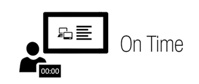
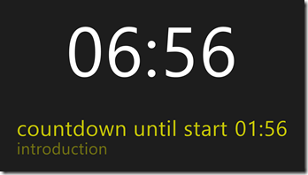

Today I am proud to release something called [On Time](http://apps.microsoft.com/webpdp/app/on-time/9e5bde3d-3c58-4e77-8b69-5f97f500203d). This is an app that I dreamed up about a month ago and today it's in the Windows Store.

Short story: [On Time](http://apps.microsoft.com/webpdp/app/on-time/9e5bde3d-3c58-4e77-8b69-5f97f500203d) is monitor for speakers, presenters or just very time conscious people who want to closely monitor their current spot against an agenda.

I hope you will try it out, provided feedback and learn something along the way. This is just the start of a bigger journey.

## What is On Time?

[On Time](http://apps.microsoft.com/webpdp/app/on-time/9e5bde3d-3c58-4e77-8b69-5f97f500203d) is a simple Windows 8 application striving to keep speakers "on time". If you're a speaker this is for you. Grab a Windows 8 machine, load in your presentation's agenda and set it down in front of where you plan on speaking. On Time will display your overall time left, where you should be in your agenda and how much time is left until your next topic. Don't worry, On Time has a few visual cues to make sure you're paying attention along the way.

## Built for us, developers

I **didn't** and **don't** want to build this in a vacuum, [so it's all out there for you to see](https://github.com/csell5/OnTime), comment or even collaborate on if you want. It's real, it's raw, but it's shipping. I am guessing a large number of people start with an idea, turn it into a spike and then whoops it's now a published application. Same here, except I wanted to start this way. I wanted to see if my idea first even worth something before investing a great deal of time. Having said that, it's worth something to me so I guess it's a mute point.

I will refactor. Part of starting this way was to quite honestly put myself in a uncomfortable spot. I want to introduce automated tests, patterns, automated build and so on But I want to talk about it along the way and hopefully help a few others out as well.

[You can find it all here on GitHub](https://github.com/csell5/OnTime).

## Built on open source

Regardless of whatever title I might carry today, I am a web developer. Open source is a big part of our ecosystem and community. The core of [On Time](http://apps.microsoft.com/webpdp/app/on-time/9e5bde3d-3c58-4e77-8b69-5f97f500203d) is built on [Knockout.js](http://knockoutjs.com/). [Knockout.js](http://knockoutjs.com/) is an amazing tool and I can't thank that team enough for the awesome work they have built. Windows 8 embraces Open Source just like the web does. As a web developer it's pretty cool to be able to take some of the tools you're used to using and use them in your app.

Open source tools used thus far:

*   [Knockout.js](http://knockoutjs.com/)
*   [Font Awesome](http://fortawesome.github.com/Font-Awesome/)

## What's next:

*   Website for On Time  <li>Add a User Voice Site for feedback and suggestions <li>Launch the app when clicking on an OT file.  <li>Update interaction between agenda and main screen  <li>Pause  <li>Switch color schemes  <li>Clean up code - blog series coming there.

## Special Thanks:

I would like to thank the following peeps for their support and help.

*   [Brandon Satrom](http://userinexperience.com): Very close friend and business partner of mine. Brandon wrote an app called [Tom8to](http://tom8to.com/) while writing his [soon to be released book on Windows 8](http://www.amazon.com/Building-Applications-JavaScript-Microsoft-Development/dp/0321861280/ref=sr_1_2?s=books&ie=UTF8&qid=1337042885&sr=1-2). I learned a number of things just by browsing his source and seeing what his thought process was compared to mine. I also stole a few nuggets from him.
*   [Lwin Maung](http://pressffive.com): Friend and Colleague of mine. Lwin cut all of the graphics you will see for [On Time](http://apps.microsoft.com/webpdp/app/on-time/9e5bde3d-3c58-4e77-8b69-5f97f500203d) and did a bunch of testing.
*   [Min Maung](http://Byteacode.com): Friend and Colleague of mine. Min tested this guy during a number of speaking engagements. He also keeps priming the pump with new features.
*   [Ryan Niemeyer](http://www.knockmeout.net/): Ryan is on the core team of Knockout and has helped me out more than enough times as I have been learning Knockout.
