This article is Day #9 in a series called [31 Days of Windows 8](http://31daysofwindows8.com/).&nbsp; Each of the articles in this series will be published for both [HTML5/JS](http://csell.net/category/windows-8/31-days/) and [XAML/C#](http://www.jeffblankenburg.com/category/31-days-of-windows-8/). You can find additional resources, downloads, and source code on our [website](http://www.31daysofwindows8.com/).

 

* * *

Today, we're covering a very important topic: Live Tiles.&nbsp; As we've mentioned in previous articles, your tile is one of the most important parts of your application's success, and it's one of the most overlooked.

Your tile represents your relationship with your user.&nbsp; They caringly pin it to their start screen, arrange it with similar apps, even decide if they want it to be big or small.&nbsp; Your job is to make it as accommodating and responsive to their needs as possible.&nbsp; We do this by passing useful updates to the tile.&nbsp; Here's a few examples from some of my favorite apps:

The family and I have gotten into a game called Jetpack Joyride, their tile is an excellent example.&nbsp; Here's four of the five states it rotates through, reminding me of my high score, as well as the achievements I haven't yet completed.&nbsp; These updates have dragged me back in more than once.

 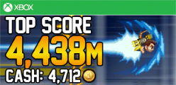 

 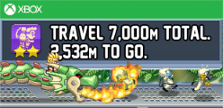 

The weather app, on the other hand, doesn't flip at all.&nbsp; But I also don't need anything more that what one static tile can provide when it comes to weather.&nbsp; I get today's high and low, as well as the current temperature.&nbsp; The five day forecast is always one click away.

&nbsp;[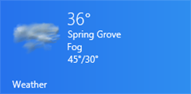](http://csell.net/wp-content/uploads/2012/11/image12.png)

Finally, as tiles go, I think that the Photos app might be my favorite.&nbsp; I haven't figured out how often it updates the set of rotated photos, or even which libraries it uses, but it always seems to have some great old photo on the tile that makes me remember that event.&nbsp; Here's a couple of screen shots of my Netduino garage door controller and some awesome peeps [That Conference's](http://thatconference.com/) Game Night. Might I suggest you check out [That Conference](http://thatconference.com/), August 12 - 14 in 2013.

&nbsp;[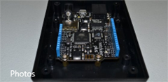](http://csell.net/wp-content/uploads/2012/11/image13.png) [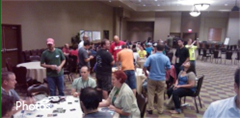](http://csell.net/wp-content/uploads/2012/11/image14.png)

I've got thousands and thousands of old photos stored in my photo libraries (yes, they're backed up online, thank you very much), and getting a blast from the past on a daily basis is awesome.

## The Rules

When we work on our apps, I've discovered there are a few rules we need to be aware of:

*   First, read, and then re-read the [Guidelines for Live Tiles](http://msdn.microsoft.com/en-us/library/windows/apps/hh465403.aspx).&nbsp; They're extensive, but interesting.  <li>You must ALWAYS have a small tile.&nbsp; Wide tiles are a nice-to-have, but you MUST accommodate a small tile.  <li>If you want wide tile notification you MUST provide a default wide tile. 

Small tiles are not always as interesting as their big brothers, but they can still be conveyed to show interesting information.&nbsp; Here's a few small tiles which range from showing nothing but branding to showing updates on your local weather:

[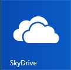](http://csell.net/wp-content/uploads/2012/11/image15.png)&nbsp;[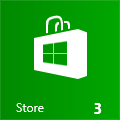](http://csell.net/wp-content/uploads/2012/11/image17.png)[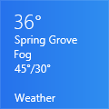](http://csell.net/wp-content/uploads/2012/11/image18.png)&nbsp; 

Things like SkyDrive don't update but one could argue what is there to update? However the Weather and Photos apps give me all the same data I get on the large tiles, just in a smaller package.

As I was investigating all the different ways a tile could look, I was worried that this article was going to be SUPER lengthy after showing an example of every possible tile template.&nbsp; As it turns out, however, Microsoft has provided an amazing page that shows every single tile template, all forty-five of them.&nbsp; Make sure you check this page out.&nbsp; It will definitely help you pick the tile template that is appropriate for you, and it provides the XML markup you'll need to do it as well.

**[MUST READ: The Tile Template Catalog](http://msdn.microsoft.com/en-us/library/windows/apps/hh761491.aspx)**

So how do we make our tile dance?&nbsp; Let's dance.

## Updating the Default Static Tile

By default, you've got an icon in your app that looks like this:

 

(I added a slight gray background to this one so you can see it on a white background, yours is likely transparent.)&nbsp; If you only want a static tile that uses your own 150 x 150 pixel image, you can do this one of two ways:

*   Replace the image that currently resides at _images/logo.png_ in your project.  <li>Update your _package.appxmanifest_ file, and change the Logo value to a different image in your project, like this: 

[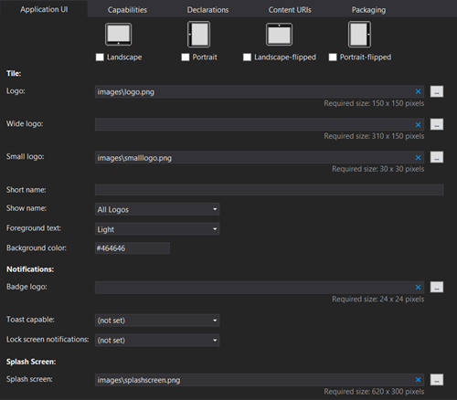](http://csell.net/wp-content/uploads/2012/11/image19.png)

OK, enough of the boring stuff.&nbsp; Let's write some code!

## Sending a Notification to a Small Live Tile

Let's start with sending a small tile notification first, since large tiles will be slightly more complicated.&nbsp; First, as we discussed earlier, you need to decide which template you want to use from the catalog.&nbsp; ([We've&nbsp; even created a static PDF version of this document for you, that's how important it will be](http://31daysofwindows8.com/content/TileTemplateCatalog.pdf)!)

In this example, I've chosen _TileSquareText04_, which looks like this template:

And is represented by this XML (you'd know this if you'd open the catalog page):
<pre class="prettyprint"><tile>
  <visual>
    <binding template="TileSquareText04">
      <text id="1">Text Field 1</text>
    </binding>  
  </visual>
</tile></pre>

Now I am sure you're sitting there thinking, can I use JSON? Well, unfortunately not that I am aware of.&nbsp; So now we just need to create a new tile update based on that XML, and push it to the [TileUpdateManager](http://msdn.microsoft.com/en-us/library/windows/apps/windows.ui.notifications.tileupdatemanager.aspx).&nbsp; Here's how it works for _TileSquareText04:_

*   Get an instance of [WinRT](http://msdn.microsoft.com/en-us/library/windows/apps/br211377.aspx) Notification<li>From Notifications, get your Template<li>From that Template, get it's content aka that XML we showed above<li>Select and Update appropriately<li>Create a new tile notification<li>(optionally) set expiration<li>Send tile update

That's it! No really, that's it. Ok it seems like a lot but it's really just a few simple functions and you could wrap that up into a nice factory, pattern here, beer there and boom.
<pre class="prettyprint">var notifications = Windows.UI.Notifications;
var template = notifications.TileTemplateType.tileSquareText04;
var tileXml = notifications.TileUpdateManager.getTemplateContent(template);

var tileTextAttributes = tileXml.getElementsByTagName("text");
tileTextAttributes[0].innerText = _tileMessage.value; // taking from input box

var tileNotification = new notifications.TileNotification(tileXml);
notifications.TileUpdateManager.createTileUpdaterForApplication()
    .update(tileNotification);</pre>

So how do you handle the other templates? Can you mix or match? Well you just select the other template, modify the xml accordingly and send it along. Let's extend what did above to send along for the tile below.
<pre class="prettyprint">....

var template = notifications.TileTemplateType.**_tileSquareBlock_**;

....

var tileTextAttributes = tileXml.getElementsByTagName("text");
**_tileTextAttributes[0].innerText = "31"; 
tileTextAttributes[1].innerText = _tileMessage.value; // taking from input box_**

....</pre>

&nbsp;

As you can see this is a pretty simple process.&nbsp; One final note about these templates is that it's likely your SmallLogo.png file will be displayed on some of these tiles as well.&nbsp; It's a great way to extend your branding, but it's also something to be aware of as you're working on this.&nbsp; Using the TileSquareBlock template, here's how my tile actually ends up looking:

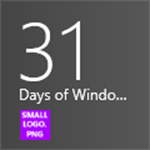 

This is yet another reason, as we stated on [Day #1](http://31daysofwindows8.com/?day=1), for you to use custom images for your app as you explore Windows 8 development.&nbsp; Without that purple image, I would have had to guess which one was being used, or worse, not realize that it was available at all.&nbsp; You will see that there are many properties that can be edited for your tile in the _package.appxmanifest_ file of your project.&nbsp; Not only can we swap out the logo image, but also set background properties, the Small Logo file, and other text and color values.

[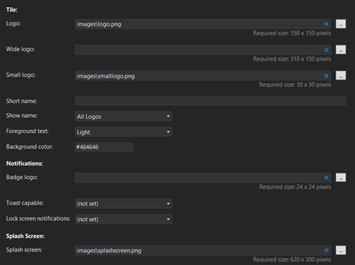](http://csell.net/wp-content/uploads/2012/11/image20.png)

One important piece of this section is the "Show name" dropdown.

I briefly mentioned this earlier, but I want to make sure you understand where these images and values are established.&nbsp; In addition, simply by defining a Wide Logo file in this manifest, you immediately support the Large Tile size.&nbsp; In fact, this is the ONLY way to support a wide tile.&nbsp; Your application won't even offer the size as an option until you've specified that value.&nbsp; Give it a try.&nbsp; Now let's look at how we send updates to a Large Tile.

## Sending a Notification to a Large Live Tile

This time, we're going to choose a Large Tile template, but we'll also include an image, so that you can see the syntax for that as well.

> **Important Lesson:**&nbsp; Remember that the user is in control here.&nbsp; If they have decided to make your tile large or small, you don't get to decide that.&nbsp; What you can decide, however, is whether or not you want to support "notifications" in both sizes.&nbsp; I recommend it, because it's an opportunity to have your user pay attention to your app on their Start screen.

Because of this, when we send updates, we can actually create two.&nbsp; One for the small tile, and one for the large one.&nbsp; Then, through the magic of XML, we'll merge them together, and send them as one notification, then regardless of what the user has set, they will still receive notifications. **But to do so, you will have to have a wide tile set by default in your package.appxmanifest**. If no wide, no notification, regardless of what you have sent. Let's create these two (I think you should use them in your application too):

[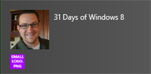](http://csell.net/wp-content/uploads/2012/11/image22.png)

The tile XML will end up looking like this:
<pre class="prettyprint"><tile>
    <visual lang="en-US>

        <binding template="TileSquareImage">
            <image id="1" src="clarkHeadShot.jpg" alt="Clark Sell"/>
        </binding> 

        <binding template="TileWideSmallImageAndText03">
              <image id="1" src="clarkHeadShot.jpg" alt="31 Days"/>
              <text id="1">31 Days of Windows 8</text>
        </binding>  

    </visual>
</tile></pre>

Now you already know how to create and modify the small tiles. To modify the large is exactly the same, just different template, and more opportunity to modify things.
<pre class="prettyprint">var wideTemplate = notifications.TileTemplateType.tileWideSmallImageAndText03;
var wideTileXml = notifications.TileUpdateManager.getTemplateContent(wideTemplate);

var wideTileAttributes = wideTileXml.getElementsByTagName("image");
var wideTileTextElements = wideTileXml.getElementsByTagName("text");

wideTileAttributes[0].setAttribute("src", "ms-appx:///images/clarkHeadShot.jpg");
wideTileTextElements[0].innerText = "31 Days of Windows 8";</pre>

Take a close look and you will see that I am actually pulling an image from some weird src, it's actually the local package. You could use just "/images/clarkHeadShot.jpg" too. You also have the ability to use images that are hosted out on the web or even in your local storage.&nbsp; Of course the more network hopes something has to take the longer it will take to load, so keep that in mind when using them. Also, to pull images from the web you will need to adjust your apps capabilities in your manifest to allow for internet access. If you do that, you need a privacy policy too.

To merge the two tiles together. We're basically going to take one template and add it to another.
<pre class="prettyprint">var node = wideTileXml.importNode(smallTileXml.getElementsByTagName("binding").item(0), true);
wideTileXml.getElementsByTagName("visual").item(0).appendChild(node);</pre>

As you can saw above, we will end up with multiple bindings in one <visual> node.&nbsp; To add additional notifications, you would go through the same process, adding even more to this same node.

## - tip -

Above we mentioned there we're a few different ways we could reference resources like images. Let's look at a few.

*   ms-appx:///images/Cats.png - reference your local package<li>ms-appdata:///images/Cats.png - reference [ApplicationData.LocalFolder](http://msdn.microsoft.com/en-us/library/windows/apps/windows.storage.applicationdata.localfolder.aspx)<li>/images/cats.png - typical local reference<li>http(s)://31daysofwindows8.com - http(s) reference

## Clearing Your Notifications

There are also going to be times where you'll want to delete your notifications.&nbsp; Perhaps new information has become available, or something changed before your expiration dates have expired, and you need to start over.&nbsp; To do this, it's a simple line of code:
<pre class="prettyprint">var notifications = Windows.UI.Notifications;
notifications.TileUpdateManager.createTileUpdaterForApplication().clear();</pre>

## Expire Notifications

Should your notification last forever? Well I can't answer that, but I am thinking that some of those notifications might in fact need to be cleared out. By default local tile and badge notifications do not expire while push, periodic and scheduled notifications will after three days. To expire a notification just set the _expirationTime_ on your tile notification.
<pre class="prettyprint">var currentTime = new Date();
tileNotification.expirationTime = new Date(currentTime.getTime() + 600 * 1000);</pre>

I know you we're expecting something much harder. So, we've covered small and large tiles, even in combination, but what if you want to provide your user with multiple tiles? 

## Secondary Tiles

Secondary tiles are an excellent way to surface the information your users want directly to their Start screen.&nbsp; If you're a weather application, they can pin multiple cities for a quick reference.&nbsp; If you're the People app, you allow me to pin the people that are important to me, so that I can easily see what they're up to.

I originally intended to write an entire section here about how to actually pin a Secondary Tile to your user's start screen, but Microsoft has done a phenomenal job already.&nbsp; Check this out:

[Quickstart: Pinning a Secondary Tile](http://msdn.microsoft.com/en-us/library/windows/apps/xaml/Hh868249(v=win.10).aspx)

Not only do they want you through creating a Secondary Tile, but they also provide you with all of the code to prompt the user from an AppBar, determine if it has already been pinned, and even remove the tile when it's not necessary anymore.&nbsp; It's a great tutorial, and I highly recommend it.

## From the cloud

Push, Periodic and Scheduled notification are something we haven't touched on yet, but I am going to save that topic for another time. Tomorrow we're talking toast and the two really go hand in hand when we're talking about something like push notifications.

## Summary

We've covered a great deal of content today related to Windows 8 Live Tile updates.&nbsp; From creation to updates, you can see that it's pretty simple to do from your app.&nbsp; I can't recommend updating your app's tiles with relevant information as frequently as possible.&nbsp; It will make your app that much more appealing to your user.

To download my entire solution of sample code for this article, click the icon below:

&nbsp;

Tomorrow, we're going to look at the other side of notifications: Toast messages.&nbsp; Until then, happy coding, and we'll see you tomorrow!