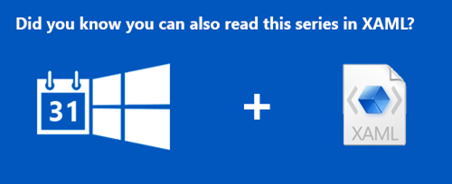
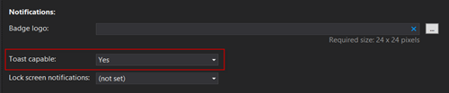

This article is Day #10 in a series called [31 Days of Windows 8](http://31daysofwindows8.com/).&nbsp; Each of the articles in this series will be published for both [HTML5/JS](http://csell.net/category/windows-8/31-days/) and [XAML/C#](http://www.jeffblankenburg.com/category/31-days-of-windows-8/). You can find additional resources, downloads, and source code on our [website](http://www.31daysofwindows8.com/).

* * *

Yesterday, we spent some time looking at Live Tiles, and how to let your users know about important information from your app.&nbsp; Today, we're looking at a different type of user notification: [Toast Notifications](http://msdn.microsoft.com/en-us/library/windows/apps/hh761493.aspx).

If you haven't worked with [Toast Notifications](http://msdn.microsoft.com/en-us/library/windows/apps/hh761493.aspx) in the past, the word might seem a little silly to you.&nbsp; The word "toast" in this case, comes from the image of a piece of toast emerging from a toaster. Yummy. Our notifications appear in a similar way, popping up in front of our user to let them know when something interesting has happened.

The primary difference between Toast notifications and Live Tile notifications is that Toast messages will appear on the user's screen regardless of which app they are currently running.&nbsp; By default in the top right hand corner. Live Tiles have to be viewed on the user's Start Screen.

Toast messages scream "YOU NEED TO KNOW THIS INFORMATION RIGHT NOW!" where Live Tiles are significantly more passive.&nbsp; Be sure you consider this when you're sending toast messages.&nbsp; If you're spamming them with unimportant nonsense, they're going to turn off your ability to send notifications, or worse, uninstall your app.&nbsp; Make sure you take a little time to read [Microsoft's guidance on toast notifications](http://msdn.microsoft.com/en-us/library/windows/apps/hh465391.aspx) before you get too deep into this.

For reference, here's a few examples of Toast notifications.

Just like Live Tiles, [there's an entire catalog of Toast Notification types you can use](http://msdn.microsoft.com/en-us/library/windows/apps/hh761494.aspx), but we'll get to those in a moment.

## Enabling Toast Notifications in Your App

Our first step to greatness with Toast Notifications is actually enabling them in our application manifest.&nbsp; Open your _package.appxmanifest_ file to the Application UI tab, and select "Yes" from the "Toast capable" dropdown list.

It will be very tempting, as you go through this article, to create a Badge logo file, and upload it to your application, but for this tutorial, don't.&nbsp; Here's why:

If you upload a Badge Logo, you must enable Lock Screen Notifications.&nbsp; However, if Lock Screen Notifications are enabled, you must have a Background Task.&nbsp; We're not covering Background tasks for two more days, and Lock Screen updates are tomorrow. Just be patient. :)

Today, we're focused on notifying the user via a Toast message.&nbsp; Let's get to that.

## Launching a Toast Notification from Your App

Yesterday, [Day #9's article focused on Live Tiles](http://csell.net/2012/11/09/31-days-of-windows-8-day-9-live-tiles), and if you read that, launching Toast Notifications is going to seem *incredibly* familiar and I am not going to go into the same amount of detail here.&nbsp; Just like live tiles there is an xml schema which represents the toast we want to send, note _<toast>_.
<pre class="prettyprint"><toast>
    <visual>
        <binding template="ToastImageAndText01">
            <image id="1" src="image1" alt="image1"/>
            <text id="1">bodyText</text>
        </binding>  
    </visual>
</toast></pre>

As we did with Live Tiles, we do the same or very&nbsp; similar with toast.&nbsp;

*   Get an instance of [WinRT](http://msdn.microsoft.com/en-us/library/windows/apps/br211377.aspx) Notification<li>From Notifications, get your Template<li>From that Template, get it's content aka that XML we showed above<li>Select and Update appropriately<li>(optional) set your duration
<li>(optional) set audio
<li>(optional) set any app launch parameters
<li>Create a new tile notification<li>Send tile update<pre class="prettyprint">var notifications = Windows.UI.Notifications;

var template = notifications.ToastTemplateType.toastImageAndText02;
var toastXml = notifications.ToastNotificationManager.getTemplateContent(template);

var toastTextElements = toastXml.getElementsByTagName("text");
toastTextElements[0].innerText = "31 Days of Windows 8";
toastTextElements[1].innerText = _toastMessage.value; //taking from screen

var toastImageElements = toastXml.getElementsByTagName("image");
toastImageElements[0].setAttribute("src", "ms-appx:///images/clarkHeadShot.jpg");
toastImageElements[0].setAttribute("alt", "Clark's Head");

var toast = new notifications.ToastNotification(toastXml);
var toastNotifier = notifications.ToastNotificationManager.createToastNotifier();
toastNotifier.show(toast);</pre>

As you can see this is scary similar to Live Tiles. I am setting two text properties, and one image property.&nbsp; For the image, you'll notice I added an extra line this time, referencing the "alt" attribute.&nbsp; If you've done any web development before, you probably already know what that is, but it's an important piece of the accessibility story on Windows 8.&nbsp; It provides a text representation of the image, for those users that are unable to see their screen.

Finally, we create a new _ToastNotification_ object, and _show(toast)_ it on the screen.&nbsp; That's the simple story to creating toast notifications in Windows 8.&nbsp; And here's what that exact tile looks like on my machine:

&nbsp;

But wait, there's more!&nbsp; If you created a project, and launched the toast message, you may have noticed that there is an audio clip that goes with it.&nbsp; This is the default Toast Notification sound, but you have options.&nbsp; There's also some other cool things you can do with toast messages.

## Setting the Audio for a Toast Notification (and more!)

Everything about creating a Toast Notification stays the same, but we can add some additional nodes to our XML to select a different audio sound, set the duration of the message, and even dictate a page to launch when the notification is clicked (with query parameters as well!)

First, regarding audio, I have some bad news.&nbsp; You can't use your own custom audio file.&nbsp; I know you were hoping to delight your user with the sound of a popping toaster, but it's just not possible.&nbsp; Instead, you can select from a list of 9 audio files, 4 of which are looping sounds that can be used like ringtones or alarms.&nbsp; [You can see the entire list of the audio files and descriptions available to Toast Notifications here](http://msdn.microsoft.com/en-us/library/windows/apps/xaml/hh761492.aspx).

To set the audio, we first need to crack open the XML we've been creating.&nbsp; By default, **none of the Toast Templates have an audio node defined**, so we need to create one.&nbsp; First, we need to dive into the <toast> node of our template, and then we can set our options.&nbsp; In the code sample below, I've excluded code for creating a Toast notification ( just look above ) and just added the part where we would modify the template to add our audio clip.
<pre class="prettyprint">....

var toastNode = toastXml.selectSingleNode("/toast");

var audio = toastXml.createElement("audio");
audio.setAttribute("src", "ms-winsoundevent:Notification.IM");
toastNode.appendChild(audio);

....</pre>

You an also set the duration, how long it will stay on the screen for a piece of Toast.
<pre class="prettyprint">....

var toastNode = toastXml.selectSingleNode("/toast");
toastNode.setAttribute("duration", "long");

....</pre>

It's important to remember that all of the options are optional, as you could see by their absence in our first example.&nbsp; Here's a couple of things to remember about these options:

*   
Long duration Toast messages are meant for things like VOIP calls and alarm clocks, not for email notifications.&nbsp; Use this sparingly. 

<li>

All of the looping audio options that are available will only work if you have set the duration to Long. 

<li>

The looping audio options will only work if you also set the "loop" attribute to true. 

Failure to follow those rules will result in the _Notification.Default_ audio to be played instead.

In addition, you might want to have SILENCE for your toast message instead of any of the audio options.&nbsp; You can do that.&nbsp; In that case, you still specify an _audioNode_, but you set a new attribute, silent, to true, like this:
<pre class="prettyprint">var audio = toastXml.createElement("audio");
audio.setAttribute("silent", "true");</pre>

This will result in a silent, but otherwise normal toast notification for your user.&nbsp; Finally, there's the "_launch_" attribute.&nbsp; Within this, we can pass any text string that we'd like, and it will be passed back to us as a page parameter when the toast message is pressed by the user.&nbsp; This data should allow you to determine which page to direct them to, with which data populating it.&nbsp; Don't put anything in the "launch" parameter that doesn't need to make the trip.
<pre class="prettyprint">....

var toastXml = notifications.ToastNotificationManager.getTemplateContent(template);

...

toastXml.selectSingleNode("/toast").setAttribute("launch", '{
                "type":"toast",
                "args1":"31days",
                "args2":"#10"}' );

....</pre>

## Summary

That's about it for Toast Notifications in Windows 8.&nbsp; Very similar to Live Tiles, toast messages are a great way to get the user's immediate attention, no matter what they are currently doing.&nbsp; Some of you are probably wondering how we make these updates from a Background task, and for you, we ask for patience.&nbsp; We wanted to make sure we gave a solid overview of each of these notification types before we dove headfirst into Background tasks.&nbsp; You're only two days away from that topic, I promise.

If you would like to download the entire code solution for this article, click the icon below:

Tomorrow, we'll cover our last topic in the notifications world, Lock Screen.&nbsp; See you then!
