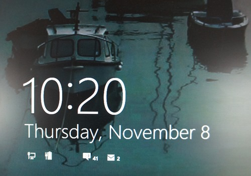
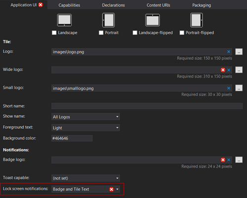
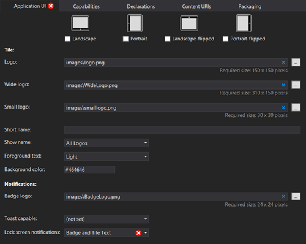
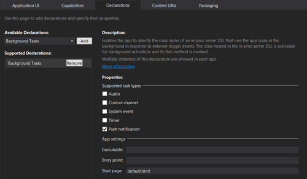
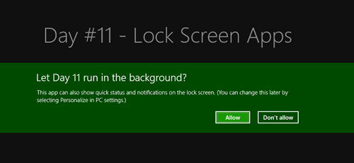
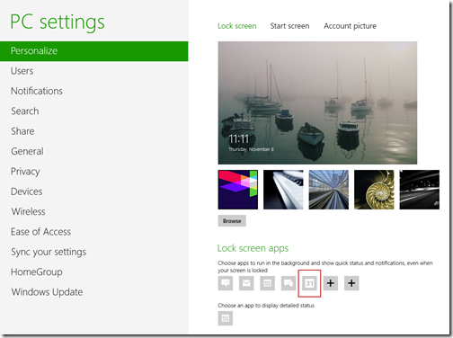
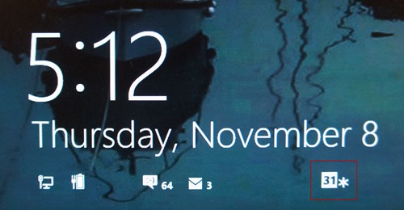
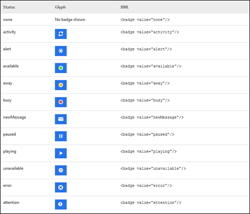
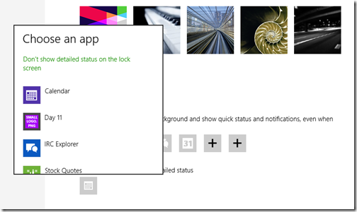
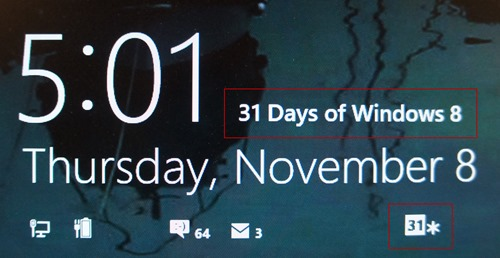

This article is Day #11 in a series called [31 Days of Windows 8](http://31daysofwindows8.com/).&nbsp; Each of the articles in this series will be published for both [HTML5/JS](http://csell.net/category/windows-8/31-days/) and [XAML/C#](http://www.jeffblankenburg.com/category/31-days-of-windows-8/). You can find additional resources, downloads, and source code on our [website](http://www.31daysofwindows8.com/).

 

* * *

Today we cover another part of notifications in Windows 8: the Lock Screen.&nbsp; If you're running Windows Phone or Windows 8 on your machine, you've likely gotten pretty familiar with the lock screen.&nbsp; It shows you how many emails you've received, Facebook messages, the clock, and your connectivity status.&nbsp; Here's my current lock screen:

Yes, that's a photo of my screen. I have no clue how to take a screen shot of my lock screen without a VM installed. Anyways, you can also see that I'm only writing this article a few days ahead of publication time, and someone has left me a number of instant messages.

We, as developers, have the ability to add our badges to this lock screen as well, but it's dangerous to go alone.&nbsp; Take this.&nbsp; It's [Microsoft's guidance on the best ways to utilize the Lock Screen notification area](http://msdn.microsoft.com/en-us/library/windows/apps/hh465403.aspx#user_experience_guidelines_for_tiles_and_badges_on_the_lock_screen).

## Configuring our Manifest

To get started the first thing we need to do is configure out application for lock screen notifications. We do that in where? Yes, our _package.appxmanifest_ file under the _Application UI_ / _Notification Section. _We're going to set the _Lock Screen Notifications_ to either _Badge_ or _Badge and Tile Text. _What's the difference? A _Badge_ would update the lock screen and your tile while _Badge and Tile Text _would update that + putting a text notification on the front screen if the user selects your app. This is something that appears to be only set from the manifest and by the user. For today let's go all out and select the _Badge and Tile Text _option.

Well that fired off a slew of validation errors huh. You'll notice the screen is now lit up with red X symbols.&nbsp; When lock screen notifications are enabled, we are required to have a Badge Logo ( we created a new 24x24 png for this which has to be transparent white png ), and since we chose the option that includes tile updates as well, we're required to provide a Wide Logo image as well.&nbsp; Here's my Application UI tab with those files added:

Wait, what? Why still red? Well "If lock screen notifications are enabled, you must specify one or more Background task declarations of type 'Timer', 'Control channel', or 'Push notification.'"

What this means is that Lock Screen apps generally expect to be updated from a Background Agent.&nbsp; Let's flip over to our _Declarations_ tab, and add a _Background Task_. We're going to add support for push notifications and add our default page as the entry point:

In my example app, we're not actually going to create a background task, however.&nbsp; I'm going to cover that extensively tomorrow.&nbsp; Instead, we're going to focus specifically on the processes and code that allows us to update our Lock Screen information.

## Asking for Permission

Before you can ever start thinking about writing content to the user's lock screen, you need to ask for their permission.&nbsp; Now, you don't HAVE to ask, but without asking their permission, the road to the Lock Screen is perilous and fraught with danger.&nbsp; Here's what I mean:
 > **You get ONE, and only ONE opportunity to ask the user for permission to be on their lock screen.**&nbsp; 
> 
> If you ask once, and they say "Don't Allow", you're not even capable of asking again.&nbsp; 

Here's what it looks like when you ask:

And here's how you do it:
<pre class="prettyprint">var background = Windows.ApplicationModel.Background;
var promise = background.BackgroundExecutionManager.requestAccessAsync();</pre>

If you never ask, the only way to get on the lock screen is for the user to open their PC Settings, and explicitly add you. How many users will really do that after the fact?

**Users can select up to 7 apps to be displayed on their Lock Screen and *1* to display text.**&nbsp; We want to make sure we're one of them.&nbsp; So, because our status can change at the user's whim, we should be responsible before trying to send updates to their Lock Screen.

## Making Sure You Have Permission

This is not a required step.&nbsp; You can have your app, or your background task (as we will cover tomorrow) continue sending updates even if you don't have permission.&nbsp; That being said, your updates also won't ever be seen by the user.&nbsp; Without permission, your updates will disappear into the ether.

Here's how we check to see if the user has granted us permission to update the lock screen:
<pre class="prettyprint">var background = Windows.ApplicationModel.Background;

var promise = background.BackgroundExecutionManager.requestAccessAsync().then(
    function (result) {
        switch (result) {
            case background.BackgroundAccessStatus.denied:
                // Background activity and updates DENIED 
                break;

            case background.BackgroundAccessStatus.allowedWithAlwaysOnRealTimeConnectivity:
                // Added to list of background apps.
                // Set up background tasks
                // CAN use the network connectivity broker.
                break;

            case background.BackgroundAccessStatus.allowedMayUseActiveRealTimeConnectivity:
                // Added to list of background apps.
                // Set up background tasks
                // CANNOT use the network connectivity broker.
                break;

            case background.BackgroundAccessStatus.unspecified:
                // The user didn't explicitly disable or enable access and updates. 
                break;
        }
    });</pre>

So at this point, we've covered asking the user for permission, and then checking to make sure that permission has been granted.&nbsp; The next step is actually sending the update.

## Updating the Lock Screen

Sending an actual update will look pretty familiar if you've read the previous two articles.&nbsp; ([Day #9 - Live Tiles](http://csell.net/2012/11/09/31-days-of-windows-8-day-9-live-tiles/), [Day #10 - Toast Notifications](http://csell.net/2012/11/10/31-days-of-windows-8-day-10-toast-notifications))&nbsp; Like those previous examples, we are grabbing a template that consists of XML (in this case, it's incredibly simple):
<pre class="prettyprint"><badge value="31"/></pre>

Next, we need to specify the value that we want to display.&nbsp; We have several options in this scenario.&nbsp; Not only can we use any number from 1 - 99, but we also have a number of glyphs to choose from.&nbsp; The best part is that the template is smart enough to recognize the difference, so the only thing that will change in our code is the actual value we pass in.&nbsp; Here's the code to make the update to the badge:

<pre class="prettyprint">var notifications = Windows.UI.Notifications;

var template = notifications.BadgeTemplateType.badgeNumber;
var templateContent = notifications.BadgeUpdateManager.getTemplateContent(template);

var element = templateContent.selectSingleNode("/badge");
element.setAttribute("value", "31");

var update = new notifications.BadgeNotification(templateContent);
notifications.BadgeUpdateManager.createBadgeUpdaterForApplication().update(update);</pre>Just like the tiles and toast I am setting an attribute on the badge element. In this case I am setting the value attribute to 31\. That results in a Lock Screen badge that looks like this:

If you would rather use one of the glyphs, here's a list of what's available, [courtesy of the Badge overview page on MSDN](http://msdn.microsoft.com/en-us/library/windows/apps/hh779719.aspx).
 

To specify a glyph rather than a number, we only need to change the value attribute to the name of the glyph listed above.
<pre class="prettyprint">//set
element.setAttribute("value", "alert");

//result
<badge value="alert"/></pre>

## 

That's about it for Lock Screen apps... Overall this is pretty easy. We're limited in what what we can display on the screen but if you're awesome then maybe you're up there.&nbsp;&nbsp; 

Wait... There's a few more things. Let's crawl into the weeds.&nbsp; 

When we started this article we jumped right into the app manifest file. The first thing we did was update the _Lock Screen Notifications_ to chose "_Badge and Tile Text_" in our appxmanifest file, we enabled these Badges we're creating to appear on our Tile as well.&nbsp; (This is why the WideTile.png file was required.)&nbsp; Here's what my Live Tile looks like with that same "Playing" badge applied:

&nbsp;

Man that tile is just ugly but, ok you get the point. Initially I thought, sweet my work here is done, but something was bothering me. The word _text_ in _Badge and Tile Text_. We really haven't displayed any true text right? Turns out the story wasn't done. If you're setup for Tile updates you can actually have your app display those tile updates on the Lock Screen too. Wait, what?!!? Yep. Let's go to: _Setting -> Change PC Settings -> Personalize. _Look really close at the bottom right hand side of the settings. Choose an app to display detailed status. Select that guy and your app should be listed in the menu. Choose it! Right now!

After doing so, when your app is running your tile text will also show up on the screen. Check out the sauce there.

But wait, who is the lucky winner? I guess that is for you to choose. It appears that your app has no rights to even put itself in that box.

## - read this -

Now during the course of writing this there were a few things that I came across.

#1: _setTimeout_ is your friend at least when trying to manually test this. To see what was going to get displayed on the lock screen, I created a silly button in my app. The handler for my button looked like such:
<pre class="prettyprint">clearNotifications();

setTimeout(function () {
    sendBadgeUpdateXML();
}, 5 * 1000);

setTimeout(function () {
    sendTileUpdate();
}, 6 * 1000);</pre>

This allowed me the time to fire off the events and lock the machine. Then I could sit back and watch the magic happen.

#2: There are "three" different ways to fire off badge updates. Why you ask? No clue. The all seem to work the same regardless. First there are two templates:
<pre class="prettyprint">var template = notifications.BadgeTemplateType.badgeGlyph;

var template = notifications.BadgeTemplateType.badgeNumber;</pre>

As the templates would imply, one is for the number and one for the glyph. That is a bit confusing when you know that the xml is just: 
<pre class="prettyprint"><badge value="31"/></pre>

Turns out, it just doesn't matter which one you pick. They act the same. Maybe down the road this will have more relevance so I would use what&nbsp; you want to "semantically" do.

So that was 2 different ways. What the third. Well just raw XML manipulation.
<pre class="prettyprint">var badgeXmlString = "<badge value='alert'/>";

var badgeDOM = new Windows.Data.Xml.Dom.XmlDocument();
badgeDOM.loadXml(badgeXmlString);

var notifications = Windows.UI.Notifications;
var badge = new notifications.BadgeNotification(badgeDOM);
notifications.BadgeUpdateManager.createBadgeUpdaterForApplication().update(badge);</pre>

It's straight forward and works but you pick your poison.

## Summary

We can update our Lock Screen information from our app at any time, but the tricky part is getting the user's permission.&nbsp; Once you've gotten that, updating the information is pretty simple, as we saw in this article.

If you would like to download a working application that uses the code from this article, click the icon below:

&nbsp;

Tomorrow, we're going to wrap up the last three days by talking about Background tasks.&nbsp; We'll show how to update Live Tiles, Toast notifications, and Lock Screen data from a background task.&nbsp; See you then!