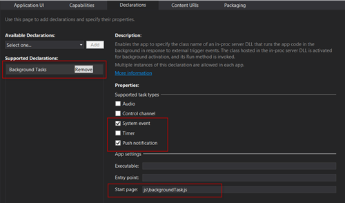

This article is Day #12 in a series called [31 Days of Windows 8](http://31daysofwindows8.com/).&nbsp; Each of the articles in this series will be published for both [HTML5/JS](http://csell.net/category/windows-8/31-days/) and [XAML/C#](http://www.jeffblankenburg.com/category/31-days-of-windows-8/). You can find additional resources, downloads, and source code on our [website](http://www.31daysofwindows8.com/).

* * *

Today, we are talking about Background Tasks.&nbsp; The short way to describe Background Tasks is this:

_A Background Task is the code that runs when your app doesn't._

Think of the scenarios:

*   Continue streaming audio, even when the user is running another app.  <li>Update the user's Live Tile to reflect new data.  <li>Pop a Toast Notification to let the user know something important has happened.  <li>Update the user's lock screen, even when the device is locked. 

But I guess we should start by asking the question, why isn't it running. With the release of Windows 8 and [WinRT](http://msdn.microsoft.com/en-us/library/windows/apps/br211377.aspx) a new [application lifecycle](http://msdn.microsoft.com/en-us/library/windows/apps/hh464925.aspx) was introduced. But more on PLM in another upcoming article. Also as a web developer this isn't something we would typically even bother thinking of. We typically think of http requests, session state, endpoints and so on. At a high level the application lifecycle looks something like this:

Image courtesy of [http://msdn.microsoft.com/en-us/library/windows/apps/hh464925.aspx](http://msdn.microsoft.com/en-us/library/windows/apps/hh464925.aspx)

So in short we need background tasks just in case we might not actually be running. For purposes of today, we're going to build a sample will get all the pipes working together and send some push notification based on system events. Getting a background task established and registered with the system is a two-step process.&nbsp; First, you have to register the Background Task in your package.appxmanifest file.&nbsp; Once that has been done, you still need to register the events of that Task with the system from your application code, and then there are additional events to manage what happens when Background Tasks should get fired, when it completes etc.

## Our Background Task

As you might imagine, a background task is nothing more than a self executing anonymous function. Sure we have to do some special sauce around the thing but we basically registered an endpoint, a trigger and then the function that should get executed, in this case the JS file that should run. 

Given this the first place we're going to start is adding a new JS file to our blank project and add the most famous three lines in Windows 8 development.
<pre class="prettyprint">(function () {
    "use strict";

})();</pre>

Of course if this is in fact our background task, then you should expect the next step to be something like this.
<pre class="prettyprint">....

function run () {

}

run();

....</pre>

I know I am starting out simple here but I want to prove some points along the way. 1\. it's just JavaScript. 2\. we're going to leverage WinRT where needed.&nbsp; At this point we have a function that when run will execute itself, hit _run()_ and call the _run_ function.

Now it's a background task so of course we want the ability to close or cancel it. Let's extend our function a bit to add a cancellation handler. Now to do that we're going to need an instance of our background task running and we get that from _[Windows.UI.WebUI.WebUIBackgroundTaskInstance.current](http://msdn.microsoft.com/en-us/library/windows/apps/windows.ui.webui.webuibackgroundtaskinstance.current)_. Let's revisit the entire function to add the cancellation handler AND call close when our work is done. After all we need to signal the fact we've finished.
<pre class="prettyprint">(function () {
    "use strict";

    var backgroundTaskInstance = Windows.UI.WebUI.WebUIBackgroundTaskInstance.current;
    var canceled = false;

    function run() {
        //make awesome!!!
        close();
    }

    function onCanceled(cancelSender, cancelReason) {
        canceled = true;
        close();
    }

    if (!canceled) {
        run();
    } else {
        //Must Call Close
        close();
    }

    //register event handlers
    backgroundTaskInstance.addEventListener("canceled", onCanceled);

})();</pre>

At this point we have a background task. Now it doesn't actually run any "background code" or talk with app but it's there and ready to go. We will come back to our task later after we have it executing.

## Setting Up Your Package.Appxmanifest File

Ah yes. the package.appxmanifest. I hope by now you understand just how much you need to know this file. Once again we're back in there. The next step in our process is to declare that we will be using Background Tasks in this application.&nbsp; We do this in the package.appxmanifest file, in the Declarations section, as illustrated by the screenshot below (click to enlarge):

As you can see, we've added a declaration for Background Tasks (you will have to add a new one of these for each Background Task you want to add to your project), and set the entry point to be the JavaScript file we just created. You will notice that I selected [System Event](http://msdn.microsoft.com/en-us/library/windows/apps/windows.applicationmodel.background.systemtriggertype.aspx) and [Push Notifications ( raw notification in this case )](http://msdn.microsoft.com/en-us/library/windows/apps/jj676791.aspx). You can think of each of these as a [category of different triggers](http://msdn.microsoft.com/en-us/library/windows/apps/Hh977046(v=win.10).aspx).

Now over the past few days we have learned about live tiles, badge updates and the lock screen. I figure today we will continue to build upon that. To do so, we will have our background task just fire some tile updates. 

Since I selected Push Notification I also have to go back to the Application UI and update the appropriate fields in the Tile and Notification sections, otherwise I couldn't send any push notifications to it. Now you already know how to do that from [Day #9 on Live Tiles](http://csell.net/2012/11/09/31-days-of-windows-8-day-9-live-tiles/). 

Next, we need to register this task in our actual application, so that Windows 8 knows to run it at the appropriate times.

## Registering Your Background Task

Up to now, we have our background task shelled out, and registered in the appxmanifest. Now on our startup of the application we need to register it with Windows. To do this we're going to run through a few things:

*   Loop through all of the tasks and see who is registered
*   Get an instance of the task builder
*   Register the exact trigger
*   (optional) Register the entry point ( although this might be duplicate work here )
*   (optional) Set any conditions on the trigger
*   Register it
*   Add any handlers we care about such as when the task completes.

Let's start by looping through the BackgroundTaskRegistration.allTasks collection. We we could have multiple Background Tasks running under our application, but in our case we will only have one that we're "really" interested in. Because of that, we're going to cheat a bit code just to prove the point and work through the process. 
<pre class="prettyprint">var _isRegistered = false,
    _bgTaskName = "our task",
    _appModel = Windows.ApplicationModel,
    _background = _appModel.Background,
    _registeredTasks = _background.BackgroundTaskRegistration.allTasks.first(),
    task;

//loop throught all of the tasks and find out who is already registered
while (_registeredTasks.hasCurrent) {
    var task = _registeredTasks.current.value;
    if (task.name === _bgTaskName) {
        _isRegistered = true;
        break;
    }

    _registeredTasks.moveNext();
}</pre>

Once we have looped through to find out if our task was registered, we can go forth and register the our task.
<pre class="prettyprint">if (!_isRegistered) {
    var taskBuilder = new _background.BackgroundTaskBuilder();

    var taskTrigger = new _background.SystemTrigger(
        _background.SystemTriggerType.timeZoneChange, false);

    taskBuilder.name = _bgTaskName;
    taskBuilder.taskEntryPoint = "js\\backgroundTask.js";
    taskBuilder.setTrigger(taskTrigger);

    /*
        do we add any conditions here...

        taskBuilder.addConditions(
            new _background.SystemCondition(
            _background.SystemConditionType.userPresent));
    */

    task = taskBuilder.register();
}</pre>

In short, we're creating the BackgroundTaskBuilder and using it to configure our task. Once done we will then register it. Now in the sample above you will see I am setting the entry point of the task. A fresh caffeinated mind should remember that I actually set that entry point in our appxmanifest. You can do either. I guess you could be somewhat dynamic with the trigger and pass in the entry point but you would need to unregister and reregister the task.

Now I choose to use a simple SystemTrigger and one that might seem odd, the timeZoneChange trigger. There was no real reason for doing so other than it's easy for you to setup things and the change your time zone kicking off the trigger. 

If you ever have a need to unregister your Background Task, it's pretty simple. Like we registered we can unregister. Difference being we pass a Boolean in as a parameter which tells the taskBuilder to either kill what is in progress or wait until that task has completed to kill it.
<pre class="prettyprint">task.unregister(false);</pre>

So we've worked through registering and unregistering our Background Task, and we now have specified that our application should kick off our Background Task when the time zone of the machine changes.&nbsp; Let's write some actual code in our Background Task class, and then give this thing a test.

## Making Your Background Task DO Something

Earlier we shelled out our background task class. Since we've spent the last few days working on sending updates to live tiles, I figure why not send out a push notification when our background task gets called by changing the time zone.

To send out that notification we could simply do something like this, note I am grabbing the Date object so we can see the Time and TimeZone on our tile:
<pre class="prettyprint">function sendTileUpdate() {
    var notifications = Windows.UI.Notifications;

    var smallTemplate = notifications.TileTemplateType.tileSquareImage;
    var smallTileXml = notifications.TileUpdateManager.getTemplateContent(smallTemplate);

    var wideTemplate = notifications.TileTemplateType.tileWideText01;
    var wideTileXml = notifications.TileUpdateManager.getTemplateContent(wideTemplate);

    var wideTileTextElements = wideTileXml.getElementsByTagName("text");
**_    wideTileTextElements[0].innerText = new Date().toTimeString();_**

    //merge tiles..
    var node = wideTileXml.importNode(smallTileXml.getElementsByTagName("binding").item(0), true);
    wideTileXml.getElementsByTagName("visual").item(0).appendChild(node);

    var tileNotification = new notifications.TileNotification(wideTileXml);

    var currentTime = new Date();
    tileNotification.expirationTime = new Date(currentTime.getTime() + 10 * 1000);

    notifications.TileUpdateManager.createTileUpdaterForApplication()
        .update(tileNotification);
}</pre>

You have seen that code a few times already. Next we would clearly need to update our original run method to call that sendTileUpate. <pre class="prettyprint">function run() {
    var key = null,
        settings = Windows.Storage.ApplicationData.current.localSettings;

    // aka "background work"
**    sendTileUpdate();**

    // Record information in LocalSettings to communicate with the app.
    key = backgroundTaskInstance.task.taskId.toString();
    settings.values[key] = "Succeeded";

    close();
}</pre>

Now I slipped in a few new lines. Let's say you wanted to interact with your background task in some way, maybe get a status some kind of status or log. You can see I just wrote some key values pairs to our apps _localSettings. _Then from my app I can easily just grab it from anywhere in my application. I thought that might be a good way to pull you back to [day #8](http://csell.net/2012/11/08/31-days-of-windows-8-day-8-local-and-roaming-data/).

Obviously, we could write a similar Background Task to implement sending a Toast notification, updating the Lock Screen, or other valuable calls to web services for example. I just thought this might be a good way to tie together the past few days together.

Also one point to note, if it was clear from earlier. Your app will have to at least run **once** to register the background task.

## Summary

That is a pretty good run-through of how you can setup and run a background tasks. Now clearly, there are a number of different triggers and conditions for a background task so it's not all ice cream and apple pies. They also get increasingly more difficult depending your overall dependencies and setup which makes them harder to debug. In fact, [Microsoft has written an entire article about exactly how to Debug Your Background Tasks](http://msdn.microsoft.com/en-us/library/windows/apps/xaml/jj542416.aspx).&nbsp; I highly recommend reading it.&nbsp; They have also created a quickstart tutorial called [Create and Register a Background Task](http://msdn.microsoft.com/en-us/library/windows/apps/xaml/hh977055.aspx). Having said that, the sample we built today you can run just hit run and put breakpoints in the appropriate places and mess around just fine.

If you would like to download the working sample code from this article, click the icon below:

&nbsp;

Tomorrow, we're going to shift gears again, and start talking about Navigation.&nbsp; Specifically, how to navigate between pages in a HTML application, and pass parameters and data as part of that process.&nbsp; See you then!