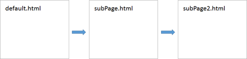
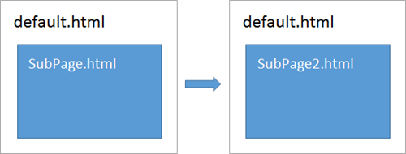
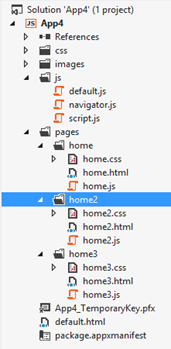

This article is Day #13 in a series called [31 Days of Windows 8](http://31daysofwindows8.com/).&nbsp; Each of the articles in this series will be published for both [HTML5/JS](http://csell.net/category/windows-8/31-days/) and [XAML/C#](http://www.jeffblankenburg.com/category/31-days-of-windows-8/). You can find additional resources, downloads, and source code on our [website](http://www.31daysofwindows8.com/).

* * *

We've spent the last few days getting pretty technical around updating the system with information to the let our users know what's going on.&nbsp; In fact, in the first 12 days of this series, we've spent very little time talking about how to do one of the most common activities we'll encounter in Windows 8 development: navigation. Now you might be sitting there saying, anchor tags, query strings and JavaScript gymnastics, right? You might even be thinking I can skip this it's web 101 and while that is somewhat true you need to understand where WinJS fits into things and just what to do when your application gets terminated.

I am pretty sure we've all done some kind of navigation in our websites but let's level set a bit see how today's web practices fit into an "app".&nbsp; After all the web is all about navigation right? We can link to anything on the web with a simple anchor tag.
<pre class="prettyprint"><a href="http://31DaysOfWindows8.com">31 Days of Windows 8</a></pre>

And when that wasn't enough we added a query string so we could get some data:
<pre class="prettyprint"><a href="http://31DaysOfWindows8.com/?days=13">Navigation</a></pre>

And when AJAX came a overnight internet sensation, we started using hashs (#) and hashbangs (#!) and creating these awesome web applications:
<pre class="prettyprint"><a href="http://31DaysOfWindows8.com/#day12">Day 12</a></pre>

But you knew all this already. So why did I even bother spewing that? Well over time there has been a subtle evolution of what we might consider a Website. Today Websites have become more of a application than what we have typically considered a Website. HTML5 has been a great catalyst in all of this but it was going to happen regardless.

Regardless, there are really two major "patters" which have emerged. The multiple page site ( [http://thatConference.com](http://thatConference.com) ) and the single page site ( [http://twitter.com](http://twitter.com) or [http://OneDay.ThatConference.com](http://OneDay.ThatConference.com) ) . While they really don't sound all that different their implementations are drastically different. Let's gently break down each:

Multiple Page Site:

*   Everything starts over on each page navigation, aka full page lifecycle.&nbsp; <li>New resources are loaded for each page request ( again full page lifecycle ), this means JavaScript pages, CSS and whatnot.<li>Session state is most likely managed on the server assuming there is session.
<li>Interaction between pages is minimal.

Single Page Site:

*   Everything runs in the container that it was loaded&nbsp; as a "control or section" ( if you will )<li>In the image below we're going to load pages within the context of the parent page. In our case the default.html page<li>Resources are usually only loaded once ( at least in the simplest of methods )<li>Usually heavily dependent on a lot of AJAX to pull in data when needed
<li>Loves JavaScript ( I do to actually )

Which one do you pick? Is there a right answer? Maybe, but your context is critical to making that decision. Take a moment here, ok. Are you a multiple page site or a single page site? Furthermore are you a multiple page _app_ or a single page _app _or are you _both_? Or are you doing something greenfield looking for guidance. And BTW how does all of this fit into Windows 8? Getting there..

Well not to fear, Windows 8 supports both just like your Website. With one major difference. We do not have any navigation buttons or address bar functionality inside our app like we do in a browser. Today, we're going to dive into the single page site model. This is the Microsoft recommended approach for a Windows 8 Store App and there are a few reason for that: 

*   Page Transitions<li>The way scripts are loaded and unloaded<li>Page and State Management

There are a few specific scenarios that I want cover in this article:

*   The simple act of navigation from Page A to Page B in either model we describe above.&nbsp; What happens when, and what information is available to us?<li>Passing data from one page to another.&nbsp; This doesn't just include strings and integers, we can also pass entire objects between pages.<li>Page State

## New Navigation App

Today we're going to start a bit differently and rather that kick things off with the blank template we're going to start from a new project template, one called the [Navigation App](http://msdn.microsoft.com/en-us/library/windows/apps/hh758331.aspx). Why what's the difference? Mainly just a few minor things:

*   A new JavaScript file called navigator.js. This is the framework which helps you do navigation.<li>Some new goo in our default.js file to to manage save and load our applications navigation state.<li>Slightly different app folder structure. There is now a pages folder with folders of pages.<li>The markup has changed in our pages to leverage the navigator.js framework.

To better see this in action let's just walk the stack and see what our template is doing when we hit run. 

When our app first fires up you will notice that our default page has the same standard references to our WinJS scripts and style. Of course we also have our own supporting style and scripts file. New to this template is the addition of the navigator framework:
<pre class="prettyprint"></pre>

When default.js kicks off, it looks very similar as it has in the past except now we have some new code to deal with the saving and loading our navigation state.
<pre class="prettyprint">app.addEventListener("activated", function (args) {
    if (args.detail.kind === activation.ActivationKind.launch) {

        /* .... */

        if (app.sessionState.history) {
            nav.history = app.sessionState.history;
        }
        args.setPromise(WinJS.UI.processAll().then(function () {
            if (nav.location) {
                nav.history.current.initialPlaceholder = true;
                return nav.navigate(nav.location, nav.state);
            } else {
                return nav.navigate(Application.navigator.home);
            }
        }));
    }
});

app.oncheckpoint = function (args) {
    app.sessionState.history = nav.history;
};</pre>

Next up, the page itself. Our default.html page is actually going to load home.html as a control inside a div.&nbsp; Application.PageControlNavigator is a control inside that navigator.js framework we mentioned earlier. This should feel very familiar to to our [Day 4 conversation on WinJS controls](http://31daysofwindows8.com/?day=4).
<pre class="prettyprint"><body>

    

    

</body></pre>

Next up, let's look at the subpage, inner page, child page, or little box in the bigger box, starting with its markup. Since we're a subpage of default.html we don't need to reference the WinJS frameworks like we did in default.html because they we're already in scope for us. The rest of our page is just standard ole markup. Nothing fancy to see here. In this case, back button, header and some content.
<pre class="prettyprint"><!DOCTYPE html>
<html>
<head>
    <meta charset="utf-8" />
    <title>homePage</title>

    <link href="/pages/home/home.css" rel="stylesheet" />
    
</head>
<body>
    

        <header aria-label="Header content" role="banner">
            <button class="win-backbutton" aria-label="Back" disabled type="button"></button>
            <h1 class="titlearea win-type-ellipsis">
                Welcome to App16!
            </h1>
        </header>
        <section aria-label="Main content" role="main">
            
Content goes here.

        </section>
    

</body>
</html></pre>

Now onto the it's associated behavior. Remember our subpage is really something called a [PageControl found in WinJS.UI.Pages](http://msdn.microsoft.com/en-us/library/windows/apps/hh770584.aspx). Why not just a normal page? Well if you think about how the lifecycle of a page really works we're well beyond the bounds of that. Things like our standard page events ( like document ready ) have been thrown off as they have really happened on our parent page. This is where our pageControl control comes in. It gives you the perception of being a page, acting like a normal page even though it's a control inside another page.
<pre class="prettyprint">(function () {
    "use strict";

    WinJS.UI.Pages.define("/pages/home/home.html", {
        ready: function (element, options) {
            var isReady = "I am ready are you?";
        }
    });
})();</pre>

At this point we have a running app which is using the navigation framework with bonus points of because we're saving our navigation state to our [apps sessionState](http://msdn.microsoft.com/en-us/library/windows/apps/hh440965.aspx) through the PLM events. I know the template did this all for you but just don't tell your boss that.

Before we move on let's create another page home2 that we can navigate too. We can easily do so, by adding a new item called a pageControl. A page control is really nothing more than an html, js and css files already semi-wired up for you to start messing around with. I say semi because depending on how you're using it, you could in fact remove some of the WinJS references, as your parent page already has them.

## Navigating Between Pages

We started off this article briefly running through a set of anchor tags, which take you to another document or to a different location in a site\application. The same is true for a Windows Store App. A simple anchor tag will redirect you from one top level page to another.
<pre class="prettyprint"><a href="/pages/home2/home2.html">Goto MultiPage Navigation</a></pre>

Which will work fine and one could build an app like that no problem. But today I want to focus on the Single Page Navigation model that we've touched on earlier. To accomplish that we will use the navigation framework that we've already briefly introduced. As you can imagine, we're going to call a method called navigate passing it our destination. 
<pre class="prettyprint">WinJS.Navigation.navigate("/pages/home2/home2.html"); </pre>

Next we need to actually use our navigation framework. To easily do so, we want really want to replace the default behavior of our anchor tags default behavior. We can easily hijack their behavior by first wiring into their event like so:
<pre class="prettyprint">WinJS.Utilities.query("a").listen("click", anchorHandler, false);</pre>

and then preventing them from doing what they normally would do and rather call the WinJS Navigation.
<pre class="prettyprint">function anchorHandler(eventInfo) {
    eventInfo.preventDefault();
    var link = eventInfo.target;

    WinJS.Navigation.navigate(link.href);
}</pre>

Now all of our anchor tags will not link like they normally do but rather use our navigation framework to navigate to other pageControls. Of course it doesn't just have to be an anchor tag, but I am taking the easy road here.

Now that got us to someplace, what about going back? Remember we don't have the browser back and forward buttons and further more the browser and\or the [HTML5 History API](http://dev.w3.org/html5/spec/single-page.html#history) would\could be keeping track of that for you ( it depends on how you setup ). The same is true when you use the WinJS Navigation. The navigator is keeping our session history and has a number of methods and events on it for your disposal. If you're using the template you may notice the back button at the top of your second page and if you click on it, you're magically taken back. Well not really. In fact all it's doing is calling one of those methods on WinJS.Navigation, specifically _[back()](http://msdn.microsoft.com/en-us/library/windows/apps/br229802.aspx)_. You can see this directly in the navigator.js file.
<pre class="prettyprint">_updateBackButton: function () {
    var backButton = this.pageElement.querySelector("header[role=banner] .win-backbutton");
    if (backButton) {
**        backButton.onclick = function () { nav.back(); };
**
        if (nav.canGoBack) {
            backButton.removeAttribute("disabled");
        } else {
            backButton.setAttribute("disabled", "disabled");
        }
    }
},</pre>

## Passing Data

Next, we're going to want to pass data between our pages.&nbsp; Maybe an object, maybe a string, but data nonetheless.&nbsp; As it turns out, our WinJS.Navigation.navigate method is overloaded to also accept a data parameter. So I am just going to create a simple little object, and modify my call to navigate to pass it alone.
<pre class="prettyprint">var myData = {
    firstName: "Clark",
    lastName: "Sell"
};

....

WinJS.Navigation.navigate(link.href, myData);

....</pre>

Then on the receiving side of that call it comes to us as the options on the ready handler for our pageControl.
<pre class="prettyprint">ready: function (element, options) {
    var results = document.querySelector("#results");
    results.innerText = options.firstName + " " + options.lastName;
}</pre>

I don't think that gets much easier.

## Application Lifecycle

Now what if your app is down a few levels and the user then switches to something else, forgetting he or she was running it. Windows suspends it and then what? All is lost? I hope not. We would want the user to resume where they left off and if that meant hitting your back button first thing, then they should be able to. Well this is in fact true. We touched on it earlier but lets took a quick look at what that code in the template was doing.

Before your app suspends, it will call checkpoint. This is our opportunity to take our navigation state and persist it.
<pre class="prettyprint">app.oncheckpoint = function (args) {
    app.sessionState.history = nav.history;
};</pre>

Now with things saved off, what happens in the other direction when things start up. Well honestly it does what you would think. 

*   Check your apps sessionState for any history
*   If there is, re-populate the navigation history
*   Then after all the controls are processed, see if the user was somewhere
*   Return the user to the correct location.<pre class="prettyprint">app.addEventListener("activated", function (args) {
    if (args.detail.kind === activation.ActivationKind.launch) {
        if (args.detail.previousExecutionState !== activation.ApplicationExecutionState.terminated) {
            // TODO: This application has been newly launched. Initialize
            // your application here.
        } else {
            // TODO: This application has been reactivated from suspension.
            // Restore application state here.
        }

        if (app.sessionState.history) {
            nav.history = app.sessionState.history;
        }
        args.setPromise(WinJS.UI.processAll().then(function () {
            if (nav.location) {
                nav.history.current.initialPlaceholder = true;
                return nav.navigate(nav.location, nav.state);
            } else {
                return nav.navigate(Application.navigator.home);
            }
        }));
    }
});</pre>

Honestly nothing too complicated, and since it's done for you, well even easier but you should know what is at least going on.

## Summary

Easier than using your GPS to find the nearest Subway? Maybe. It's not overly complicated and in fact the frameworks are already there to really support us. Of course today's applications can be very complicated so don't assume your work is done for you. Today we covered the navigation models, the Navigator App template, navigation back and forth and even persisted our navigation history in case our app gets suspended.

If you would like to download the complete code sample from this article, you can click the icon below. 

Tomorrow, we're going to start our conversation determining a user's current location using GeoLocation, including the rules that go with using this technology.&nbsp; See you then!

