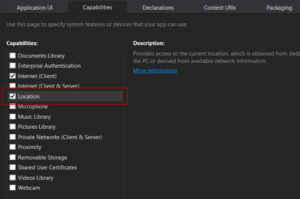
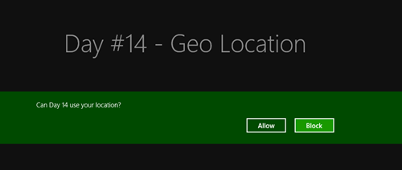
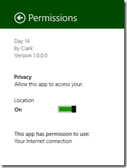
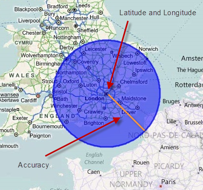
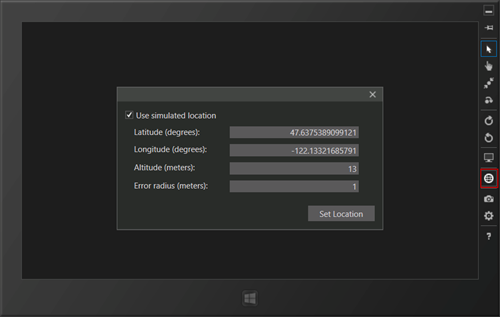

This article is Day #14 in a series called [31 Days of Windows 8](http://31daysofwindows8.com/).&nbsp; Each of the articles in this series will be published for both [HTML5/JS](http://csell.net/category/windows-8/31-days/) and [XAML/C#](http://www.jeffblankenburg.com/category/31-days-of-windows-8/). You can find additional resources, downloads, and source code on our [website](http://www.31daysofwindows8.com/).

 

* * *

Today, we get to talk about geolocation.&nbsp; Having knowledge about the user's location (or more specifically, the device) makes every app and its user experience better.&nbsp; Here's some examples of how:

**Line of Business Apps**

Know which plant your field manager is visiting today, so that he has all of the appropriate documentation for the machinery in that facility.&nbsp; In addition, your app could surface the photos and names of the employees in that facility, so that they are more prepared and personable when they arrive.

**Games**

Identify other nearby players, and make an opportunity to match them up in game.&nbsp; It will not only potentially improve network latency for them, but you might also form a guild out of nothing.&nbsp; Create a global game of tag, based solely on proximity, not touching.

**Maps**

Duh.&nbsp; We'll do this as part of the sample code today.

**Travel**

Recognize the user's distance and potential travel time from the airport, and alert them to the impending urgency to leave before missing their flight.&nbsp; In addition, once you've established they can't make it on time, help them find the next available flight without the user having to find it on their own.

**Exercise**

There are tons of apps available to track your exercise route.&nbsp; Think running, cycling, etc.&nbsp; The obvious application of geolocation to these apps is the ability to map the route you took during your travels.&nbsp; A more important one, however, and I think this responsibility probably falls to the mobile OS manufacturers themselves, is the ability to recognize an accident.&nbsp; On average, [4500 cyclists a year are victims of hit-and-run situations](http://bicycleuniverse.info/transpo/almanac-safety.html), where they are left injured (or worse) on the side of the road.&nbsp; In today's world, nearly everyone has their phone with them, even when running or cycling.&nbsp; Imagine that your phone is capable of recognizing a large impact (using accelerometer or gyroscope data), followed by no movement at all.&nbsp; After 30 seconds of no movement, your phone prompts you to call 911 and send text messages to a pre-selected list of contacts with an SOS message and your location.&nbsp; After 30 more seconds, it immediately sends that information and dials 911.&nbsp; This functionality could save lives, as many of these cyclists die needlessly only because nobody knows where they are.&nbsp; Sorry for being so morbid, but it's an important thing to think about.

As you can see there is always a way to take location data and make your app even better.&nbsp; In addition, if you love my ideas above, you are completely welcome to steal them outright.&nbsp; I will likely never build any of those apps, specifically.&nbsp; There needs to be 48 hours in every day to make that happen.

## Geolocation and the Browser

Geolocation is a fairly new [spec](http://www.w3.org/TR/geolocation-API/) in our Web world but an exciting one nonetheless. Of course when you think about geolocation in the browser on our laptop the scenarios are slightly&nbsp; different. I mean after all we're not going to strap a 1k dollar ultrabook to our sleeve and going running. So we typically think of someone using it at their desk, wherever that is. 

But that doesn't mean geolocation wasn't a needed feature. If you're [Yelp](http://yelp.com) and your users are looking for a restaurant within 25 miles why on earth would you ask them for their location? Ok, maybe there is a scenario where they are at work and they want to find a place 25 miles from their home, but you get my point. 

This is all fine and dandy but we're also getting into a new world of new form factors, awesome hardware and so on. So if that ultrabook was actually some cool convertible , then maybe things like geolocation in the browser become something more than just behind a desk.

Regardless, this is all important and as we've seen throughout this series as web developers we have this unique skillset that is applicable in both the app world" and the "web world". So, lets get started.

## Updating our Manifest

Thankfully, getting our geolocation data is pretty easy, and as usual, we have to declare that Location is one of our capabilities in order to use it.&nbsp; To do this, open the Capabilities section of your package.appxmanifest file, and check the Location box.

If you skip this step, and just try implementing the code in the rest of the article, you won't get any errors, but you also won't get any data.

## Getting our Geolocation Data

In this example, I have constructed an application that constantly tracks the device's location.&nbsp; The first thing that got me confused in this process was how to ask the user for permission to start tracking their location in the app.&nbsp; If you'll recall, in [Day #11 Lock Screen Apps](http://csell.net/2012/11/11/31-days-of-windows-8-day-11-lock-screen-apps), we had to explicitly prompt the user for permission to access their lock screen.&nbsp; With Location, however, we don't.&nbsp; The simple act of trying to access the data will prompt the user on your behalf.&nbsp; To get access to the users position, we will need to create the Geolocator object from WinRT and then ask for the user position. I have just wrapped this in a function that I will assign to a button for demonstration purposes.
<pre class="prettyprint">function getlocation() {

    if (_geolocator == null) {
        _geolocator = new Windows.Devices.Geolocation.Geolocator();
    }

    if (_geolocator != null) {
        //this call will also ask the user for permission to their location
        _geolocator.getGeopositionAsync().then(getPosition);
    }
}</pre>

As you can see we're getting access to the [Geolocator](http://msdn.microsoft.com/en-us/library/windows/apps/windows.devices.geolocation.geolocator.aspx) in [WinRT](http://msdn.microsoft.com/en-us/library/windows/apps/br211377.aspx) is easy. We can then ask for the users position and pass it the function to execute once it has it. As you can see from our comment when we ask for the users position, Windows will ask the user ( the first time ) for access to get their location.

Now this isn't a permanent thing. The user can go into the settings of the application and turn off permission to the location. You should in fact guard for that scenario.

Once the position has been acquired our function will be called at which time we can get at the raw data. Below I am going to take the [Geocoordinate class](http://msdn.microsoft.com/en-us/library/windows/apps/windows.devices.geolocation.geocoordinate.aspx) and grab a few of it's data values, presenting them on the screen.
<pre class="prettyprint">function getPosition(position) {
    _lat.innerText = position.coordinate.latitude;
    _long.innerText = position.coordinate.longitude;
    _accuracy.innerText = position.coordinate.accuracy;
}</pre>

## Wait, but that HTML5 thing...

So wait a minute, we already have geolocation in HTML5 doesn't that work? Is Microsoft cooking up it's own thing here? Nope. Let's quickly look at the HTML5 way. Quite honestly it's just like what we did with WinRT, just different APIs. Key difference being we're going to our navigation object from window rather than WinRT.
<pre class="prettyprint">function getHtml5Location() {
    if (navigator == null)
        navigator = **window.navigator**;

    var geolocation = navigator.geolocation;
    if (geolocation != null)
        **//this call with prompt for access.
**        geolocation.getCurrentPosition(positionCallback);
}</pre>

We will of course get prompted again when we ask for the users location. Then our callback will get executed, passing the users position.
<pre class="prettyprint">function positionCallback(position) {
    _lat.innerText = position.**coords**.latitude;
    _long.innerText = position.**coords**.longitude;
    _accuracy.innerText = position.**coords**.accuracy;
}</pre>

So the million dollar question is why are there two and which one do you use? Well there are two simply because WinRT is projected to all of the languages including JavaScript and since those API's have to be there for the other languages then JavaScript get's it too. So which one? Well at this point I am not sure it really matters. If you want cross platform JavaScript code, then I would stick with the HTML5 way. If you want the native API used across all languages, then maybe WinRT is your answer. I honestly don't know if it matters. For the rest of this article I am just going to 

## but I'm moving...

At this point we've successfully asked for our location data and retrieved it but what if we we're moving and the position changes or better yet the status of our GPS changes. 

> At this point I feed the need to put out a disclaimer. 
> 
> Please do not try to test and drive your code at the same time without another geek actually driving.

As you might have guessed the answer here is events. There are two different events we can register for; positionChanged and statusChanged. Let's look at each.

## positionChanged event

Before we called getGeppositionAsync to get our location data like such:
<pre class="prettyprint">_geolocator.getGeopositionAsync().then(getPosition);</pre>

This was a one time call that returned to us some coordinate data ( the same coordinate data that we're about to talk about in greater detail ). But that was a one time async call. What if we want it as the users position changed? Well rather than calling to get the coordinate data we will just wired up and event to it like so:
<pre class="prettyprint">_geolocator.addEventListener("positionchanged", onPositionChanged)</pre>

Just like any event handler you've wired in the past the same is true here. when positionchanged is fired it will call my function onPositionChanged. Now this time when my function is called a _slightly_ different object is passed through. it's an argument object with a position on it rather than just the position being passed through. So let's modify the code slightly to easily account for both scenarios.
<pre class="prettyprint">//called by my event handler that we wired
function onPositionChanged(args) {
    displayPosition(args.position);
}

//called by a button who called getGeopositionAsync()
function getPosition(position) {
    displayPosition(position);
}

//displays on screen
function displayPosition(position) {
    _lat.innerText = position.coordinate.latitude;
    _long.innerText = position.coordinate.longitude;
    _accuracy.innerText = position.coordinate.accuracy;
}</pre>
You will notice that I have modified my functions such that I can reuse some of the logic a bit better.

Now this object passed through has is where all this location data will come from such as Longitude, Latitude, and Accuracy, as you've already seen.&nbsp; If you look a little closer at this [Geocoordinate class](http://msdn.microsoft.com/en-us/library/windows/apps/windows.devices.geolocation.geocoordinate.aspx) you will see there is actually much more data on it such as:

*   **Accuracy** is the measurement, in meters, of the radius of a circle that has our latitude and longitude value as the centerpoint.&nbsp; Like this: 

*   **Timestamp** is the actual time that the Location value was read.&nbsp; This includes timezone information, so you'll have to convert the times to store everything in UTC.<li>**Altitude** is the elevation of the device, in meters.&nbsp; This is likely only to be found in devices with a barometer (we will cover sensors later in this series), but it's a valuable piece of information if you can get it.<li>**AltitudeAccuracy** is just like our other Accuracy value, except that it is simple the margin of error for the Altitude value.&nbsp; It means you are + or - this many meters.<li>**Heading** will also only be displayed with the appropriate sensor, the compass.&nbsp; This is measures in degrees relative to true north.<li>**Speed** can technically be calculated by tracking the lat/long values over time, but they've made it incredibly easy for us.&nbsp; It is measured in meters/second, but is an optional value that the device's GPS sensor can provide.&nbsp; This means that not all devices will return a value.

## statusChanged event

So we've gathered our location data, but there's still this other event called "statusChanged".&nbsp; This is not something we would generally give our user direct access to, as it's more administrative data for us, but it's an interesting set of data nonetheless.&nbsp; It can have six different values:

*   **notInitialized** is returned when your application has not yet requested permission to access the location data.<li>**disabled** is the value you will get when the user declines your request to access their location information.<li>**notAvailable **is returned if the user's device does not support location data.<li>**noData** is returned if the user's device supports location, but can't acquire any.&nbsp; This could happen in a scenario where the device is not connected to wi-fi, and is inside a buiding, for example.<li>**initializing** is the status value you'll receive between the time the user grants access to location data, and the time you actually start receiving that data.&nbsp; In future uses of your app, this will also be sent when your app is waiting to access location data for the first time.<li>**ready** is the golden response, and lets you know that data is available for your use.

It works much the same as the positionChanged event. We will register for it:
<pre class="prettyprint">_geolocator.removeEventListener("statuschanged", onStatusChanged);</pre>

And then when something interesting happens we can react to it with out callback.
<pre class="prettyprint">function getStatusString(locationStatus) {
    var posStatus = Windows.Devices.Geolocation.PositionStatus;

    switch (locationStatus) {
        case posStatus.ready:
            return "ready";
            break;

        case posStatus.initializing:
            return "initializing";
            break;

        case posStatus.noData:
            return "noData";
            break;

        case posStatus.disabled:
            return "disabled";
            break;

        case posStatus.notInitialized:
            return "notInitialized";
            break;

        case posStatus.notAvailable:
            return "notAvailable";
            break;

        default:
            return "Unknown status.";
    }
}</pre>

## When your done....

Stop listening, not to me but your gps:
<pre class="prettyprint">function stopGetPosition() {
    if (_geolocator) {
        _geolocator.removeEventListener("positionChanged", onPositionChanged);
        _geolocator.removeEventListener("statuschanged", onStatusChanged);
    }
}</pre>

## Debugging

Now what if your in a some locked away in some super secret government bunker with no access to the outside world ( yet you can read this blog ) or you're just sitting still and you would like to see positionChanged fire. How might we test this? Well, we turn to our friend the simulator. 

In the simulator there is a set location button ( as you can see below ). Here we can set our geolocation parameters and then go back to our applications as normal therefore fooling it to think it's somewhere it's really not. In fact we can even move that input window off to the side and enter values hitting set and watch our application react to the change. This might be a good way to manually test the positionChanged event.

If you want to see the _statuschanged_ event fire, the easiest way is to just turn off your wireless network and unplug the wired network. My laptop doesn't have a GPS in it so it will triangulate from my wifi and wired network to stalk me. Turn it off, and you will see the event fire.

## Summary

Today, we talked about geolocation data, and how important it can be to any application in the market.&nbsp; We looked at tracking a user's location, as well as getting their location once, for applications that just need the specific location "right now," but not all the time. I would highly suggest looking through the article [Guidelines for location-aware Apps](http://msdn.microsoft.com/en-us/library/windows/apps/hh465148.aspx).

I am going to save working with something like the [Bing Maps SDK](http://visualstudiogallery.msdn.microsoft.com/bb764f67-6b2c-4e14-b2d3-17477ae1eaca) for another time but you should feel free to explore it. If you would like to download a sample application that includes all of the code from this article, click the icon below:

Tomorrow, we are going to look at the on-screen keyboard.&nbsp; See you then!