This article is Day #15 in a series called [31 Days of Windows 8](http://31daysofwindows8.com/).&nbsp; Each of the articles in this series will be published for both [HTML5/JS](http://csell.net/category/windows-8/31-days/) and [XAML/C#](http://www.jeffblankenburg.com/category/31-days-of-windows-8/). You can find additional resources, downloads, and source code on our [website](http://www.31daysofwindows8.com/).

* * *

Today we are going to take a look at the on-screen keyboard in Windows 8.&nbsp; Microsoft does not seem to make a distinction in naming between the keyboard that appears when you tap your finger on a input control and the one that can be found in the Ease of Access Center.&nbsp; We are going to focus today on the keyboard that looks like this:

 

The Ease of Access On-Screen Keyboard, on the other hand, is a tool designed for making a computer easier to use for those that may not be able to use a keyboard at all.&nbsp; It can be found by opening the Ease of Access center on your machine...

[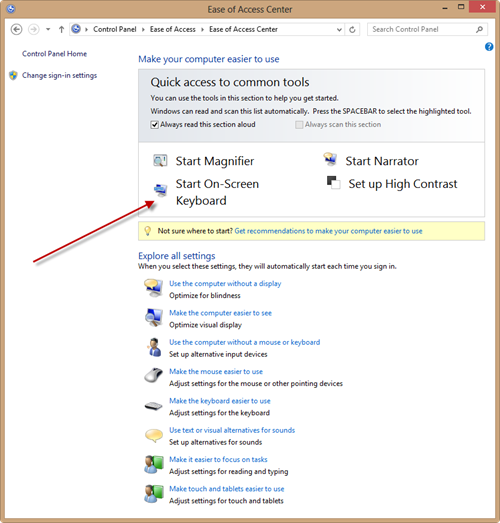](http://csell.net/wp-content/uploads/2012/11/15-XAML-EaseOfAccessCenter.png) 

And clicking the "Start On-Screen Keyboard" option.&nbsp; You will discover a keyboard that looks like this, instead:

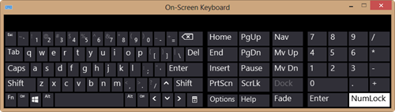 

The primary focus of this keyboard is to allow a user to completely use Windows without having a keyboard attached to their computer.&nbsp; It's not customizable, and doesn't respond to any of the code we are going to write in this article.&nbsp; This keyboard is also one of the only windows that can be placed over the Start Screen.&nbsp; Check this out:
[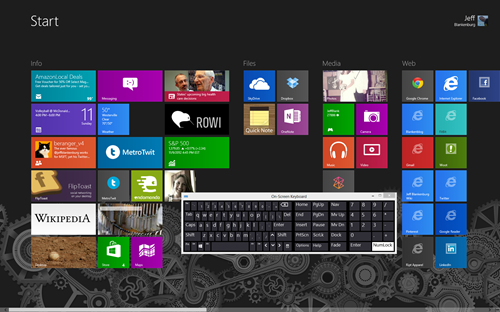](http://csell.net/wp-content/uploads/2012/11/15-XAML-OnScreenKeyboardStartScreen.png)  

OK, so I've spent the first few paragraphs of this article talking about a keyboard that is NOT the focus of this article.&nbsp; **Why?**&nbsp; There are two reasons:

*   If you are using a non-touch device when you work through this article (or on your own app and want to use the features of the regular touch keyboard), you'll find that mouse clicks don't launch the touch keyboard on your machine.&nbsp; So you'll search the web looking for a solution to make it show up.  <li>As you search around the web looking for more information about manipulating the on-screen keyboard in Windows 8, you're going to get plenty of articles on the Ease of Access one, which is likely not what you wanted. If you do find an appropriate article about how to turn on the touch keyboard, it's likely this one, because I wasn't able to find any way to make this work. 

The primary reason for this is because this is one of the few times that Windows 8 makes a distinction between a mouse click and and finger tap.&nbsp; If you mouse click on a input box, Windows 8 assumes you are using a real keyboard, even if you're using a touch-enabled machine.&nbsp; A finger-tap, however, will produce that keyboard we're going to talk about today.

To save you some frustration, when developing your application that will take advantage of the on-screen keyboard, use the simulator if you're not working on a touch machine.&nbsp; It allows you to simulate "taps" with your mouse.&nbsp; Here's where you set it:

 

OK, now that we've gotten all that out of the way, let's get this actual article started.

## Using the On-Screen Keyboard

First, let's take a look at the default states of the on-screen keyboard that the user can navigate to any time the keyboard is open.&nbsp; We saw the standard QWERTY view earlier:

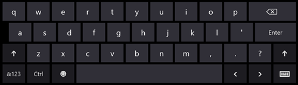 

But there are several more.&nbsp; When we build an application, our primary focus, above all else, should be to make the tasks a user needs to accomplish as easy as possible.&nbsp; (That IS on the top of your mind, right?)&nbsp; To that end, the on-screen keyboard can be manipulated to make that happen. Our [input element](http://www.w3.org/TR/html-markup/input.html#input) has had this notion of a _type_ now for some time. With HTML5 we had a number of new types introduced such as datetime, email and more. This type attribute will activate the the appropriate keyboard for the task at hand.&nbsp; If type is not specified, the normal keyboard will be displayed.&nbsp; Here's what the code looks like:
<pre class="prettyprint"><input type="number" value="1234" /></pre>

You will find, as you start playing with the type attribute, that there are a large number of types, actually 23\. Now these of these 23 input types they are not all applicable in changing the keyboard. For example a datetime type isn't going to provide you a different keyboard other than the standards keyboard. Let's look at how these input types might change the keyboard layout.

**Standard Keyboard Layout**
<pre class="prettyprint"><input type="color" value="color"/>
<input type="date" value="date"/>
<input type="datetime" value="datetime"/>
<input type="datetime-local" value="datetime-local"/>
<input type="month" value="month"/>
<input type="text" value="text"/>
<input type="time" value="time"/>
<input type="week" value="week"/></pre>

**[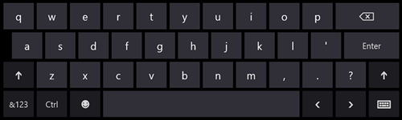](http://csell.net/wp-content/uploads/2012/11/15-XAML-NormalKeyboard2.png)**

**Search Keyboard**
<pre class="prettyprint"><input type="search" value="search"/></pre>

Enter key changes to Search.

**[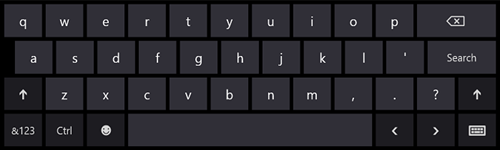](http://csell.net/wp-content/uploads/2012/11/15-XAML-Search.png)**

**Email**
<pre class="prettyprint"><input type="email" value="email"/></pre>

Added "@" and ".com" buttons, smaller space bar

[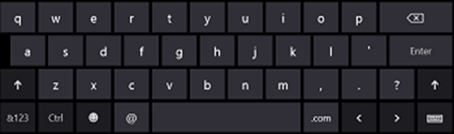](http://csell.net/wp-content/uploads/2012/11/image38.png)

**URL**
<pre class="prettyprint"><input type="url" value="url"/></pre>

Added "/" and ".com" buttons, smaller space bar, Go key ( as enter )

 

**Numeric keypad**
<pre class="prettyprint"><input type="number" value="1234567890"/>
<input type="tel" value="111-111-1111"/></pre>

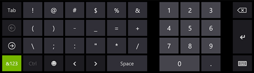 

**Password**
<pre class="prettyprint"><input type="password" value="password"/></pre>

Added the Hide keypress button

[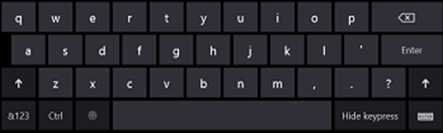](http://csell.net/wp-content/uploads/2012/11/image39.png)

**Others**

*   **type="file" **brings up the file picker
*   **type="hidden" **hides it, what else
*   **type= ["radio"] or ["range"] or ["reset"] or ["submit"] **brings up a native looking control

In addition to our types, it's important to understand the other options our users can navigate to at any time when the keyboard is on the user's screen.&nbsp; Here they are:

**Capital Letters**

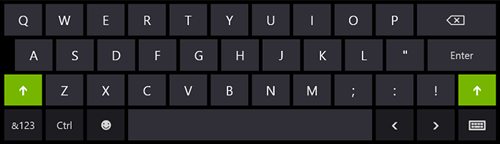 

**Emoji** ([there's actually 30 PAGES of emoji, click here to see all of them](http://jeffblankenburg.com/downloads/31daysofwindows8/emoji.png))

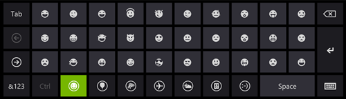 

**Symbols** (a second set of symbols after the set shown with the Number keyboard)

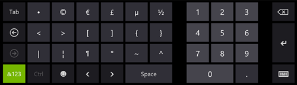 

**Split Keyboard** (a user choice, this keyboard is optimized for thumb typing)

[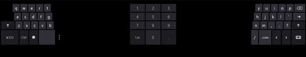](http://csell.net/wp-content/uploads/2012/11/15-XAML-SplitKeyboard.png) 

**Inking Keyboard **(this keyboard does handwriting recognition)

[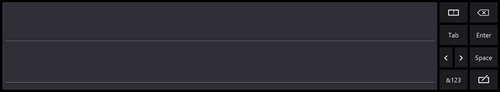](http://csell.net/wp-content/uploads/2012/11/15-XAML-InkingKeyboard.png) 

Obviously, this is a huge set of input points for us as developers, and by providing the right keyboard for the job will make your app more useful to your users.

On last point, you can't launch the on-screen keyboard via code at all.&nbsp; In fact, setting the focus on a input control won't do anything but make the cursor blink.&nbsp; It specifically requires a tap event (not a mouse click) to occur on the input box before the on-screen keyboard will appear.&nbsp; (This is the same reason why you should use the Simulator when debugging this type of functionality in your apps.)

## Summary

Today, we've covered off on the variety of keyboards that are available to our users.&nbsp; We can leverage input types to show the right keyboard at the right time.&nbsp; In addition, we learned that there are [30 entire pages of Emoji characters to use](http://31daysofwindows8.com/content/emoji.png) as well.&nbsp; (If it's not obvious, we benefit greatly from writing these articles as well!)

If you would like to see a working application that uses all of the input types, click the download icon below:

Tomorrow, we are going to dive into using Context Menus to gather data, both in our application, as well as from buttons in our AppBar control.&nbsp; See you then!

 

[Here's that huge list of Emoji, in case you forgot to click on it.](http://31daysofwindows8.com/content/emoji.png)