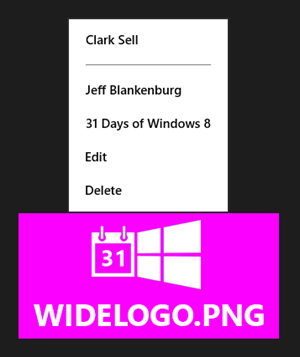
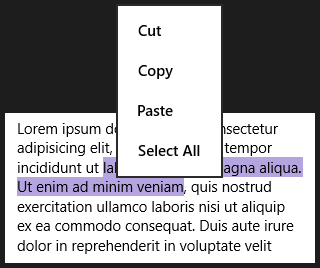
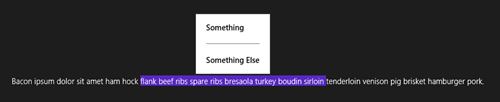

This article is Day #16 in a series called [31 Days of Windows 8](http://31daysofwindows8.com/).&nbsp; Each of the articles in this series will be published for both [HTML5/JS](http://csell.net/category/windows-8/31-days/) and [XAML/C#](http://www.jeffblankenburg.com/category/31-days-of-windows-8/). You can find additional resources, downloads, and source code on our [website](http://www.31daysofwindows8.com/).

* * *

Today, our focus is on context menus aka _PopupMenu_.&nbsp; These are those small little popup commands that appear from time to time in your application when you right click on something. [Microsoft offers some very specific guidance on when to use these context menus](http://msdn.microsoft.com/library/windows/apps/Hh465308) vs. when to use the AppBar control instead, so we will be following those rules in this article.&nbsp; 

## What Is a Context Menu?

If you've used Windows 8 at all, you've likely encountered these before.&nbsp; Often they result from a right-click on something you couldn't select, or on text you wanted to interact with.&nbsp; Here's a quick sample of a context menu:

(image from [http://msdn.microsoft.com/library/windows/apps/Hh465308](http://msdn.microsoft.com/library/windows/apps/Hh465308 "http://msdn.microsoft.com/library/windows/apps/Hh465308"))

You could also launch a context menu from an element on your page that is unselectable, like this image in my sample app:

&nbsp;

Right-clicking the image launches the context menu center right above it.&nbsp; (I will show you how to make this happen next.)&nbsp; Each of the command items will have an action assigned to it, which is executed when the item is clicked.

## Creating the Context Menu

Creating the Context Menu that you see above is pretty straight forward. To start with, we will wire up a handler&nbsp; to our image element such that anytime someone right clicks on the object they will get our context menu. This looks like any other event listener, and we will listen on 'contextmenu' like such.
<pre class="prettyprint">document.getElementById("myImage").addEventListener("contextmenu",
    imageContentHandler, false);</pre>

Next, we need to create our handler, which I have managed to call imageContentHandler, I know pretty awesome naming there. In our function we will simply start out by creating our PopupMenu object and adding the items we want to be shown. Each item can have its on event handler as well and in the example below I am just giving them all the same event handler of somethingHandler ( I know more awesome naming ).
<pre class="prettyprint">var contextMenu = Windows.UI.Popups.PopupMenu();

contextMenu.commands.append(
    new Windows.UI.Popups.UICommand("Clark Sell", somethingHandler));

contextMenu.commands.append(
    new Windows.UI.Popups.UICommandSeparator());

contextMenu.commands.append(
    new Windows.UI.Popups.UICommand("Jeff Blankenburg", somethingHandler));

contextMenu.commands.append(
    new Windows.UI.Popups.UICommand("31 Days of Windows 8", somethingHandler));

contextMenu.commands.append(
    new Windows.UI.Popups.UICommand("Edit", somethingHandler));

contextMenu.commands.append(
    new Windows.UI.Popups.UICommand("Delete", somethingHandler));</pre>

With our PopupMenu defined, now we just need to show it. We can do that by calling showAsync and passing it some x,y coordinates like you see below.
<pre class="prettyprint">contextMenu.showAsync({ x: [someCoords], y: [someCoords] });</pre>

Now how do we figure out where exactly to put it?

## Determining The Location

You may have noticed that context menus appear directly above and centered to the element that has been selected.&nbsp; This doesn't happen by magic.&nbsp; We'll actually have to determine the position of the clicked element by ourselves (as well as any applicable offsets), and pass that along when we show the menu. Time to sharpen some pencils.

When a user click on our image, our _contextmenu_ event is going to fire, calling our handler, _imageContentHandler_. It's going to pass some arguments that we need to kick off our fact finding. There are three critical pieces of data we're looking for here. 1\. the x and y of the click and 2\. the offset of the element that was its target and 3\. the width of the target object. ( target object here is the image ) . Let's see the code, and then come back to it.
<pre class="prettyprint">function showWhereAbove(clickArgs) {
    var zoomFactor = document.documentElement.msContentZoomFactor;
    var position = {
        x: (clickArgs.pageX - clickArgs.offsetX - window.pageXOffset + (clickArgs.target.width / 2)) * zoomFactor,
        y: (clickArgs.pageY - clickArgs.offsetY - window.pageYOffset) * zoomFactor
    }

    return position;
}</pre>

So I have created this simple function called _showWhereAbove_ taking something called the _clickArgs_. _clickArgs _is nothing more than the args that was passed into our _contextmenu_ handler. To figure out both x and y are actually pretty much the same. 

x = ( where x click was - offset to top of target - windows x offset + ( target width /2 )) * window zoom factor 

Let's continue to break that down

*   where x click was = the x position of the mouse at the time of click<li>offset to top of target = how much to the right of the elements left edge are we<li>window x offset = where are we in relation to the window being scrolled<li>target width / 2 = we need to move the PopupMenu to the middle of the object so we're going to take the width and get middle<li>window zoom factor = if the screen is zoomed in put it in apply that factor

Now the y axis is the same in principal as x, except we don't have to worry about the height of the target. Since we're working with the bottom center of the context menu, just getting our y offset is enough to put the bottom of the PopupMenu in the right position.

Again remember&nbsp; - we're trying to position the the bottom middle of the Popup Menu. Now that we know our position, we just need to show it.
<pre class="prettyprint">contextMenu.showAsync(showWhereAbove(args));</pre>

Here is the finished function:
<pre class="prettyprint">function imageContentHandler(args) {
    var contextMenu = Windows.UI.Popups.PopupMenu();

    contextMenu.commands.append(
        new Windows.UI.Popups.UICommand("Clark Sell", somethingHandler));
    contextMenu.commands.append(
        new Windows.UI.Popups.UICommandSeparator());
    contextMenu.commands.append(
        new Windows.UI.Popups.UICommand("Jeff Blankenburg", somethingHandler));
    contextMenu.commands.append(
        new Windows.UI.Popups.UICommand("31 Days of Windows 8", somethingHandler));
    contextMenu.commands.append(
        new Windows.UI.Popups.UICommand("Edit", somethingHandler));
    contextMenu.commands.append(
        new Windows.UI.Popups.UICommand("Delete", somethingHandler));

    contextMenu.showAsync(showWhereAbove(args));
}</pre>

&nbsp;

## Launching a Context Menu From Selected Text

Actually, nearly everything about this process is the same, except for the math on where to pop the box from.&nbsp; Initially when setting out to solve this problem, I was hoping to add on to the existing context menu that already appears when you right-click on text:

 

As it turns out, you can't ( at least that we're aware of ).&nbsp; So, for our example, let's say that we want to keep all of those options, but also add a new one titled "Delete" at the bottom.&nbsp; To do this, we're going to have to create our own. While we know how to do so already there are two differences:

*   We need to place our PopupMenu at the top of our selected text and in the middle.<li>Stop the default behavior.

Like wire up an event handler to the _contextmenu_ event of something like a _
_ element.
<pre class="prettyprint">document.getElementById("myInputBox").addEventListener(
            "contextmenu", inputHandler, false);</pre>

- tip - I am using a paragraph element here for demonstration. Because of that I need to make my element selectable. I did so in CSS like so
<pre class="prettyprint">p {
    -ms-user-select: element;
}</pre>

Now we need to create our handler in this case _inputHandler._ Remember I said that we needed to prevent the default and do our own thing. To do so, we're going to call _preventDefault_ AND we're going to see if some text was in fact selected. At that point, we can then crate our _PopupMenu_ and show it.
<pre class="prettyprint">function inputHandler(args) {

    args.preventDefault();

    if (isTextSelected()) {
        //create the PopupMenu and its items

    }
}

function isTextSelected() {
    return (document.getSelection().toString().length > 0);
}</pre>

After your PopupMeu is created we need to show it, but unlike before when we called _showAsync() _this time we need to call _showForSectinoAsync_. Since we're going to show above the selection we need to understand what exactly was selected rather than just the element itself.
<pre class="prettyprint">contextMenu.showForSelectionAsync(
    showForSelectionWhere(
        document.selection.createRange().getBoundingClientRect()));</pre>

You can see I have created again a helper function called _showForSelectionWhere_ to take care of that math. We're going to pass into it the bounding rectangle of our selection. Lets look at the code and then come back to it.
<pre class="prettyprint">function showForSelectionWhere(boundingRect) {
    var zoomFactor = document.documentElement.msContentZoomFactor;

    var position = {
        x: (boundingRect.left +
            document.documentElement.scrollLeft -
            window.pageXOffset) * zoomFactor,

        y: (boundingRect.top +
            document.documentElement.scrollTop -
            window.pageYOffset) * zoomFactor,

        width: boundingRect.width * zoomFactor,
        height: boundingRect.height * zoomFactor
    }

    return position;
}</pre>

_showForSelectionAsync_ takes an object with 4 properties; x, y, width, height. Let's look at x quickly.

*   x = left edge of the bounding rect + any pixels scrolled within the container element - the window scroll&nbsp; offset * zoom factor<li>y is basically the same as x, different axis.

Very similar to when we were working with the image element other than we have to figure out our position from within the element we we're part of. The results should be as you would expect.

## Summary

Today we looked at the art of creating inline context menus for our users.&nbsp; They are an excellent way to provide interactions with elements that aren't selectable, or for commands that make more sense directly adjacent to the element being interacted with.

If you would like to see the entire code sample from this article, click the icon below:

Tomorrow, we will venture further into the Clipboard functionality available to us in Windows 8 development.&nbsp; See you then!

