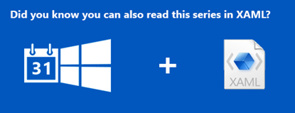

This article is Day #17 in a series called [31 Days of Windows 8](http://31daysofwindows8.com/).&nbsp; Each of the articles in this series will be published for both [HTML5/JS](http://csell.net/category/windows-8/31-days/) and [XAML/C#](http://www.jeffblankenburg.com/category/31-days-of-windows-8/). You can find additional resources, downloads, and source code on our [website](http://www.31daysofwindows8.com/).

Today, we're going to focus on the Windows 8 clipboard exclusively. More specifically, we're going to look at how we can save and retrieve data from this system-wide and heavily used mechanism.&nbsp; There are generally four types of data that we are going to see a user want to copy and paste:

*   Text  <li>HTML  <li>Images  <li>Files 

These are called the [Standard Clipboard Formats](http://msdn.microsoft.com/en-us/library/windows/desktop/ff729168(v=vs.85).aspx). We'll write some code in this article that shows not only how to copy and paste these values, but also how to detect which type of data the clipboard currently contains. There are 4 other categories of [Clipboard Formats](http://msdn.microsoft.com/en-us/library/windows/desktop/ms649013(v=vs.85).aspx):

*   [Registered](http://msdn.microsoft.com/en-us/library/windows/desktop/ms649013(v=vs.85).aspx#_win32_Registered_Clipboard_Formats)
*   [Private](http://msdn.microsoft.com/en-us/library/windows/desktop/ms649013(v=vs.85).aspx#_win32_Private_Clipboard_Formats)
*   [Multiple](http://msdn.microsoft.com/en-us/library/windows/desktop/ms649013(v=vs.85).aspx#_win32_Multiple_Clipboard_Formats)
*   [Synthesized](http://msdn.microsoft.com/en-us/library/windows/desktop/ms649013(v=vs.85).aspx#_win32_Synthesized_Clipboard_Formats) 

We will leave those for another day but get ready to do some copying!

## Saving Data to the Clipboard

As we saw briefly in [yesterday's article on context menus](http://csell.net/2012/11/16/31-days-of-windows-8-day-16-context-menus), we took a very quick look at saving some text to the clipboard.&nbsp; This time, we'll cover that in more depth, and include saving images and files to the clipboard as well.&nbsp; It's important to note that some controls like the paragraph that we made selectable yesterday can copy by default. An input element of _type="text"_ can read from the clipboard. The point of today is to learn how to interact with the clipboard outside of those default scenarios.

To get started, we should talk about the _[DataPackage](http://msdn.microsoft.com/en-us/library/windows/apps/windows.applicationmodel.datatransfer.datapackage.aspx)_ object. A [_DataPackage_](http://msdn.microsoft.com/en-us/library/windows/apps/windows.applicationmodel.datatransfer.datapackage.aspx) is what we are going to use to transport our data.&nbsp; We will create a [_DataPackage_](http://msdn.microsoft.com/en-us/library/windows/apps/windows.applicationmodel.datatransfer.datapackage.aspx)_ _when we save data to the clipboard, and we will use the [_Clipboard_](http://msdn.microsoft.com/en-us/library/windows/apps/br205867.aspx) object to get the content ( actually calling a method called [_getContent()_](http://msdn.microsoft.com/en-us/library/windows/apps/windows.applicationmodel.datatransfer.clipboard.getcontent.aspx) ) method to retrieve the data when we're pasting it.

In my sample project (which you can download from [GitHub](https://github.com/csell5/31DaysOfWindows8/tree/master/source/HTML5/Day17-Clipboard)), you will see that I've created a button with an event handler for each data type.&nbsp; We'll spend the rest of this section looking at how we store these different types of data to the [_Clipboard_](http://msdn.microsoft.com/en-us/library/windows/desktop/ms648709(v=vs.85).aspx).

It is important to note that the clipboard is actually divided into several sections, one for each data type.&nbsp; You can save data to one or many of these sections, and the target for pasting will make the determination as to what type of data it will display when pasted.&nbsp; This might sound very similar to how the [Share Contract](http://msdn.microsoft.com/en-us/library/windows/apps/Hh758314.aspx) works, and for the most part, it is.

It's also likely that you've encountered this in the past: you copy content from one app, and try to paste it in another, only to have it paste something else.&nbsp; This is a direct artifact of the "sections" of the clipboard.&nbsp; Let's take a look at how to save each data type:

#### Text

Certainly the simplest example, text can be stored to the [Clipboard](http://msdn.microsoft.com/en-us/library/windows/apps/br205867.aspx) in just a few lines of code. First let's just grab some selected text:
<pre class="prettyprint">var selectedText = window.getSelection();</pre>

Certainly the text of which you decide to grab is up to you. With some text in hand now we need to create our [DataPackage](http://msdn.microsoft.com/en-us/library/windows/apps/windows.applicationmodel.datatransfer.datapackage.aspx) and set the text on it.
<pre class="prettyprint">var _clipboard = Windows.ApplicationModel.DataTransfer.Clipboard,
    _dataTransfer = Windows.ApplicationModel.DataTransfer;

var dataPackage = new _dataTransfer.DataPackage();
dataPackage.setText(selectedText);

_clipboard.setContent(dataPackage);</pre>

You will see a pattern form as we move through the other examples, but this is about as basic as they come.&nbsp; We create a new [DataPackage](http://msdn.microsoft.com/en-us/library/windows/apps/windows.applicationmodel.datatransfer.datapackage.aspx) object, call the _setText() _method with the text we want to save, and then set the content of the [Clipboard](http://msdn.microsoft.com/en-us/library/windows/apps/br205867.aspx) to that [DataPackage](http://msdn.microsoft.com/en-us/library/windows/apps/windows.applicationmodel.datatransfer.datapackage.aspx).

#### HTML

HTML, while similar to text, has its own quirks and formatting, and because of this, requires slightly different treatment when adding it to a [DataPackage](http://msdn.microsoft.com/en-us/library/windows/apps/windows.applicationmodel.datatransfer.datapackage.aspx).&nbsp; In this example, I am just grabbing the _innerHtml_ of an element on our _default.html_ page and using that as my [DataPackage](http://msdn.microsoft.com/en-us/library/windows/apps/windows.applicationmodel.datatransfer.datapackage.aspx) contents. Let's that a first pass at things.
<pre class="prettyprint">var htmlContent = document.querySelector("#content").innerHTML;
var dataPackage = new _dataTransfer.DataPackage();
dataPackage.setHtmlFormat(htmlContent);

_clipboard.setContent(dataPackage);</pre>

It looks very much in line with what we had done previously. Now if you we're to run that and try to paste into something like Notepad++ or Visual Studio you in fact wouldn't see anything. As I briefly mentioned before, HTML requires some slightly different formatting. Let's modify.
<pre class="prettyprint">var htmlContent = document.querySelector("#content").innerHTML;
var htmlContentFormated =
    _dataTransfer.HtmlFormatHelper.createHtmlFormat(htmlContent);

var dataPackage = new _dataTransfer.DataPackage();
dataPackage.setHtmlFormat(htmlContentFormated);

_clipboard.setContent(dataPackage);</pre>

Now that format helper will take our html and create some special sauce around it, transforming it to something like this:
<pre class="prettyprint">Version:1.0
StartHTML:00000097
EndHTML:00000806
StartFragment:00000153
EndFragment:00000773
<!DOCTYPE><HTML><HEAD></HEAD><BODY><!--StartFragment -->
        <h1>Day #17 - The Clipboard</h1>

         
        

            <button id="btnCopyText">copy text</button>
            <button id="btnCopyHtml">copy html</button>
            <button id="btnCopyImage">copy image</button>
            <button id="btnCopyFile">copy file</button>
             
            
Bacon ipsum dolor sit amet pig jowl filet mignon sirloin ribeye tenderloin. Sausage cow shank jerky pancetta pig biltong corned beef short loin.

            <input id="inputBox">
            
        

    <!--EndFragment --></BODY></HTML></pre>

Interesting. If we run that code again we can in fact copy and paste into an HTML based file in something like Visual Studio but if I go back and try that same thing in Notepad++ I get nothing. Windows is smart enough to only allow you to paste the types content which are applicable for the destination. To fix that we need multiple types I guess. All we need to do is just call _SetText()_ value of this [DataPackage](http://msdn.microsoft.com/en-us/library/windows/apps/windows.applicationmodel.datatransfer.datapackage.aspx), with the original unformatted string. Here is the completed function:
<pre class="prettyprint">var _clipboard = Windows.ApplicationModel.DataTransfer.Clipboard,
    _dataTransfer = Windows.ApplicationModel.DataTransfer;

function copyHtmlToClipboard() {
    var htmlContent = document.querySelector("#content").innerHTML;
    var htmlContentFormated =
        _dataTransfer.HtmlFormatHelper.createHtmlFormat(htmlContent);

    var dataPackage = new _dataTransfer.DataPackage();
    dataPackage.setHtmlFormat(htmlContentFormated);
    dataPackage.setText(htmlContent);

    _clipboard.setContent(dataPackage);
}</pre>

As you can see above, we can set multiple values at the same time, and as you get deeper into this example, you'll start to notice that most of your favorite apps store data in multiple formats "just in case."

#### Images

Our next example is images, and I want to be really clear on this one.&nbsp; We're not talking about a file that happens to be an image.&nbsp; We're talking about copying an image from a website, for example, and then pasting it into a [OneNote](http://apps.microsoft.com/webpdp/en-us/app/onenote/f022389f-f3a6-417e-ad23-704fbdf57117) file or [Windows Live Writer](http://windows.microsoft.com/en-US/windows-live/essentials-other-programs).&nbsp; In my example, I grabbing an image from the HTML DOM and putting that on the clipboard.
<pre class="prettyprint">var imageSrc = document.getElementById("myImage").src;
var imageUri = new Windows.Foundation.Uri(imageSrc);
var streamRef = Windows.Storage.Streams.RandomAccessStreamReference.createFromUri(imageUri);

var dataPackage = new _dataTransfer.DataPackage();
dataPackage.setBitmap(streamRef);

_clipboard.setContent(dataPackage);</pre>

Above we get the source of an image in the DOM and create a URI from it. Once we have the URI we can create a stream reference to it and pass it along to our [_DataPackage_](http://msdn.microsoft.com/en-us/library/windows/apps/windows.applicationmodel.datatransfer.datapackage.aspx) calling _SetBitmap()_. As with all of the examples in this article, we end our code with actually setting the [Clipboard](http://msdn.microsoft.com/en-us/library/windows/apps/br205867.aspx) with our [DataPackage](http://msdn.microsoft.com/en-us/library/windows/apps/windows.applicationmodel.datatransfer.datapackage.aspx) to actually complete the action.

#### Files

Files are treated very similarly to images, but there's one major difference: we can copy multiple files to the clipboard at once and getting files is async.&nbsp; You've done this before, highlight and grab some of the files cluttering up your desktop before dragging them as a group to the Recycle Bin.&nbsp; Instead of throwing them away, you could cut/copy them, and paste them to another location.&nbsp; Files are always passed as a collection of files, even if there is only one. To the code!
<pre class="prettyprint">var _clipboard = Windows.ApplicationModel.DataTransfer.Clipboard,
    _dataTransfer = Windows.ApplicationModel.DataTransfer,
    _storageFile = Windows.Storage.StorageFile;

var imageSrc = document.getElementById("myImage").src,
    imageUri = new Windows.Foundation.Uri(imageSrc);

var splashScreenSource = document.getElementById("splashScreen").src,
    splashUri = new Windows.Foundation.Uri(splashScreenSource);

var files = [],
    promises = [];

promises.push(_storageFile.getFileFromApplicationUriAsync(imageUri)
    .then(function (file) {
        files.push(file);
    }));

promises.push(_storageFile.getFileFromApplicationUriAsync(splashUri)
        .then(function (file) {
            files.push(file);
        }));

WinJS.Promise.join(promises)
    .then(function () {
        var dataPackage = new _dataTransfer.DataPackage();
        dataPackage.setStorageItems(files);
        _clipboard.setContent(dataPackage);
    });</pre>

A bit different from the image but really only because of the [WinJS Promise](http://msdn.microsoft.com/en-us/library/windows/apps/hh700330.aspx) ( of which we will cover another day ). The core of this code is really the same except for the fact that we're going to create an array of files aka [StorageItems](http://msdn.microsoft.com/en-us/library/windows/apps/windows.applicationmodel.datatransfer.standarddataformats.storageitems.aspx) and then add them to the [dataPackage](http://msdn.microsoft.com/en-us/library/windows/apps/windows.applicationmodel.datatransfer.datapackage.aspx) calling [setStorageItems](http://msdn.microsoft.com/en-us/library/windows/apps/windows.applicationmodel.datatransfer.datapackage.setstorageitems.aspx)

So, as far as saving content to the [Clipboard](http://msdn.microsoft.com/en-us/library/windows/apps/br205867.aspx), that's just about it!&nbsp; Our next step is going to be retrieving it from the [Clipboard](http://msdn.microsoft.com/en-us/library/windows/apps/br205867.aspx) when the user chooses to paste it. 

## Detecting the Contents of the Clipboard

When it comes to "getting pasted" as I've started saying, I tend to do this all in one method that gets the content, determines which data type is available, and displays the content correctly based on that determination.

I had hoped, when writing this article, that there was going to be some amazing event handler, like OnPastedTo() or something, that would recognize when the user is attempting to paste some content to the app, so that we can take action on it.&nbsp; (I personally live and die with Ctrl + X, Ctrl + C, and Ctrl + V).&nbsp; I have not found that event yet, other than mapping the keyboard command directly.For now, I've created my own event handler that fires when you click a button.

You'll see, in the example below, that I call the getContent() method on the Clipboard, and then use a series of _if_ statements to act on the content appropriately.
<pre class="prettyprint">var dataPackage = _clipboard.getContent(),
    sdFormats = _dataTransfer.StandardDataFormats;

if (dataPackage.contains(sdFormats.text)) {
    dataPackage.getTextAsync().then(function (text) {
        document.querySelector("#pasteResults").innerText = text;
    });
}

if (dataPackage.contains(sdFormats.html)) {
}

if (dataPackage.contains(sdFormats.bitmap)) {
}

if (dataPackage.contains(sdFormats.storageItems)) {
}</pre>

Let me quickly discuss each of the _if_ statements.&nbsp; For text, which is the only one I displayed I am going to just grab the text with a promise and set it as the _innerText_ of a _label_ that I have on my page.&nbsp; Just like when we put items on the clipboard we will now need to do the reverse. Depending on the data format we will have to do the appropriate thing for what that data type requires. If it's a collection of files we would need to loop through that collection of files and do something with them.

In all it's pretty simple, but I was delighted the first time that I copied content from a webpage directly into my app, and it just worked!&nbsp; The same is true for images, text, and files.&nbsp; I highly recommend grabbing the source of this project and playing with it.&nbsp; It will really help you to understand exactly how the clipboard is being used by your other applications.

## Summary

Today, we took a deep look at the Clipboard, and how we can save and retrieve data as needed.&nbsp; It supports several different file types, and I think you'll be surprised just how redundant most of your favorite applications are when they save data to the Clipboard. 

To download the entire code solution for the project discussed in this article, click the icon below:

Tomorrow, we're going to add another useful tool to our Windows 8 development tool belt: the FilePicker.&nbsp; We'll look at retrieving files from the user's device, and even filtering them so that we only get our preferred file types.&nbsp; See you then!

