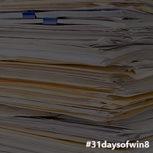
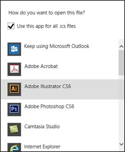
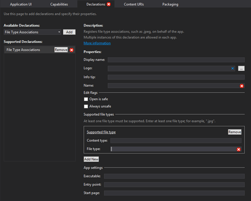
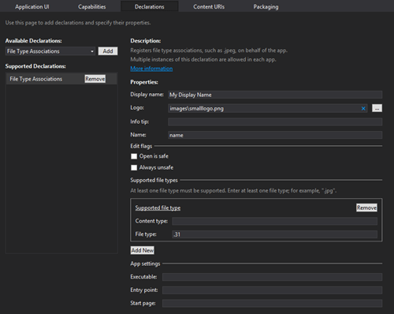
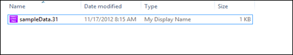
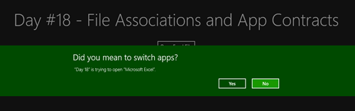
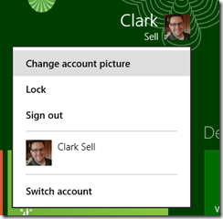
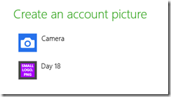

This article is Day #18 in a series called [31 Days of Windows 8](http://31daysofwindows8.com/).&nbsp; Each of the articles in this series will be published for both [HTML5/JS](http://csell.net/category/windows-8/31-days/) and [XAML/C#](http://www.jeffblankenburg.com/category/31-days-of-windows-8/). You can find additional resources, downloads, and source code on our [website](http://www.31daysofwindows8.com/).

Today, we are going to look at a couple of cool features in Windows 8: File Associations and App Contracts.&nbsp; With file associations, we'll look at both sides of this Windows 8 feature:  

*   Registering our app with Windows 8 as an app that opens files of a certain type, like .png, or a custom extension, .31days.  <li>Empowering our app to suggest a list of compatible applications when our user tries to open a file that our app doesn't support, like an .xls file. 
Finally, we'll also discuss some of the other ways our application can register with the user's system, including things like AutoPlay.  

## Registering to Open Certain File Types
 
There's going to be times that we want to have our user open files of a certain type in our application.&nbsp; Maybe we are creating an image editor, so no matter what type of image format the user's files are in, if they're a common image type, we should be able to open it.&nbsp; Perhaps we're building an XML editor that consumes .xml files.&nbsp; Maybe you just created a new extension like I did for [On Time](http://apps.microsoft.com/webpdp/app/on-time/9e5bde3d-3c58-4e77-8b69-5f97f500203d) and you want to have it registered. Regardless, we want to register our app with the user's system, so that when they get a prompt like this:  
&nbsp;   
We want to make sure that our app is in this list when a user opens files appropriate for our application.&nbsp; To do this, it's as simple as making some simple changes to our package.appxmanifest file.&nbsp; Open the file, and choose the declarations tab.&nbsp; From the "Available Declarations" selection list, choose "File Type Associations," and click Add.  
You will see that it fills the screen with a new form for specifying the file associations you would like to register your app with.&nbsp; By default, it has a few red Xs that you will need to address.  

For this sample, I am only going to pick one file type, and one we will make up.&nbsp; We shall call it 31, it seems fitting.  

The first is Display Name. This is the name that shows up as the type. Next I associated the logo that I also want to show up as well. You can use any icon you'd like, but they do have a square aspect ratio, so I chose my smallLogo.png file which has the same ratio. Simple enough, see below.  
  
The last property value that we need to set it _Name. Name _is just a name for the set of extensions you are listing here.&nbsp; The reason that we can have different sets of extensions is because you might want your app to act differently depending on the file type.&nbsp; At the bottom of the form, you can specify the entry point for your application for this set of files.&nbsp; If it's an JSON file, that you want to pre-load information.&nbsp; If it's an image, perhaps you'd rather take them to an image editing page, or just attach it to an email.&nbsp; That's up to you.  
Once you've done that, you're basically done.&nbsp; 
Run the application once, to install it on your system. At this point thing are registered and you're ready to roll. If you notice above our custom file is now associated and if we click on it it will open up our application. Of course our application has no clue what to do with it, but nonetheless our application is open open.  

## Now Do Something
 
Ok our app opened, now what? First let's just quickly look at the contents of my .31 file so we know what we're working with.
<pre class="prettyprint">{"days": [
    {"day":"1",     "title":"asdf"},
    {"day":"2",     "title":"asdf"},
    {"day":"3",     "title":"asdf"},
    {"day":"4",     "title":"asdf"},
    {"day":"5",     "title":"asdf"},
    {"day":"6",     "title":"asdf"},
    {"day":"7",     "title":"asdf"},
    {"day":"8",     "title":"asdf"},
    {"day":"9",     "title":"asdf"},
    {"day":"10",    "title":"asdf"}
]}</pre>

I am cheating a bit and just using some JSON that I want to later bind using Knockout.js. To hook into our app getting called we want to tie into our app's activation. The Visual Studio templates already have a number of things shelled out for us around the Application Lifecycle. We simply need to extend it checking to see if the activation was a file rather than something else. 
<pre class="prettyprint">args.detail.kind === activation.ActivationKind.file</pre>

We will do that with a simple _if _statement. If it's true, then in our case here all I want to do is grab the file, read it's content and then bind the data to the screen. The important part here isn't that I am using Knockout.js and dumping something on the screen but rather us getting activated and getting to the necessary data.
<pre class="prettyprint">var app = WinJS.Application;
var activation = Windows.ApplicationModel.Activation;

app.onactivated = function (args) {

    if (args.detail.kind === activation.ActivationKind.launch) {

        /* ... */

        args.setPromise(WinJS.UI.processAll());
    }

    if (args.detail.kind === activation.ActivationKind.file) {
        Windows.Storage.FileIO.readTextAsync(args.detail.files[0])
            .then(function (contents) {
                var myObject = JSON.parse(contents);
                ko.applyBindings(myObject);
        });
    }

};</pre>

You can take a further deeper look at how this works in [my sample](https://github.com/csell5/31DaysOfWindows8/tree/master/source/HTML5/Day18-FileAssoociations).

## Opening a File In Another App

Sometimes, your application just can't open every single file type.&nbsp; For example, Microsoft Outlook is really good at accepting images, text, and files, but if you've ever tried to open an Excel file attached to an email, you've probably noticed (and come to expect) that the file gets opened in Excel, not Outlook.&nbsp; We want to provide that same functionality to our users.&nbsp; To do this, we are going to explore the Windows.System.Launcher class. 

In our first simple example, we're just going to launch an Excel file without any options or settings.&nbsp; The system will use the default app to launch our file, without any choice or warning. <pre class="prettyprint">var _launcher = Windows.System.Launcher,
    _current = Windows.ApplicationModel.Package.current;

var excelFile = "data\\sampleData.xlsx";
_current.installedLocation.getFileAsync(excelFile)
    .then(function (file) {
        _launcher.launchFileAsync(file)
            .then(function (isSuccess) {
                if (isSuccess) { /* Rock on Garth! */ }
                else { /* failWail */ }
            });
    });</pre>

As you can see in this first example, it's pretty simple.&nbsp; We call __launcher.kaunchFileAsync()_, and pass it a _StorageFile _object.&nbsp; Sometimes, however, you might want to warn your user that you are going to be launching another piece of software, so that they get to decide if that's really what they want to do.&nbsp; In this case, we can create a LauncherOptions object, and provided that as part of our _launchFileAsync() _call.&nbsp; Like this: <pre class="prettyprint">var _launcher = Windows.System.Launcher,
    _current = Windows.ApplicationModel.Package.current;

var excelFile = "data\\sampleData.xlsx";
_current.installedLocation.getFileAsync(excelFile)
    .then(function (file) {

        var launchOptions = new Windows.System.LauncherOptions();
        launchOptions.treatAsUntrusted = true;

        _launcher.launchFileAsync(file, launchOptions)
            .then (function (isSuccess) {
                if ( isSuccess ) { /* Rock on Garth! */ }
                else { /* failWail */ }
            });
    });</pre>

When we do this, an alert pops up on the screen letting the user know that another application is being opened. 

Finally, there may be a time where you want your user to be able to select the app that they will open a file with.&nbsp; In this case, we want to bring up the same box that appears when a user selected "Open With..." in the previous section.&nbsp; To do this, we just set another option: d_isplayApplicationPicker_.&nbsp; If you want to modify the position of this dialog box you can do that as well with a little more work, but it's very similar to what we did on [Day #16 with context menus](http://csell.net/2012/11/16/31-days-of-windows-8-day-16-context-menus/). If you don't specify a location, however, it will launch the dialog box centered on the user's screen.&nbsp; Personally, I prefer how this looks to having it closer to the control the user clicked, but I understand what the Windows team is trying to do.&nbsp; 
So there you have it.&nbsp; How to launch a file in a separate application from your own.&nbsp; In the final section of this article, we're going to briefly look at App Contracts, and how we can make our apps available in other lists for our users. 

## Using App Contracts for Good

When reading this article, some developers will think that it's a good idea to register their app for every possible file extension, because it will keep their app and logo in front of their users as often as possible. 

_**PLEASE DON'T DO THAT.**_ 

That rule applies to App Contracts as well.&nbsp; Don't abuse them, especially if you aren't actually providing the functionality required.&nbsp; This will be reviewed when you submit your application to the store, so it will be discovered. 

###### Account Picture Provider

You can declare this functionality if you can provide the ability for the user to create a new Account Picture in Windows 8.&nbsp; You get to the menu on the Start Screen, like this: 

And when your app is registered, the options will look like this, with your app listed: 

To do this, just add the Account Picture Provider to your declarations tab in your package.appxmanifest file, like this: 

 

I told you this appxmanifest file is going to become your best friend. By default, it will just launch your app, but you can also provide custom entry points, just like we did for [background tasks in day #12](http://csell.net/2012/11/12/31-days-of-windows-8-day-12-background-tasks/)&nbsp; and things like the file association that we discussed today. This just ensures your users ends up on the right section of your app automatically. 

## AutoPlay and Protocols

There are three other App Contracts we can subscribe to, and each of them only really requires another entry in the Declarations. 

"AutoPlay Content" recognizes when new media is inserted into the device, like a USB drive or DVD.&nbsp; If the content type you register for is present, your app will appear in the AutoPlay list that is displayed.&nbsp; [There is an excellent article on MSDN about AutoPlay, and the different values you can use](http://msdn.microsoft.com/en-us/library/windows/apps/xaml/hh452741.aspx). 

"AutoPlay Device" is basically the same idea, but you're registering for specific types of devices, like cameras, printers, or USB drives.&nbsp; The same article above applies to this as well. 

"Protocol" is a little different.&nbsp; This allows us to register for URI schemes, like "mailto:" or even use our own custom URI schemes like "31days:."&nbsp; It's another way to register our application with the system to be used at the appropriate times.&nbsp; [Microsoft has an excellent article about protocols as well.](http://msdn.microsoft.com/en-us/library/windows/apps/hh452686.aspx) 

## Summary

Today, we looked at some of the extensible points we can access to make our app more prominent and useful to our users.&nbsp; If they expect to be able to open images with our application, then we should show up in their list of apps when they try to open an image. 

If you would like to see the full working solution for the code covered in this article, click the download icon below: 

Tomorrow, we're going to look at another powerful mechanism in Windows 8: the File Picker.&nbsp; This empowers our user to grab files from their hard drive, and provide them to our applications.&nbsp; See you then! 

