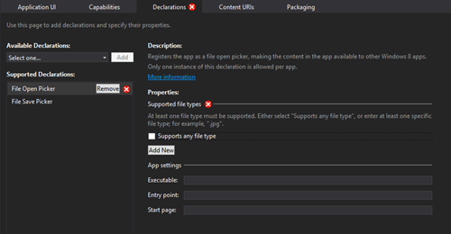
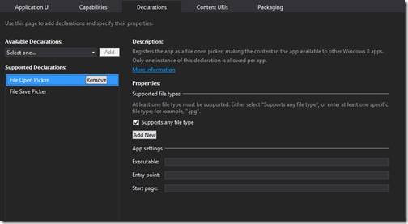
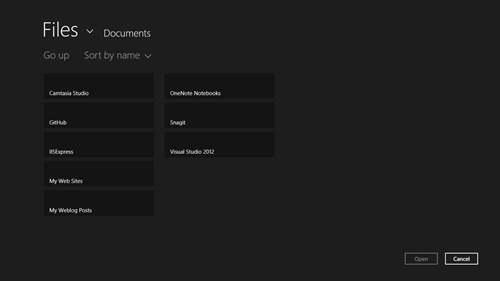
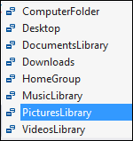
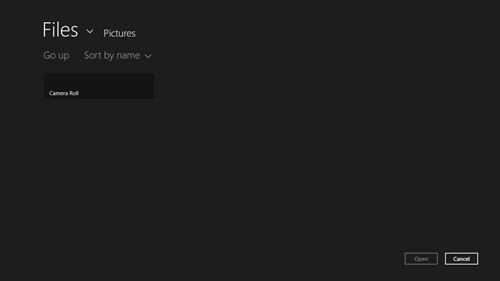
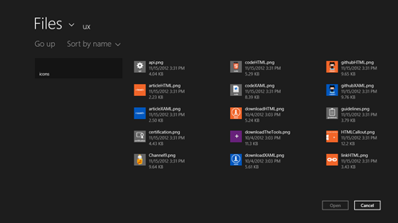
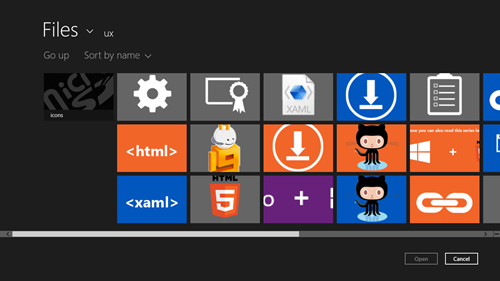
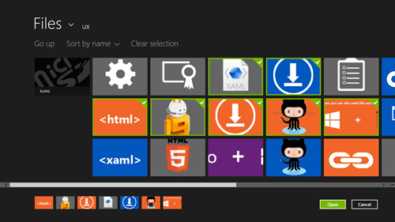
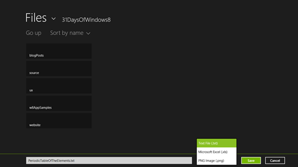
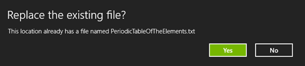

This article is Day #19 in a series called [31 Days of Windows 8](http://31daysofwindows8.com/).&nbsp; Each of the articles in this series will be published for both [HTML5/JS](http://csell.net/category/windows-8/31-days/) and [XAML/C#](http://www.jeffblankenburg.com/category/31-days-of-windows-8/). You can find additional resources, downloads, and source code on our [website](http://www.31daysofwindows8.com/).

Today, we are going to look at another invaluable tool in Windows 8 development, the File Picker.&nbsp; There are millions of ways to use the File Picker, but when you boil it down, you're going to need to get files from the user's computer for something.&nbsp; This article will show you how to do it.

## Start: package.appxmanifest

As with all of the different mechanisms we've used to interact with the user's system, we need to start with updating our package.appxmanifest file.&nbsp; Since we are going to be both opening files AND saving files in this article, we need to add **both** of those Declarations to our file.

For the File Open Picker, you'll start with a form that looks like this:

You're expected to make one of two choices:

*   **Supports any file type.**&nbsp; By checking this box, you are declaring that you could access any file type from your application.  <li>**Supported file type**.&nbsp; You can also specify which file types you want to open, so if your app only opens Excel files, for example, you could list ".xls" as your file type. 

For this demo, you can just select "Supports any file type." I want to do so, so you can see all the files on your system regardless.&nbsp; The same process can be done for the File Save Picker, which offers you the same choices, like this:

## Getting a File from Your User's Machine

This article is going to build a progressively more complex app for selecting files from a user's machine.&nbsp; We'll start getting just one file, then multiple files, and then multiple files of only a specific file type (.png).&nbsp; Most of the code for each example is identical, so we'll focus on what is the "new" code in each step.

For selecting a single file from the user's hard drive, we are going to start with the _[FileOpenPicker](http://msdn.microsoft.com/en-us/library/windows/apps/windows.storage.pickers.fileopenpicker.aspx)_ object.&nbsp; This is the object that will open the File Picker dialog for the user, help them select one or many files, and return them to us.&nbsp; It has many options, and we'll work our way through all of them.&nbsp; For selecting a single file, of any type, the code starts quite simply:
<pre class="prettyprint">var _pickers = Windows.Storage.Pickers,
    openPicker = new _pickers.FileOpenPicker();

openPicker.fileTypeFilter.append(".png");
openPicker.suggestedStartLocation = _pickers.PickerLocationId.picturesLibrary

openPicker.pickSingleFileAsync().then(function (file) {
    //do something awesome here
});</pre>

You'll notice that we have to set a [fileTypeFilter](http://msdn.microsoft.com/en-us/library/windows/apps/windows.storage.pickers.fileopenpicker.filetypefilter.aspx) when we create a [FileOpenPicker](http://msdn.microsoft.com/en-us/library/windows/apps/windows.storage.pickers.fileopenpicker.aspx).&nbsp; You are not allowed to provide a wildcard, or just ignore the filter.&nbsp; You have to provide at least one, but you can also provide several, which means you can list 8-10 common file types (especially when you're looking for images on the user's device, because they could be PNG, JPG, JPEG, GIF, BMP, etc.) To do so, rather than appending just one fileType we can just replace all of them like so:
<pre class="prettyprint">openPicker.fileTypeFilter.replaceAll([".png", ".jpg"])</pre>

When you run this, your user will see an interface that looks like this:

This is the File Picker interface, and once the user selects a file, it will be returned to your application as a [StorageFile](http://msdn.microsoft.com/en-us/library/windows/apps/windows.storage.storagefile.aspx), which we have worked with in several of the previous articles in this series.

Next, we might have a good idea as to where the user should start looking for the files they would want to open in your app.&nbsp; Maybe it's their Photos collection, or Music.&nbsp; We can specify one of 8 locations on their computer:

So, to get the File Picker to open in one of these locations, you need to add one line of code to your method, so that it looks like this:
<pre class="prettyprint">openPicker.suggestedStartLocation = _pickers.PickerLocationId.picturesLibrary;</pre>

This time the File Picker will launch directly to the location you've specified (in my example, it is the Pictures Library):

The last option we can manipulate relates to how the File Picker will display the files.&nbsp; Simply use the ViewMode property of the FileOpenPicker object, like this:
<pre class="prettyprint">openPicker.viewMode = _pickers.PickerViewMode.list;</pre>

Your options are limited to List or Thumbnail, but they look distinctly different.&nbsp; Thumbnail ONLY shows a square image representing the file.&nbsp; List shows an icon as well, but also shows some of the metadata for the files.&nbsp; Here's a look at the same folder with each view (click to enlarge):

**List**

**Thumbnail**

## Retrieving Multiple Files From Your User's Computer

Sometimes, we want to grab more than one file at a time.&nbsp; In this case, we can use a [different method call on our FileOpenPicker object](http://msdn.microsoft.com/en-us/library/windows/apps/windows.storage.pickers.fileopenpicker.aspx#methods).&nbsp; This time, we'll use the [pickMultipleFilesAsync()](http://msdn.microsoft.com/en-us/library/windows/apps/windows.storage.pickers.fileopenpicker.pickmultiplefilesasync.aspx) method.
<pre class="prettyprint">var _pickers = Windows.Storage.Pickers,
    openPicker = new _pickers.FileOpenPicker();

openPicker.fileTypeFilter.replaceAll([".png", ".jpg"])

openPicker.pickMultipleFilesAsync().then(function (file) {
    //do something awesome here
});</pre>

So, more or less, there's very little difference between selecting one or multiple files from a code perspective.&nbsp; We do receive a collection of [StorageFile](http://msdn.microsoft.com/en-us/library/windows/apps/windows.storage.storagefile.aspx) objects rather than just one, but that should be expected when we're enabling multiple files to be selected.

What is different, at least from what I can tell, is HOW the user can select multiple files.

As you can see from the image above (click to enlarge), not only can we select multiple files, but we can also see that there is a "basket" of sorts at the bottom of the File Picker interface.&nbsp; This shows a list of the files that the user has selected.&nbsp; What it also enables, however, is a way for a user to select multiple files at once, _from completely different folders._&nbsp; Your users will be able to select a few files from one folder, and a few files from another, and they'll all be provided to your application at once, without your user having to make multiple trips to those folders.&nbsp; This is an absolutely awesome feature that should not be overlooked.

In our final section of this article, let's look at how we can use the File Picker to also save files to a user's machine.

## Saving a File To Your User's Hard Drive

One of the related operations we may want to use is to save a file to your user's machine.&nbsp; This is different from what we talked about on [Day #8 of this series, where we were saving files internal to our application](http://31daysofwindows8.com/?day=8).&nbsp; In this instance, we are saving a permanent file that will continue to live on the user's machine, even if our app is uninstalled.&nbsp; If your files are unusable by other apps, this is likely NOT the way you'd want to store your files.&nbsp; I generally recommend saving files like this for file types that could be opened by a variety of applications.&nbsp; To do this, it looks very similar to our [FileOpenPicker](http://msdn.microsoft.com/en-us/library/windows/apps/windows.storage.pickers.fileopenpicker.aspx), but it's now a [FileSavePicker](http://msdn.microsoft.com/en-us/library/windows/apps/windows.storage.pickers.filesavepicker.aspx).

The other difference with this situation is that we are writing data to the user's hard drive.&nbsp; This means we have all of the other hassles that come with it.&nbsp; Files can be open already, they can be edited by other apps, or even deleted as we're working with them.&nbsp; So we will first launch the File Save Picker to determine where the user wants to save their file (as well as what file type and name they want to give it.&nbsp; This looks like this:

And here's what the code looks like to make this entire process happen:

<pre class="prettyprint">var savePicker = new _pickers.FileSavePicker(),
    _pickers = Windows.Storage.Pickers;

var savePicker = new _pickers.FileSavePicker();

savePicker.fileTypeChoices.insert("Plain Text", [".txt"]);
savePicker.fileTypeChoices.insert("31 Days", [".31"]);
savePicker.fileTypeChoices.insert("Excel", [".xlsx"]);

savePicker.suggestedFileName = "31DaysOfWindows8";
savePicker.suggestedStartLocation = _pickers.PickerLocationId.picturesLibrary;

savePicker.pickSaveFileAsync().then(function (file) {
    //yea do awesome here
})</pre>

In this case, you can see that the beginning of our code sample doesn't look that different.&nbsp; Instead of filters, we can add [FileTypeChoices](http://msdn.microsoft.com/en-us/library/windows/apps/windows.storage.pickers.filesavepicker.filetypechoices.aspx) which function as the different formats our user might want to save their file.&nbsp; The choices I've included don't really make much sense together, but it helps to illustrate that you can specify any file types (or types) in this list. I also added a suggestedFileName to help guide the user as to what we think the file should be called.&nbsp; This is all at your full control.

In addition, once the user has selected a location and name for their file, we're not done.&nbsp; If they actually returned those values to use, our next step is to actually write the file to the drive itself.&nbsp; Let's crawl into the promise and see just how we would save it off. 
<pre class="prettyprint">var _pickers = Windows.Storage.Pickers,
    _fileManager = Windows.Storage.CachedFileManager,
    _fileIO = Windows.Storage.FileIO,
    _updateStatus = Windows.Storage.Provider.FileUpdateStatus;

savePicker.pickSaveFileAsync().then(function (file) {
    if (file) {
        _fileManager.deferUpdates(file);
        _fileIO.writeTextAsync(file, "file contents").done(function () {
            _fileManager.completeUpdatesAsync(file).done(function (updateStatus) {
                if (updateStatus === _updateStatus.complete) {
                    //saved
                } else {
                    //opps
                }
            });
        });
    } else {
        //user cancelled
    }
});</pre>

Inside our if statement, we first check to make sure we actually received a file. We then use the deferUpdates() method to prevent any additional edits to the file that we're working with.&nbsp; They will be "deferred" until after our operation is complete.&nbsp; Next, we write the contents of our file.&nbsp; Finally, we commit those changes using the completeUpdatesAsync() method.&nbsp; This is where all of the work is actually completed.

You'll find that if the file already exists, you'll also get prompted with a "Replace the existing file?" dialog box.

Ultimately, that's all it takes to save a simple file to the user's system.&nbsp; For more complex operations and file types, [you're going to want to explore the FileIO class.&nbsp; You can read more about that on MSDN](http://msdn.microsoft.com/en-us/library/windows/apps/windows.storage.fileio.aspx).

## Selecting a Folder on the User's Machine

The last topic I want to cover in this article is also very related to the others: selecting a folder from the user's machine instead of a specific file.&nbsp; This is great for allowing the user to choose a default save location for the future, or perhaps a place for you to look for files in the future.&nbsp; What's great about this process is that once the user has selected a folder, we can save it as our default folder, and we are granted explicit rights to read and write to/from this folder in the future without having to request future access.&nbsp; Here's how we do it.
<pre class="prettyprint">var _pickers = Windows.Storage.Pickers,
    _fileManager = Windows.Storage.CachedFileManager,
    _fileIO = Windows.Storage.FileIO,
    _updateStatus = Windows.Storage.Provider.FileUpdateStatus;

var folderPicker = new _pickers.FolderPicker(),
    accessCache = Windows.Storage.AccessCache;

folderPicker.fileTypeFilter.replaceAll([".txt", ".31"]);

folderPicker.pickSingleFolderAsync().then(function (folder) {
    if (folder) {
        accessCache.StorageApplicationPermissions.futureAccessList.addOrReplace
            ("PickedFolderToken", folder);
    }
});</pre>

As you can see, all of this code look very familiar.&nbsp; However, if we confirm that an actual folder was returned to us, we can save this to the [StorageApplicationPermissions.futureAccessList](http://msdn.microsoft.com/en-us/library/windows/apps/windows.storage.accesscache.storageapplicationpermissions.futureaccesslist.aspx) as a place we have been granted permission to use.&nbsp; Saving it this way, and referring to it in the future will limit the number of times you have to ask your user for permission to save a file to their system.

## Summary

Today, we looked at several different ways to help our users interact with the files that live on their machine.&nbsp; We saw how to open single and multiple files, save files back to the hard drive, and even select default save locations for future use.&nbsp; You'll likely find yourself using these methods over and over in your apps, so this is an important lesson to learn.

If you would like to download the sample code that was discussed in this article, click the icon below:

Tomorrow, we're going to take a look at another common feature you're likely to run into: Printing.&nbsp; We'll look at how to communicate with a user's printers, as well as how we register with the system to make printing even easier.&nbsp; See you then!

