This article is Day #21 in a series called [31 Days of Windows 8](http://31daysofwindows8.com/).&nbsp; Each of the articles in this series will be published for both [HTML5/JS](http://csell.net/category/windows-8/31-days/) and [XAML/C#](http://www.jeffblankenburg.com/category/31-days-of-windows-8/). You can find additional resources, downloads, and source code on our [website](http://www.31daysofwindows8.com/).[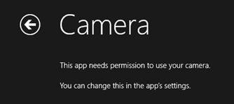](http://31daysofwindows8.com/?days=21)

Today, it's all about devices, ok well really just one device; the camera. As web developers media has been one thing which has taken us on a wild rollercoaster. From browser plugins to native specs in the browser, hang on cause it hasn't come to the station. It also shows just how awesome, and yet how ever changing some if the individual specs contained within HTML5 really are. Regardless, we need our media!!!

For those who have been playing the HTML5 game at home, you may remember that the [Device API was killed this past February](http://dev.w3.org/2009/dap/api-reqs/). This was the standard put in place to do things like capture audio and video from our things like our webcam as well as a number of other items. This is a complicated space no doubt but have no fear, we have a new spec focused just on media, called [Media Capture and Streams or navigator.getUserMedia().](http://dev.w3.org/2011/webrtc/editor/getusermedia.html) Unfortunately it's one of those specs which is very early in it's life and [isn't very adopted](http://caniuse.com/#search=getUserMedia) across all of the browsers. If you would like to know more about it check out a great article on [getUserMedia on HTML5 Rocks](http://www.html5rocks.com/en/tutorials/getusermedia/intro/).

Now, let's talk about Windows 8\. On [day 14](http://31daysofwindows8.com/?day=14), we talked about [geolocation](http://31daysofwindows8.com/?day=14).&nbsp; We had two different implementation options; use WinRT or use the standard html5 spec. Both were similar, achieving the same goal. But [getUserMedia](http://dev.w3.org/2011/webrtc/editor/getusermedia.html) is different, it's not supported yet in the browser, so we have to turn to WinRT. 

This clearly poses some interesting questions, at least for me. Things like feature detection and polyfills have long been the preferred way to to make sure the browser the client was using something that we knew how to adapt to. Now in Windows 8, do we need to think about feature detection and polyfills across hardware? Maybe not, if you just writing for Windows, but what if you're writing code for both the browser and Windows? Time will tell, patterns will develop, and like anything the context of what your doing has the greatest impact. 

Now that I have gotten off topic, let's get back on. Media Capture. WinRT. Let's GO.

## Start

This shouldn't come as a surprise to you, but where do you think we're going to start. RIGHT-O the appxmanifest. We need to check Webcam.

[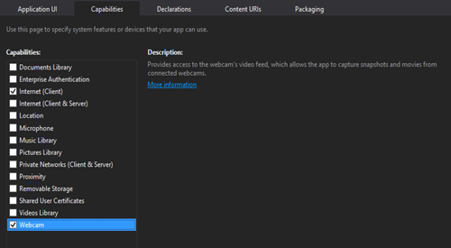](http://csell.net/wp-content/uploads/2012/11/image63.png)

Now that we have declared we're going to use the Webcam, let's start snapping some pictures. Like in days past, I've just created the simple blank template with a couple of elements; specifically a _button_ and a _div_ to dump our results into. Let's look at the button handler.
<pre class="prettyprint">var _capture = Windows.Media.Capture;
var captureUI = new _capture.CameraCaptureUI();
captureUI.captureFileAsync(_capture.CameraCaptureUIMode.photo)
    .then(function (capturedItem) {
        // now what ?
    }
);</pre>

We start by creating a new instance of the [WinRT CameraCaptureUI](http://msdn.microsoft.com/en-us/library/windows/apps/windows.media.capture.cameracaptureui.aspx). In Windows 8, we actually get to leverage the built in Camera UI to do all of the hard work and we just interface with that. Similar to how [printing](http://31daysofwindows8.com/?days=20) worked yesterday. Once we have created the instance then we just need to pop the UI and add a promise to our statement that will execute when the user has finished taking a picture. You should also notice we've passed in what "mode" we would like our camera in. For now we've selected photo. We could have selected any of the following; [photo, video or photoOrVideo](http://msdn.microsoft.com/en-us/library/windows/apps/windows.media.capture.cameracaptureuimode.aspx). Once we run it, we're presented with a dialog box asking the user if we can in fact use the webcam.

[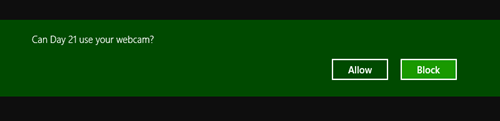](http://csell.net/wp-content/uploads/2012/11/image64.png)

Once we allow that, we will be presented with the Camera Capture UI.

[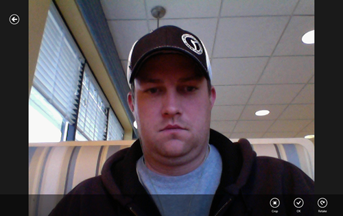](http://csell.net/wp-content/uploads/2012/11/image65.png)

Yes I am sitting in a restaurant while writing this part and the camera has appeared to have added another chin. Let's change mode to video just to contrast a bit. I've cut some of code just for display purposes.
<pre class="prettyprint">captureUI.captureFileAsync(_capture.CameraCaptureUIMode.video)
    .then();</pre>

By just changing that and rerunning you will notice we seem to no longer have the required access. Why, what happened? By looking in the settings of the application and looking at it's permissions we get some insight.

[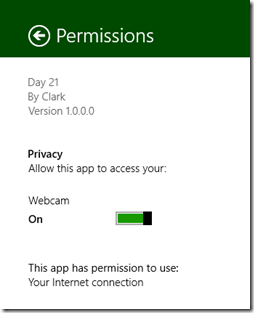](http://csell.net/wp-content/uploads/2012/11/image66.png)

Since we switched to video, we now have access ( or lack thereof ) to the microphone. Because of that we need to go back to our package.appxmanifest and declare we will use the **microphone** as well.

[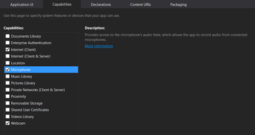](http://csell.net/wp-content/uploads/2012/11/image67.png)

Declaring the Microphone and rerunning we get prompted again. This time for both, **webcam and microphone** access:

And now if we look at our permission of the application.

[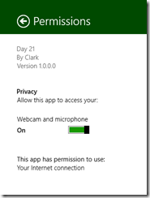](http://csell.net/wp-content/uploads/2012/11/image69.png)

You will notice we have both permissions. I went through this in detail for a few different reasons. 1\. I hope you don't sit there beating your head against the wall late at night trying to figure out why your video isn't working when it's just a declaration in the app. 2\. Access is an all or none here. The access isn't webcam and\or microphone.

Back to the code.

## .then()

Ok so up until this point we've fire the Camera UI but that's really it. Once the user takes a picture, what happens. Well our promise will fire. 
<pre class="prettyprint">captureUI.captureFileAsync(_capture.CameraCaptureUIMode.photo)
    .then(function (capturedItem) {
        if (capturedItem) {
            /* Storage Item */       
        }
        else {
            /* user cancelled */
        }
    }
);</pre>

When our promise fires we're given a [StorageFile](http://msdn.microsoft.com/en-us/library/windows/apps/windows.storage.storagefile.aspx). This pictured captured is actually automatically save to the [application temporary storage](http://msdn.microsoft.com/en-us/library/windows/apps/windows.storage.applicationdata.temporaryfolder). You can see this from my watch window here.

[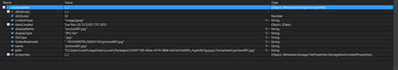](http://csell.net/wp-content/uploads/2012/11/image70.png)

Since what we're given was a StorageFile we can just work with it from there. Below I am just going to create a url for the StorageFile, create a new img element and start appending it to my less than awesome app.
<pre class="prettyprint">var photoBlobUrl = URL.createObjectURL(
                      capturedItem,
                      { oneTimeOnly: true });

var imageElement = document.createElement("img");
imageElement.setAttribute("src", photoBlobUrl);

document.querySelector("#result").appendChild(imageElement);</pre>

[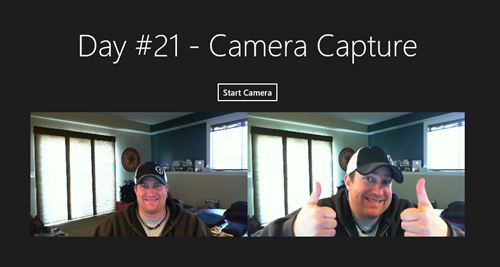](http://csell.net/wp-content/uploads/2012/11/image71.png)

Just like in printing, we also have the ability to influence some of our settings both seen in the Camera UI as well as the the output. This is done by setting the [CameraCaptureUIPhotoCaptureSettings](http://msdn.microsoft.com/en-us/library/windows/apps/br241041.aspx) ( no that wasn't a bad joke ) found on your instance of the CameraCaptureUI class. By default jpegs were saved let's change that to pngs.
<pre class="prettyprint">captureUI.photoSettings.format = _capture.CameraCaptureUIPhotoFormat.png;</pre>

[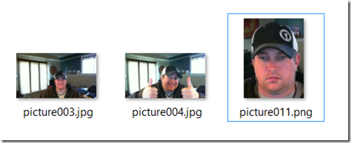](http://csell.net/wp-content/uploads/2012/11/image72.png)

We can also influence how Camera UI works. Below I am going to change the aspect ratio of the crop window to force it to 4:3
<pre class="prettyprint">captureUI.photoSettings.croppedAspectRatio = { height: 4, width: 3 };</pre>

[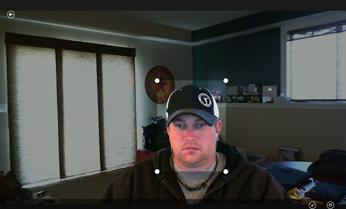](http://csell.net/wp-content/uploads/2012/11/image73.png)

I think you get the point.

## Motion Pictures

Ok enough of my terrible pictures which will end up getting indexed and used somehow when I'm least expecting it. Let's move onto motion pictures. Thankfully we've really already seen this because it's pretty much exactly more of the same. Let's go all in and capture some video.

<pre class="prettyprint">var captureUI = new _capture.CameraCaptureUI();

**captureUI.videoSettings.format
    = _capture.CameraCaptureUIVideoFormat.mp4;

captureUI.videoSettings.allowTrimming = true;

captureUI.videoSettings.maxDurationInSeconds = 15;

captureUI.videoSettings.maxResolution =
    _capture.CameraCaptureUIMaxVideoResolution.highestAvailable;
**
captureUI.captureFileAsync(_capture.CameraCaptureUIMode.video)
    .then(function (capturedItem) {
        if (capturedItem) {

            var url = URL.createObjectURL(
                capturedItem,
                { oneTimeOnly: true });

**            var imageElement = document.createElement("video");
**            imageElement.setAttribute("src", url);
**            imageElement.setAttribute("autoplay");
            imageElement.setAttribute("controls");**

            document.querySelector("#result").appendChild(imageElement);
        }
        else {
            document.querySelector("#result").innerText = "User Cancelled"
        }
    }
);</pre>

I have bolded the items above that we're different and honestly nothing much. Given that I'm not going to spend much time on it. We pop the same [Camera UI but with a different mode](http://msdn.microsoft.com/en-us/library/windows/apps/windows.media.capture.cameracaptureuimode.aspx). We can set things like we did before but this time they are related to video. Can you guess what class that's on? [CameraCaptureUIVideoCaptureSettings](http://msdn.microsoft.com/en-us/library/windows/apps/windows.media.capture.cameracaptureuivideocapturesettings.aspx)

Let's look at a few of the settings. First, we can specify between MP4 video or WMV.&nbsp; You won't see a difference between the two formats until you try to share that video with other systems and platforms.&nbsp; MP4 is far more widely used than WMV, but it's also a larger format, so that's worth considering.

Second, I've turned on "AllowTrimming" which allows the user to select the segment of their recorded video that they would like to use.&nbsp; They'll get a user interface similar to this, where they can drag either end of the video using the white crop circles:

 

Third, I've specified a MaxDurationInSeconds, which limits the maximum length of video a user can provide.&nbsp; If they record more than that duration, they'll be able to select which 30 seconds (or the duration you specify) that they'd like to use.&nbsp; I can see this being useful for businesses like Match.com where people make profile videos, but they don't want them to run on forever.

Finally, I've also specified a MaxResolution.&nbsp; This allows us to manage the resolution that the user can record with, which can also help with the final file size we end up with.&nbsp; You have four choices:

[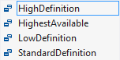](http://csell.net/wp-content/uploads/2012/11/21-XAML-ResolutionList2.png) 

Otherwise, we end up with a very similar result to our camera efforts.&nbsp; This time I created a video element and set a few attributes on it. The results? Well I will save that for Hollywood.

## Summary

In short, capturing photos and videos from your user's camera is very easy, as well as customizable.&nbsp; Most of the complicated UI is handled directly by Windows 8, so we don't have to worry about most of the interaction with the user.&nbsp; I've provided screenshots and a video in this article, but the best way to get a feel for this process is to work with a real application.

[Jeff](http://jeffblankenburg.com) also put together a nice little [video](http://www.youtube.com/watch?v=N9NfqI_5H2s) of him showing off how the Camera UI in action.

If you would like to download the sample code that was discussed in this article, click the icon below:

Tomorrow, we're going to take a look at how to send these pictures somewhere with PlayTo.

