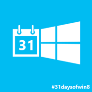
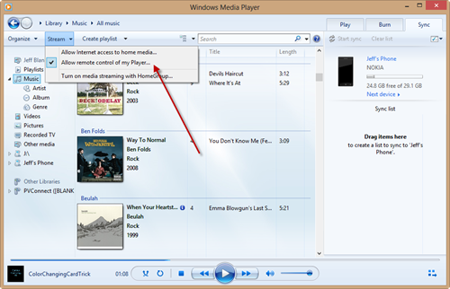
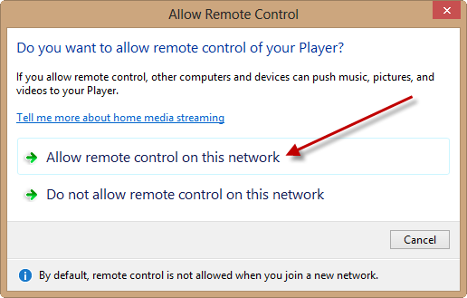
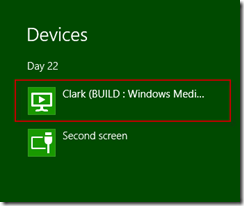
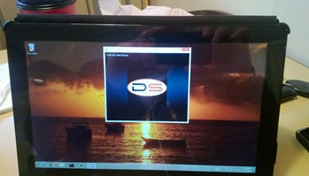

This article is Day #22 in a series called [31 Days of Windows 8](http://31daysofwindows8.com/).&nbsp; Each of the articles in this series will be published for both [HTML5/JS](http://csell.net/category/windows-8/31-days/) and [XAML/C#](http://www.jeffblankenburg.com/category/31-days-of-windows-8/). You can find additional resources, downloads, and source code on our [website](http://www.31daysofwindows8.com/).

It's day Day 22\. We've crawled all around Windows 8 but today we get to talk about a feature that seems to lack any press; Play To. I [said yesterday](http://csell.net/2012/11/21/31-days-of-windows-8-day-21-camera-capture/) that today we would talk about how to send the pictures and videos to another machine and this is exactly what we're going to do; with Play To. 

Let's set this up some. I am an unusual customer. I have many many computers, smartphones, internet connected TVs, XBOXs and so on. I've even been in the long process of home automation. Basically if it needs electricity, I probably want it. But I am also a family man, who takes a lot of pictures, videos and whatnot. When you have all this great tech why not use it to its fullest potential?

And then there is software. I love software. I love the fact that we can make something that solves the needs for us to do something else. I love that I can just sit down and create something simple like [On Time](http://apps.microsoft.com/webpdp/app/on-time/9e5bde3d-3c58-4e77-8b69-5f97f500203d) and hopefully make a presenters life just a little bit easier. 

The place that's always fallen down for me was the integration between the two. If' you've ever tried to dip your toe into the home automation space then you know exactly where I am coming from. It's like someone threw up electronic parts in a room and left you a flat head screwdriver to try and get them all to work together.

Now Play To isn't the savior, but it's&nbsp; a great start. It brings together a very important gap we've today, media sharing.&nbsp; By media, I mean, images, audio, and video. Media today is a mess, from the makers, to the providers to just my own organization of my music and pictures. I can say we're not going to fix that here but maybe we can send that mess around to your different devices AND applications.

This is the first article where we're going to need multiple devices to effectively test this. Today I am just going to use two different machines, the one I am doing development on and the Samsung Build Tablet. That doesn't mean there isn't an array of hardware out there that you could use to test. Microsoft has a great little site that will list the different [compatible devices](http://www.microsoft.com/en-us/windows/compatibility/winrt/CompatCenter/Home). 

Before we get into the coding, I want to make sure you have a way to test this functionality.&nbsp; In Windows 8, open the Windows Media Player app.&nbsp; (You know, the app that you haven't opened on a Windows machine in 10 years?&nbsp; Yeah, that one.)

 

Select the "Allow remote control of my Player..." option.&nbsp; You'll be asked to confirm your choice, just to make sure this is actually what you want to do.

 

Once you've confirmed this choice, your machine will be registered on your network as a device available for Play To content.&nbsp; OK, let's get to coding, so that we can see what this really means.

## Send To

The easiest way to think about Play To is just as another device. If you remember back to how we interfaced with the [printers in Devices Charm](http://csell.net/2012/11/20/31-days-of-windows-8-day-20-printing/), this is more of the same. The first thing we need to do is create our Play To Manager.
<pre class="prettyprint">var _playToMgr = Windows.Media.PlayTo.PlayToManager.getForCurrentView();</pre>

Once we have that, then we need to registered for the _sourcerequested_ event. This is the magic sauce that registers your app with Windows telling it we have some content that we can send along.
<pre class="prettyprint">_playToMgr.addEventListener("sourcerequested", sourceRequestHandler, false);</pre>

With our event registered we just need to implement that handler. This will get fired when the user activates the Devices Charm. When our event fires we have to tell it what element we want to send along. 
<pre class="prettyprint">function sourceRequestHandler(e) {
    if (e)
        e.sourceRequest.setSource(_audioElement.msPlayToSource);
}</pre>

Ironically, that's it. Here is the majority of the JS file I wrote to demonstrate the send. Clearly happy path, error free scenarios.
<pre class="prettyprint">var _audioElement,
        _playToMgr = Windows.Media.PlayTo.PlayToManager.getForCurrentView();

function sourceRequestHandler(e) {
    if (e)
        e.sourceRequest.setSource(_audioElement.msPlayToSource);
}

function getDomElements() {
    _audioElement = document.querySelector("#audioTag");
}

function wireEventHandlers() {
    _playToMgr.addEventListener("sourcerequested", sourceRequestHandler, false);
}

app.onloaded = function () {
    getDomElements();
    wireEventHandlers();
}</pre>

## Let's Play

My UX is simple, it's one audio element wired to my podcast, [Developer Smackdown](http://developerSmackdown.com).

When I select the Devices Charm you will now see my tablet shown below.

After selecting that. my tablet will start playing the audio.

And, if that isn't trippy enough. Hit pause on your Played To device. You will see the pause change on your source machine. So you have full fidelity controls between the two devices. 

## - play to tip -

If you switch networks, say you go to a McDonalds to work for a while, maybe even write an article. You have to go through that brief setup we did at the start of this article ( at least for Windows Media Player ).

## Receiving Content

Ok, now for the other way around. I honestly don't know what is more exciting, the fact that you can send stuff or receive stuff. Believe me, the app ideas are rolling. 

Receiving content is for the most part just as easy. We can break up the steps into 5 different parts:

*   create the receiver
*   set some properties on the receiver
*   wire the event handlers for the receiver
*   wire the event handlers for the element ( in our case an audio control )
*   start

To create the receiver we just need an instance of of the [PlayToReceiver](http://msdn.microsoft.com/en-US/library/windows/apps/windows.media.playto.playtoreceiver).
<pre class="prettyprint">var _receiver = new Windows.Media.PlayTo.PlayToReceiver();</pre>

Next we have some properties we can set. I think the properties are self explanatory.
<pre class="prettyprint">_receiver.friendlyName = "31 Days Play To Receiver";
_receiver.supportsAudio = true;
_receiver.supportsVideo = false;
_receiver.supportsImage = false;</pre>

With the properties set the next step is the most tedious, creating all of the event handlers. These event handlers are the things that map the events from both sides and your code is basically just a pass through. For example. If a user hits pause on the destination device, you need to map pause from that element back to the receiver so you can actually pause your element. The same is true the other way. Pause on the source, we hit pause on the destination and so on.
<pre class="prettyprint">_receiver.addEventListener("sourcechangerequested", receiver_SourceChangeRequested);
_receiver.addEventListener("pauserequested", receiver_PauseRequested);
_receiver.addEventListener("currenttimechangerequested", _receiver_CurrentTimeChangeRequested);
_receiver.addEventListener("mutechangerequested", receiver_MuteChangeRequested);
_receiver.addEventListener("playbackratechangerequested", _receiver_PlaybackRateChangeRequested);
_receiver.addEventListener("playrequested", receiver_PlayRequested);
_receiver.addEventListener("stoprequested", receiver_StopRequested);
_receiver.addEventListener("timeupdaterequested", receiver_TimeUpdateRequested);
_receiver.addEventListener("volumechangerequested", receiver_VolumeChangeRequested);

_audioReceive.addEventListener("durationchange", audioPlayer_DurationChange);
_audioReceive.addEventListener("ended", audioPlayer_Ended);
_audioReceive.addEventListener("error", audioPlayer_Error);
_audioReceive.addEventListener("loadedmetadata", audioPlayer_LoadedMetadata);
_audioReceive.addEventListener("pause", audioPlayer_Pause);
_audioReceive.addEventListener("playing", audioPlayer_Playing);
_audioReceive.addEventListener("ratechange", audioPlayer_RateChange);
_audioReceive.addEventListener("seeked", audioPlayer_Seeked);
_audioReceive.addEventListener("seeking", audioPlayer_Seeking);
_audioReceive.addEventListener("volumechange", audioPlayer_VolumeChange);</pre>

I'm going to spare you the detail of the functions, just go look at the [sample code](https://github.com/csell5/31DaysOfWindows8/tree/master/source/HTML5/Day22-PlayTo). It's just mapping code, a line or two each.&nbsp; Now we just need to hit start the receiver so we can broadcast on the network.
<pre class="prettyprint">_receiver.startAsync().done(function () {
    // good place to think about locking the display on.
});</pre>

And just like that, you're now streaming back and forth between devices on your network. Seriously cool stuff that I would encourage you to play around with.

## Summary

I'm really excited about the potential that Play To has. It open a unique scenario for media between devices and applications. Now what we do with it, is a different story. I could go on, but why? You should just start playing with it.

If you would like to download the sample code that was discussed in this article, click the icon below:

Tomorrow, it's off to more devices.

