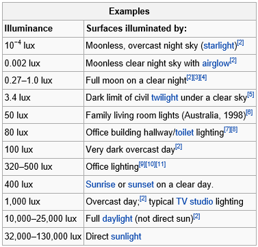

This article is Day #24 in a series called [31 Days of Windows 8](http://31daysofwindows8.com/).  Each of the articles in this series will be published for both [HTML5/JS](http://csell.net/category/windows-8/31-days/) and [XAML/C#](http://www.jeffblankenburg.com/category/31-days-of-windows-8/). You can find additional resources, downloads, and source code on our [website](http://www.31daysofwindows8.com/).

Today, we are taking a look another one of the sensors we might find in a Windows 8 device: the Light Sensor.  With the Light Sensor, we can determine the brightness of the light around the user's machine, and help to accommodate things like contrast, brightness, and other values that would make our app easier to read in high and low light.

I let [Jeff](http://jeffblankenburg.com) put together yet another [horribly produced video](http://www.youtube.com/watch?v=fbuOeibcT98&list=UUqU3asqRVJxLJoRemk_6FJQ&index=1&feature=plcp) to show you how a light sensor works, and what kinds of values we can expect. To make this application work, we're going to follow a very similar pattern to the one we used yesterday for the [Compass sensor](http://csell.net/2012/11/23/31-days-of-windows-8-day-23-the-compass).

*   Initialize the Light Sensor.
*   If it's available, create a _ReadingChanged_event handler.
*   In the event handler, grab the data from the sensor and write it to the screen.
Here's my the entirety of my code and it looks scary similar to that of the compass.
<pre class="prettyprint">var _light;

function onReadingChanged(e) {
    _light.innerText = e.reading.illuminanceInLux.toFixed(2);
}

function startLightSensor() {
    var lightSensor = Windows.Devices.Sensors.LightSensor.getDefault();

    if (lightSensor) {
        var minimumReportInterval = lightSensor.minimumReportInterval;
        var reportInterval = minimumReportInterval > 16 ? minimumReportInterval : 16;
        lightSensor.reportInterval = reportInterval;

        lightSensor.addEventListener("readingchanged", onReadingChanged);
    }
}

function getDomElements() {
    _light = document.querySelector("#light");
}

app.onready = function () {
    getDomElements();
    startLightSensor();
}</pre>
There's nothing surprising about getting this data, but I was surprised to see how diverse the values on different machines (that were sitting next to each other) could be.  For instance, my Qualcomm ARM device (the one featured in the video above) generally rated the room I'm currently sitting in around 59 lux.  My Samsung tablet, however, which is a Windows 8 Pro device, rates this room around 42 lux.  Finally, my Surface RT device says this place is about 115 lux.

This is likely due to the accuracy and quality of the light sensor in each device, but in general, they're really not that far apart on the scale of lux values.  Here's an example from the [Wikipedia article on Lux](http://en.wikipedia.org/wiki/Lux).

As you can see, even 100 lux is still a pretty dim value.  Just flipping the lightswitch on in my office jumped my sensor values up closer to 175.  Using the chart above, however, you should be able to create "ranges" of values that behave differently depending on the brightness of the light available.

For example, if you recognize that the user is in a low-light environment, you might switch their display to show a dark background and white text, because that is easier to read in that kind of light.  In a bright room, you might want to switch to black text on a white background.

In either case, you now know how to recognize the data from the light sensor, and use it effectively in your app.

## Summary

Today we talked about the Light Sensor, and how it can be used to alter a user's interface to make it more readable.  Ultimately, there are dozens of creative ways to leverage the lux data in your applications, and I'm looking forward to hearing how you'll use it in your app.

If you'd like to download my working sample that uses the code from this article, click the icon below:

Tomorrow, we're going to get involved with a more robust sensor, the Accelerometer.  We can use this data to determine the rotation of the user's device.  See you then!

