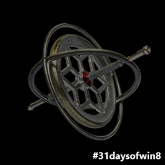

This article is Day #26 in a series called [31 Days of Windows 8](http://31daysofwindows8.com/).&nbsp; Each of the articles in this series will be published for both [HTML5/JS](http://csell.net/category/windows-8/31-days/) and [XAML/C#](http://www.jeffblankenburg.com/category/31-days-of-windows-8/). You can find additional resources, downloads, and source code on our [website](http://www.31daysofwindows8.com/).

As a kid I was always amazed at a gyroscope. I would find anything I could to balance that thing on. I always though physics was very interesting but like anything if you don't constantly use it, you start to forget bit's and pieces of it. As we've seen over the past few days, the machines of today have started to become an interesting physics experiment. Rather than just some toy of days past we can leverage these sensors to accomplish some very interesting features.

Today, we are taking a look at yet another sensor that we might find in a Windows 8 device: the gyrometer.&nbsp; The gyrometer measures the angular velocity or rotational motion. The gyrometer can easily compliment the [accelerometer](http://csell.net/2012/11/25/31-days-of-windows-8-day-25-accelerometer/) to create one very advanced game controller. When used together, the accelerometer measuring the linear motion and the gyrometer measuring the rotational force, you can make things like a pretty wicked game controller. 

Working with the gyrometer is the same as working with our other sensors. Just a few simple steps and we're getting data:

*   Initialize the Sensor.  <li>If it's available, 

Here's my the entirety of my code and it looks scary similar to that of the other sensors. 
<pre class="prettyprint">    var _x, _y, _z;

    function onReadingChanged(e) {
        _x.innerText = e.reading.angularVelocityX.toFixed(2);
        _y.innerText = e.reading.angularVelocityY.toFixed(2);
        _z.innerText = e.reading.angularVelocityZ.toFixed(2);
    }

    function onShaken(e) {
        _wasShaken.innerText = e.timestamp;
    }

    function getDomElements() {
        _x = document.querySelector("#x");
        _y = document.querySelector("#y");
        _z = document.querySelector("#z");
    }

    function startAccelerometer() {
        var gyro = Windows.Devices.Sensors.Gyrometer.getDefault()

        if (gyro) {
            var minimumReportInterval = gyro.minimumReportInterval;
            var reportInterval = minimumReportInterval > 16 ? minimumReportInterval : 25;
            gyro.reportInterval = reportInterval;

            gyro.addEventListener("readingchanged", onReadingChanged);
        }

    }</pre>

Once again, no real surprises here. We get to our data in the same basic was as we did with the other sensors. The real magic is your software that leverages the data it's measuring.

## Summary

Today we briefly looked at getting data from our gyrometer. Working with each of these sensors is pretty much the same but what you do with them is entirely up to you.

If you'd like to download my working sample that uses the code from this article, click the icon below:

&nbsp;

Tomorrow, we're going to look at the Inclinometer.&nbsp; See you then!

