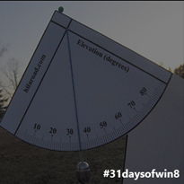

This article is Day #27 in a series called [31 Days of Windows 8](http://31daysofwindows8.com/). Each of the articles in this series will be published for both [HTML5/JS](http://csell.net/category/windows-8/31-days/) and [XAML/C#](http://www.jeffblankenburg.com/category/31-days-of-windows-8/). You can find additional resources, downloads, and source code on our [website](http://www.31daysofwindows8.com/).

As someone who's never written a game, or even an app which required such physics like heuristics, it's become clear to me that getting the data from the sensor is really the easy part. I think it's also pretty clear that no one sensor might ever be used alone but rather in partnership with the others. All of the devices really complement each other in someway and depending on what you're building, while simple to work with they are essential to the overall experience you're trying to create for your customer.

Today, finishes off our series of device sensor conversations that you might find in your new Windows 8 device. Today we're going to take a very brief look at a device called the inclinometer. So what really is the inclinometer? Well, chances are you've probably been taken somewhere in a plane. When a plane turns, it actually exhibits all three axis to accomplish it's turn. To make the plane turn in a nice smooth manor, we have three simple steps ( at least for the pilot that is ):

* Pitch the plan in the direction of travel, by adjusting the aileron's ( assumed in opposite directions to pitch the plane ). This is our Y axis or the Pitch.
* Adjust the elevator either up ( or down ). This helps pull the nose of the plane up ( or down ) helping to point the noise in the direction of the desired turn. This is our X axis or the Roll.
* Adjust the rudder. With the rudder we can make the play turn side to side. If you have ever landed in a windy situation and the plan felt sideways, it's because it was, and they we're using the rudder to cock the rear of the plan sideways. This is our Z axis or the Yaw. 

Image courtesy of MSDN: [http://msdn.microsoft.com/en-us/library/windows/apps/jj155767.aspx](http://msdn.microsoft.com/en-us/library/windows/apps/jj155767.aspx "http://msdn.microsoft.com/en-us/library/windows/apps/jj155767.aspx")

While the physical example is nice, how does that translate to our computers in hand?

Image courtesy of MSDN: [http://msdn.microsoft.com/en-us/library/windows/apps/jj155767.aspx](http://msdn.microsoft.com/en-us/library/windows/apps/jj155767.aspx "http://msdn.microsoft.com/en-us/library/windows/apps/jj155767.aspx")

As you can guess, working with the inclinometer is just like working with our other sensors.  Just a few simple steps and we're getting data:

* Initialize the Sensor.
** If it's available,
*** create a _readingchanged _event handler.  <li>In the event handlers, grab the data from the sensor and write it to the screen. 

Here's my the entirety of my code and it looks well super duper scary similar to that of the other sensors. 
    
    var _pitch, _yaw, _roll, _timestamp;

    function onReadingChanged(e) {
        _pitch.innerText = e.reading.pitchDegrees.toFixed(2);
        _yaw.innerText = e.reading.yawDegrees.toFixed(2);
        _roll.innerText = e.reading.rollDegrees.toFixed(2);
        _timestamp.innerText = e.reading.timestamp;
    }

    function getDomElements() {
        _pitch = document.querySelector("#pitch");
        _yaw = document.querySelector("#yaw");
        _roll = document.querySelector("#roll");
        _timestamp = document.querySelector("#timestamp");
    }

    function startInclinometer() {
        var inclinometer = Windows.Devices.Sensors.Inclinometer.getDefault()

        if (inclinometer) {
            var minimumReportInterval = inclinometer.minimumReportInterval;
            var reportInterval = minimumReportInterval > 16 ? minimumReportInterval : 16;
            inclinometer.reportInterval = reportInterval;

            inclinometer.addEventListener("readingchanged", onReadingChanged);
        }
    }

    app.onloaded = function () {
        getDomElements();
        startInclinometer();
    }

Once again, no real surprises here. We get to our data in the same basic was as we did with the other sensors. Wire up to an event, which will fires on an desired interval giving us the X, Y, Z values. No real magic here other than the software you're building to consume it.

# Summary

Today we briefly looked at getting data from our inclinometer. Working with each of these sensors is pretty much the same but what you do with them is entirely up to you.

If you'd like to download my working sample that uses the code from this article, click the icon below:

Tomorrow, we're going to look at the Inclinometer.

~ Clark