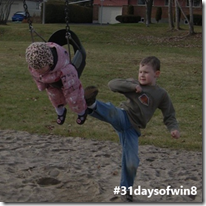
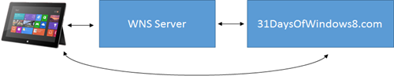
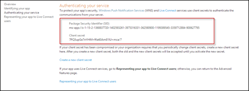
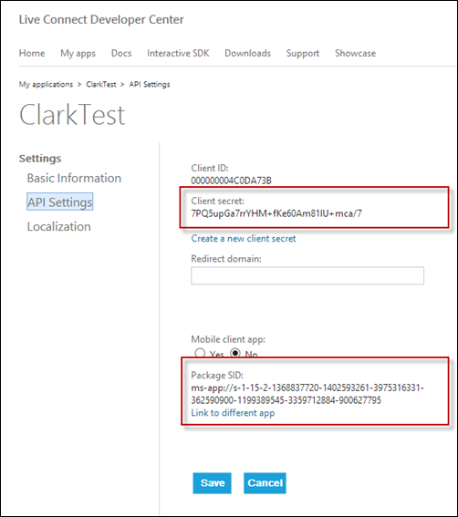
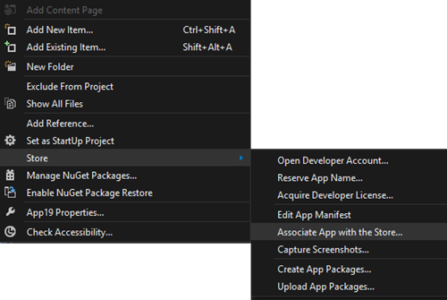

This article is Day #28 in a series called [31 Days of Windows 8](http://31daysofwindows8.com/). Each of the articles in this series will be published for both [HTML5/JS](http://csell.net/category/windows-8/31-days/) and [XAML/C#](http://www.jeffblankenburg.com/category/31-days-of-windows-8/). You can find additional resources, downloads, and source code on our [website](http://www.31daysofwindows8.com/).

Today we're going to dive pretty deep into the world of Push Notifications. In short, push notifications is a mechanism for some external thing to send a notification to the user in a variety of different forms. Now, this isn't anything new to us. On [Day 9 we introduced Live Tiles](http://csell.net/2012/11/09/31-days-of-windows-8-day-9-live-tiles), [Day 10 - Toast Notifications](http://csell.net/2012/11/10/31-days-of-windows-8-day-10-toast-notifications) and [Day 11 Lock Screen Applications](http://csell.net/2012/11/11/31-days-of-windows-8-day-11-lock-screen-apps). These were all methods in which we could notify the user and allow them to take action if they so desired. When we explored each of these methods we we're sending notification from within our application or some background process. Push notifications is really the last piece in that notification puzzle and maybe one we should have ordered a bit different in our series. Hindsight is always 20/20 right?

Before we dive into Push Notifications I want to set the stage a bit. I am going to assume a web like connected scenario. I am going to create a simple website. This website will be the thing that we ultimately send notifications to our apps on the different clients. The server will determine Who, What, When will get those notifications. Of course for demonstration purposes we're going to cut out some of that "business logic" such that we can just exercise the ole internet pipes. At a 50k foot level this all looks something like this:

# What is?

Now, what really is Push Notifications? Well Push Notifications is really some cloud infrastructure to manage and facilitate the sending of notification for applications who subscribed to receive them. These notification can be a [tile](http://msdn.microsoft.com/en-us/library/windows/apps/hh779724.aspx), [toast](http://msdn.microsoft.com/en-us/library/windows/apps/hh779727.aspx), [badge](http://msdn.microsoft.com/en-us/library/windows/apps/hh779719.aspx) and [raw](http://msdn.microsoft.com/en-us/library/windows/apps/hh761488.aspx) notifications ( any or or all of them ). They are actually determined from the server and then sent through to the WNS server which will then send it along to the appropriate client. The notification work the same way as we saw in our previous articles but are just sent from a outside source, such as the little website we will build.

These notifications are managed through what is called the Windows Push Notification Services or WNS. This is the piece of cloud architecture that resides in the middle of everything. The WNS server is the thing in which our client and server interact with to send and receive notifications. Having said that our client *will still have* to send its endpoint to the website, such that it knows who would like to receive a notification.

The basic steps are such:

*   Before we can do anything we need to be registered with the store. This will gives us our keys such that we can authenticate with the WNS server. Our app needs to register a channel with the WNS server. The result of a successful registration is a URI. It will look something like:

    https://bn1.notify.windows.com/?token=AgYAAAAe%2buFwf2o%2fz1nJdCAMwzf4bO9u3QXmrW4L73WAPNpsP8DpbfSmHIuRpoOIJKusNKxTvkXo4tposjhTPkbLNnsvXXzCh8eIMpyTPXOFNStcZ0FR7kQZHf86MwL4Ga5f7vg%3d 

Once we have the URI we need to give it to our cloud service so it knows which clients want communication Our cloud service ( in our case our website ) will have to have some knowledge about our secret WNS keys. These keys are what our site will use to authenticate to the WNS server. Once authenticated it can then post notification to that URI the client gave him. 

Image curiosity of MSDN: [http://msdn.microsoft.com/en-us/library/windows/apps/hh913756.aspx](http://msdn.microsoft.com/en-us/library/windows/apps/hh913756.aspx "http://msdn.microsoft.com/en-us/library/windows/apps/hh913756.aspx"). For more information on the Push Notifications process, please see the [Push Notification Overview on MSDN](http://msdn.microsoft.com/en-us/library/windows/apps/hh913756.aspx).

# The Setup

To start, we need to get our app registered. Now at the time of writing this there <strike>seems</strike> used to be two different methods. 

* [Windows Store ( dashboard )](http://dev.windows.com)  <li>[Live Connect Developer Center](https://manage.dev.live.com) 

Now the Windows Store is the official way that you will want to register your application. The Windows team has put together a nice set of documentation on how to get registered so I won't rehash that here. Just check out the article [How to authenticate with the Windows Push Notification Service (WNS).](http://msdn.microsoft.com/en-us/library/windows/apps/hh465407.aspx) The first part of the article walks through in great detail just how to register your application in the store and so forth. 

The Live Connect Developer Center used to be a place where you could also register an application and get all all of the goods but that seems to have recently changed. I tell you this because there are a number of blog posts out there with outdated information ( as one day this will be too ). Yes, you can still create an application there but you will be missing some essential pieces of information ( like the SID ) needed to do the proper authentication. Having said all this, any application you create in the Windows Store will appear listed here and with some of that information.

Why do we need to register anything to do Push Notifications? Security. This registration process does two things for us. 1\. It will identify our application to not only the Store so we can submit our wonderful app but also identify itself to the WNS servers correctly. 2\. Provides us an identity to use outside our of our application ( aka server side ) which can authenticate via OAuth with our WNS servers, this is our SID and the Secret. If your secret was to ever get compromised, you can always regenerate it from either the Store ( which really takes you to Live ) or the Live Connect Developer Center. Below the top image is our results from the Store while the bottom image is the Live Connect portal page.

Ok, now you have your app registered in the store, the next thing to do is associate the solution with the Store. What that really means is changing all of that great information that we haven't talked about in the Packaging tab of our appxmanifest. But rather than just entering it all by hand we can just go to _**Project -> Store -> Associate App with the Store**_. This will do all the nasty for us.

# Tip

One thing that has caught me once or twice, was the generation of our certificate. Every application has a unique certificate associated with it. When you create a new blank template Visual Studio will actually create a temporary certificate for you, something like _App29_TemporaryKey.pfx_. This certificate will be associated to your app in the packaging tab of the appxmanifest file. Now when you associate your app with the store, not only will it update that Packaging tab with new information but you should *also* get a new certificate that will be associated with the store. 

Now I have personally seen this not happen and no matter how many times I tried to associate my application, I couldn't seem to get the Store certificate. As it turns out there was an easy fix. Make sure you somehow didn't mess up your own temporary certificate. If you're actually missing your pfx file ( say you deleted it or excluded it from source control ) you can recreate a temporary one from that Packaging tab in the appxmanifest. Once you have your certificate correctly associated, then re-associate with the store and you should in fact get your official key.

# The Client

Now that our app is registered, and we have the keys ( SID and Secret ) to our castle, the first thing our application will need to do is register a channel with the WNS server. Our application *has* to be the thing that will tells the WNS servers that we in fact want notifications. In return our WNS server will tell our application what our actual Push Notification URI will be. Once we have that endpoint we can pass it along to our cloud services such that we can start receiving notifications.

Ironically, the client part is the easy part. The only thing we need to do in our application is register ourselves with the WNS server and pass along our URI. As we saw from our conversations on [tile](http://msdn.microsoft.com/en-us/library/windows/apps/hh779724.aspx), [toast](http://msdn.microsoft.com/en-us/library/windows/apps/hh779727.aspx), [badge](http://msdn.microsoft.com/en-us/library/windows/apps/hh779719.aspx) notifications we really didn't have any work to do to receive notifications. Meaning we didn't need to setup OS level events to catch and pop dialog boxes, unlike our devices conversation where we did ( at least have to register ourselves ).

When our application launches, we can register ourselves with the WNS servers.

    var notify = Windows.UI.Notifications;
    var push = Windows.Networking.PushNotifications;
    var net = Windows.Networking.Connectivity;

    notify.TileUpdateManager.createTileUpdaterForApplication().clear();
    notify.BadgeUpdateManager.createBadgeUpdaterForApplication().clear();

    var profile = net.NetworkInformation.getInternetConnectionProfile();

    if (profile.getNetworkConnectivityLevel() === net.NetworkConnectivityLevel.internetAccess) {
        push.PushNotificationChannelManager.createPushNotificationChannelForApplicationAsync()
            .then(function (channel) {
                document.querySelector("#uri").innerText = channel.uri;

                /* 
                this would be the place to post your uri to your cloud service.
                */
            })
    }

Above, I am just clearing all notifications ( it's a demo after all ), then I will check for internet access. If so, we can then register for Push Notifications and pass along our URI. In our case I am just going to put the URI on the screen for us to see.

# yet another tip

Internet Access. By default, the Visual Studio template has the _Internet Access_ Capability already checked. This is in fact a capability we need for Push Notifications, so no immediate work is required by us. 

Having said that, if we have Internet Access Checked then when we try to publish our app to the store we will also be required to provide a privacy policy. See [section 4.1.1](http://msdn.microsoft.com/en-us/library/windows/apps/hh694083.aspx) for more information. Without that you will be rejected.

You've been warned.

# The Server

Our server is where all the magic will happen. To send a notification it really just takes a few simple steps. Authenticate with the WNS servers, create your notifications and then send them along. Since we've already covered how to create [tile](http://msdn.microsoft.com/en-us/library/windows/apps/hh779724.aspx), [toast](http://msdn.microsoft.com/en-us/library/windows/apps/hh779727.aspx), and [badge](http://msdn.microsoft.com/en-us/library/windows/apps/hh779719.aspx) notifications I will not cover that but rather I would like to introduce a library which will make all of this pretty dead simple. It's called [WNS Recipe](http://nuget.org/packages/WnsRecipe). While I could walk you through the [OAuth Authentication](http://msdn.microsoft.com/en-us/library/windows/apps/hh465407.aspx) process with the WNS servers, why?

[WNS Recipe](http://nuget.org/packages/WnsRecipe), makes all of this very simple. As a fun little experiment, I created a simple webpage on [31 Days to test Push Notifications](http://31daysofwindows8.com/push). you plug in your information and it will send you a tile and toast notification. Sure I could go a lot further but for now, it will at least test the pipes. Below is the majority of that code.

    var sid = Request["sid"];
    var secret = Request["secret"];
    var uri = Request["uri"];
    var message = Request["message"];

    WnsAccessTokenProvider tokenProvider = new WnsAccessTokenProvider(sid, secret);

    var title = "31 Days";
    var subText = message;

    var tileNotification = TileContentFactory.CreateTileWideText01();

    tileNotification.RequireSquareContent = false;

    tileNotification.TextHeading.Text = "31 days";
    tileNotification.TextBody1.Text = message;

    var tileResult = tileNotification.Send(new Uri(uri), tokenProvider).ErrorDescription;

    if (!string.IsNullOrEmpty(tileResult) ){
        <h1>tile result: @tileResult</h1>
    }

    var toastNotification = ToastContentFactory.CreateToastText02();
    toastNotification.TextHeading.Text = "31 Days";
    toastNotification.TextBodyWrap.Text = message;

    var toastResult = toastNotification.Send(new Uri(uri), tokenProvider ).ErrorDescription;

    if (!string.IsNullOrEmpty(toastResult) ){
        <h1>toast result: @toastResult</h1>
    }

The first major step is creating an instance of what is called the token provider. To create it, we need that SID and Secret that we received when we registered our application. They will look something like this:

* SID: [ms-app://s-1-15-2-1368837720-1402593261-3975316331-362590900-1199389545-3359712884-900627795](ms-app://s-1-15-2-1368837720-1402593261-3975316331-362590900-1199389545-3359712884-900627795 "ms-app://s-1-15-2-1368837720-1402593261-3975316331-362590900-1199389545-3359712884-900627795")
* Secret: 7PQ5upGa7rrYHM+fKe60Am81lU+mca/7

Once we have our token provider in place, then we just need to create the notifications we would like to send. WNS Recipe makes this easy, as it's wrapped all of the types of notifications in some nice factories. If you remember there are a number of different templates for each category of notification. WNS Recipe makes dealing with those templates a breeze.

Then when we're ready to send, we just send to that URI our app gave us, using our token.

# Sounds too easy

Sounds to easy Clark, I call BS. Ok, well, maybe you got me. Push Notifications is actually really easy. Here is what can be a pain. Managing those URIs the hundreds of millions of customers will be sending you. 

Yes, your services in the cloud will need to have some endpoint that your app can post it's URI to. Then it will need to manage if that URI has expired ( yes they can change and expire ), who do you send to and when, and so forth. So yes, sending the notification is easy. Just how you leverage them is a different story.

But wait, there is more. Today I talked through the raw details of sending Push Notifications. At the time of writing this Microsoft has recently released something called [Azure Mobile Services](https://www.windowsazure.com/en-us/home/scenarios/mobile-services/). Azure Mobile Services is a great utility for application developers. Azure Mobile Services will actually setup and host a great deal of this plumbing that I just mentioned. Now [Jeff spent his day 28](http://www.jeffblankenburg.com/2012/11/28/31-days-of-windows-8-day-28-push-notifications) working through that approach. This is something I would highly suggest taking a read through as well.

Hopefully between the two of us, you have a more than complete picture on how you can leverage Push Notification in your application.

# Summary

Push Notifications is very cool. There have been some [recent studies](http://www.intomobile.com/2012/10/06/push-notifications-good-app-engagement/) done where applications are claiming push notification driving over 60% of interaction with its application. Regardless, having a facility to entice the users to come back is always a good thing.

If you'd like to download my working sample that uses the code from this article, click the icon below:

Tomorrow, we're finally going to talk about Process Lifecycle Management. See you then!

~ Clark