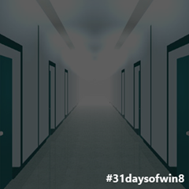
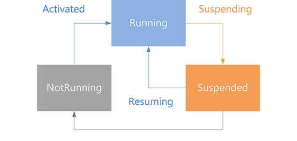

---
layout: post 
title: "31 Days of Windows 8 | Day #29: PLM"
subTitle: 
heroImageUrl: 
date: 2012-11-29
tags: ["31 Days","Application Lifecycle","PLM","Windows 8"]
keywords: 
---

This article is Day #29 in a series called [31 Days of Windows 8](http://31daysofwindows8.com/).  Each of the articles in this series will be published for both [HTML5/JS](http://csell.net/category/windows-8/31-days/) and [XAML/C#](http://www.jeffblankenburg.com/category/31-days-of-windows-8/). You can find additional resources, downloads, and source code on our [website](http://www.31daysofwindows8.com/).



After 29 days, we're finally going to talk about the Application Lifecycle or Process Lifecycle management ( aka PLM ). Now before you close the browser thinking I will just skip this one, please don't. We're going to talk about how your application will run, when it runs, and what events are there for us to plug into. Ultimately we're looking at the management of the different states our application can be in on a user's device.  Here's an illustration (image from [MSDN](http://msdn.microsoft.com/en-US/library/windows/apps/hh464925)):



As web developers this process lifecycle thing might feel a bit foreign to us. Of course our web applications and\or sites have a lifecycle but our word is a pretty stateless world. Now having said that, we've always had to deal with bouncing between servers, network volatility and overall session management. The same principals are somewhat true in our native app. Windows makes the call as to when we should live, and we should be ready for that.

The reason that this is important to us as developers of Windows 8 applications is because we want to provide a seamless user experience in our apps.  When a user presses the Windows key on their machine, and leaves your app, you want to make sure you save or preserve their data in some way, so that when they come back, it's all still there.

# I Thought Windows Handled This Automatically??

Yes and no.  By default, if you run a Windows 8 application, leave it, and come back, it will automatically be exactly where you left it.  However, if you leave it, and then open 6 or 7 more applications, it's likely that the operating system is going to suspend your application, or even terminate it.  Thankfully, there's a couple of great mechanisms we can use to manage this.

# Recognizing Your App Has Been Suspended

According to Microsoft, "an app can be suspended when the user switches away from it, ***or*** when Windows enters a low power state.  Most app stop running when the user switches away from them."  There's a few things you need to know about how your app will end up in a suspended state:

* Your app "might" be suspended.  For the simple app I've built for this article, I've never seen it enter a suspended state on its own.
* Generally, when the system runs out of resources, this is the time your app will enter a suspended state.
* When you leave an app to use another, Windows will wait a few seconds before suspending it, just in case you were planning to return to it quickly.
So, if you're anything like me, you're probably wondering how we are going to write and test some code that only occurs when Windows feels like making it happen. Thankfully, there's some tools for that.

Now to talk about this whole lifecycle thing, I'm purposefully going through things somewhat backwards, this will make more sense when we turn to talking about what happens when our application launches. Most likely you'd started your application development from one of the Visual Studio templates. Assuming so, then will see a bunch of boilerplate code in your default.js file. This boilerplate code is basically some of the simple hooks for PLM as well as getting your app started up.

Before our application transitions into another state and event called _oncheckpoint_ will get called. This _*an*_ opportunity ( not the only one, you can always save too ) for you to do something like possibly save the users session state or something like their navigation history

    app.oncheckpoint = function (args) {
        args.setPromise(finishOff());
    };

    function finishOff() {
        return new WinJS.Promise(function (complete, cancel, progress) {
            WinJS.log && WinJS.log("app.oncheckpoint called.", "31 days", "status");
            complete();
        });
    }

Looking at the code above, you can see I we have created a function that will in turn get executed when the checkpoint event is fired. In our code we are  creating a promise that will in turn tell Windows there is some async activity occurring and things shouldn't end until complete has been called. Having said that, Windows isn't going to wait around forever either. Windows will wait a few seconds ( 5 seconds I believe ) before it says, "sorry dude, I am outty you're just taking to long".

In WinJS there is an object called [sessionState](http://msdn.microsoft.com/en-us/library/windows/apps/hh440965.aspx). This [sessionState](http://msdn.microsoft.com/en-us/library/windows/apps/hh440965.aspx) object is a great place for you to keep some of your users session data like navigation history (as the Navigation template in fact already does). The beauty of this [sessionState](http://msdn.microsoft.com/en-us/library/windows/apps/hh440965.aspx) object is Windows will in fact manage the persistence and recreation of that object and its associated data. While less work for us, we will still have to take the data from that object and re-create our own objects if necessary.

Checkpoint is called when you application is going to be suspended. If  you app is suspended there are no more notifications that you'll receive, so this is the place to take care of business while you still have a chance.

# Recognizing That Your App Is Resuming

In this case, we're going to simply add an event handler that will execute when the resuming event is fired.

    var webUI = Windows.UI.WebUI.WebUIApplication;
    webUI.addEventListener("resuming", onResume, false);

    function onResume() {
        WinJS.log && WinJS.log("app resuming", "31 days", "status");
    }

# On Launch

This is where things can get a bit more complicated. In the code below, I have listed out all of the different execution states and I am logging that to the console window. Just like we did with the [blank app on day one](http://csell.net/2012/11/01/31-days-of-windows-8-day-1-the-blank-app), this gives us some history as to when these things will get fired and whatnot. This is our place where we can do things like reconstitute objects depending on the state the applications was in before ( if we care of course ).

    var app = WinJS.Application;

    app.onactivated = function (args) {
        WinJS.log && WinJS.log("app.onactivated", "31 days", "status");

        if (args.detail.kind === activation.ActivationKind.launch) {
            WinJS.log && WinJS.log("Activation Kind === Launch.", "31 days", "status");

            switch (args.detail.previousExecutionState) {

                case activation.ApplicationExecutionState.terminated:
                    WinJS.log && WinJS.log("previousExecutionState terminated", "31 days", "status");
                    break;

                case activation.ApplicationExecutionState.running:
                    WinJS.log && WinJS.log("previousExecutionState running", "31 days", "status");
                    break;

                case activation.ApplicationExecutionState.suspended:
                    WinJS.log && WinJS.log("previousExecutionState suspended", "31 days", "status");
                    break;

                case activation.ApplicationExecutionState.closedByUser:
                    WinJS.log && WinJS.log("previousExecutionState closedByUser", "31 days", "status");
                    break;

                case activation.ApplicationExecutionState.notRunning:
                    WinJS.log && WinJS.log("previousExecutionState notRunning", "31 days", "status");
                    break;
            }

            args.setPromise(WinJS.UI.processAll());
        }
    };

To look at a concrete example of this. We can look no further than the Navigation App template found inside of Visual Studio. Here we will see no only are we saving our navigation history on checkpoint to the sessionState object but when our application launches we are making sure we 1\. reconstitute it as well as navigate them back to the place they had left off.

    app.addEventListener("activated", function (args) {
        if (args.detail.kind === activation.ActivationKind.launch) {
            if (args.detail.previousExecutionState !== activation.ApplicationExecutionState.terminated) {
            } else {
            }

            if (app.sessionState.history) {
                nav.history = app.sessionState.history;
            }
            args.setPromise(WinJS.UI.processAll().then(function () {
                if (nav.location) {
                    nav.history.current.initialPlaceholder = true;
                    return nav.navigate(nav.location, nav.state);
                } else {
                    return nav.navigate(Application.navigator.home);
                }
            }));
        }
    });

    app.oncheckpoint = function (args) {
        app.sessionState.history = nav.history;
    };

# Now how in the world do I test this PLM stuff?

Because this is a tough scenario to make happen automatically, there are tools inside Visual Studio that allow us to simulate these states in our application.  First, make sure that you've opened the **Debug Location** toolbar in Visual Studio.



Once you've added that toolbar, it's as simple as choosing one of these three options:



*   **Suspend** will immediately put your application in a suspended state.  This will also fire your suspended event handler before it stops running.
*   **Resume** will obviously resume your app from a suspended state.  If your app is not suspended, nothing will happen.
*   **Suspend and shutdown** will simulate what happens when Windows terminates your application.  The suspended state will happen first, followed by a complete shutdown of your app.

# Summary

In short, we want to provide a seamless experience for our users, so keep the lessons in this article in mind.  Don't overdo it, though.  Saving unsaved data for a user is a convenience, so unless you think it will be important, don't exhaust yourself trying to anticipate everything the user might need. Also be mindful of performance, I don't think we want to persist to disk ever single time a character changes in a textbox.

In games, if the user leaves, and they have to replay a level, so be it.  You don't have to remember that they were jumping over that block to make it a great experience.  Remember which level they were on is probably enough.

If you'd like to download my working sample that uses the code from this article, click the icon below:



Tomorrow, it's time to ship your awesome to the store.  See you then!

~ Clark
