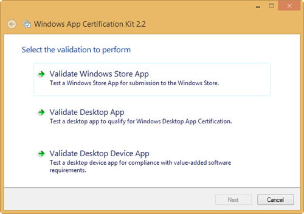
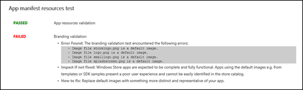
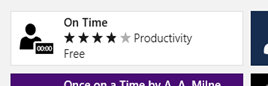
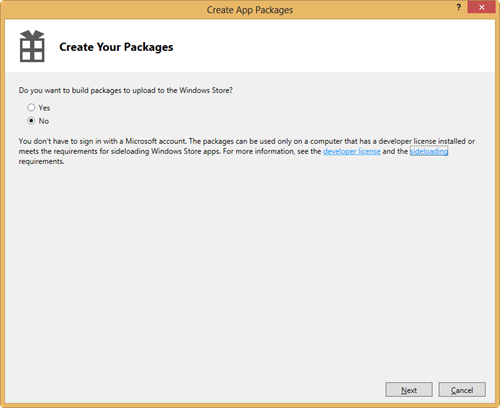
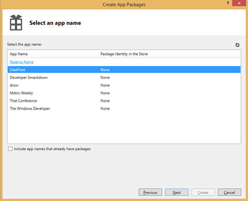
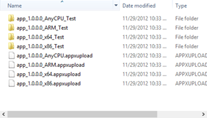

This article is Day #30 in a series called [31 Days of Windows 8](http://31daysofwindows8.com/). Each of the articles in this series will be published for both [HTML5/JS](http://csell.net/category/windows-8/31-days/) and [XAML/C#](http://www.jeffblankenburg.com/category/31-days-of-windows-8/). You can find additional resources, downloads, and source code on our [website](http://www.31daysofwindows8.com/).

 

Wow, here we are finally talking about the Store. This is really our last step (and a very exciting one no less) in your development process. Today we're going to share with you some of our steps and experience in not only helping others get their apps into the store, but also submitting our own.

If you've gotten to this point, then no doubt, these are exciting times. Whether you're a few code slingers at Rovio making Angry Birds or someone like me who was building an app on the nights and weekends, it's exciting. If you've have an app in the Store, I would also invite you to share in the comments the things that have worked well for you, and not so well.

Microsoft announced just a few short days ago, that they've sold 40 million licenses of Windows 8 in it's first month of life. I don't know about you, but that's a pretty big audience for some indie developer like me. The Store is our new platform for us to ship our software to.

For purposes of today, we are only going to talk about the public facing Microsoft Store. If you feel you fall outside of that scenario, say you're an enterprise developer and might like to deploy through group policy, I would suggest start by reading the [Managing Client Access to the Windows Store](http://msdn.microsoft.com/en-US/library/windows/apps/hh832040).

# To the Store

Now to get in the store, you have to have to first be [signed up](http://www.windowsstore.com/) as a individual developer ($49 USD) or a company ($99 USD). Once signed up, you can then [start reserving app names](http://msdn.microsoft.com/en-us/library/windows/apps/hh694077.aspx). Now I know this might sound a bit like duh, of course, but maybe you already have an idea but just haven't started it. Nothing is stopping you from creating your account and reserving those application names now. Now unlike all of those domain names you've been buying over the years and just parking until you get time, you have 1 year from the time of reservation to shipping. If you don't release anything, then that reserved name goes back into the pool. As someone who has a few apps reserved, it's a pretty good incentive program for me.

# Pre-Certification

If for some reason you're new to this notion of a "store" or "marketplace" concept, as developers once we finish our app we have to go through a certification process before our application will be officially published. While this may seem somewhat cumbersome, this certification process is really there for everyone's benefit. Having been through it, the first time you submit your app the minutes can feel like hours but in the end it's the right thing.

Of course the certification process is both automated and manual. For the Microsoft Store you as the developer have access to the same automated tools ([WACK](http://msdn.microsoft.com/en-US/windows/apps/jj572486)) which are used once you've submitted to the store. This allows you to go through the process before you've ever submitted addressing any potential issues.

The [Windows App Certification Kit](http://msdn.microsoft.com/en-US/windows/apps/jj572486) or WACK is really two different kits; one kit for Intel based processors and another one for ARM based processors. These kits are tools that you would of course install on a test system which will run through the same automated process that the Microsoft Store would do from it's servers. The beauty about these kits you can run them on yourself before you ever submit your application to the marketplace. As I said this really helps to ensure you've cut down any issues long before submitting to the store, ultimately cutting down your certification time if you we're to have any issues. 

After starting the Windows App Certification Kit you have 3 different categories of apps that you can select. For our apps we would select the validate Windows Store App option. Once selected, you'll be asked as to what application you want to validate.

Once you pick out your application, the WACK tool will start running. It will start to run a variety of tests against your application and even do things like open it, to see how long wait times are. After it's completed, you will get a detailed report as to what was validated. Of course just like in TDD, green is good and red is bad. Below is just a snip from a failed event report. 

The WACK tool provides a very detailed report as to its findings. Having said you should run it across all of the platforms you expect to run on, as your load times on a low power ARM device might be a lot longer than that of a multicore Intel machine. It's also *not a replacement* for hard core testing, both manual and automated. Just saying...

It's also true, when you submit there is still a potential for failing the certification. Now Microsoft has released a pretty good document which details a number of the [most common certification failures](http://msdn.microsoft.com/en-us/library/windows/apps/jj657968.aspx) but make sure you have read through the [certification requirements](http://msdn.microsoft.com/en-us/library/windows/apps/hh694083.aspx) such that you're not surprised.

One of the biggest reason apps fail is [certification requirement 4.1](http://msdn.microsoft.com/en-us/library/windows/apps/hh694083.aspx#acr_4_1). 4.1 states that an app with the Internet Access capability checked must provide a policy policy to the Store. Of course this means you might have to setup a simple website just to contain the privacy policy required. If you're not using the internet, just uncheck it.

# TIP

All of the Visual Studio templates for the Windows Store create the shell of an app but with the internet capability.enabled. If you're *not* using the internet - uncheck it and save yourself the hassle. 

# App Images

Like it or not, the first thing your potential customer will see is an image of your application in the store. In fact, there are a number of different images your user might see depending on where the store app has placed your application.

Now mind you, this is all before your potential customer has even installed it, so make sure you have some great store appeal is a good thing. 

During [day 1](http://csell.net/2012/11/01/31-days-of-windows-8-day-1-the-blank-app) when we talked about the blank application, we discussed a number of different images you needed to include in your application. These were things like the store logo, small tile, wide tile and so on. 

As it turns out, when you try and submit your application, you're not done with the image creation process. At the time of submission you will be asked for a number of _new_ logos that will be used by the store specifically. They are not part of your app's package, they are images uploaded directly to the store. Specifically these images are your billboard images as well as screenshots of your application.

Making logos is clearly an art form. To help make things a bit easier, a friend of mine build a number of [Photoshop templates around these Store submission graphics](http://pressffive.com/blog/article/17). I would encourage you to check them out as they could save you a number of hours.

Whatever you do, please, please, PLEASE replace all of the default images. Now I do not know who wrote Backgammon Gold nor am I not trying to place a dig on all the hard work they've done. But, I would never spend $4.99 on something where someone hasn't even taken the time to replace the default Visual Studio images. I'm not saying, but I'm saying. Clearly their rating proves my point.

# Making Money

Your monetization model is clearly something that only you can determine. While charging outright for the application is one way, there are many creative ways as well. The minimum price someone can [charge for an application is $1.49 USD with increments starting at .50 USD](http://msdn.microsoft.com/en-us/library/windows/apps/jj193599.aspx#pricetiers).

While charging upfront is a clearly an easy way to make some coin, it's not the only and it might not be the best depending on your scenario. What about offering the user a [time-limited trial](http://msdn.microsoft.com/en-us/library/windows/apps/hh694065.aspx), or a [feature-limited trial](http://msdn.microsoft.com/en-us/library/windows/apps/hh694065.aspx)? Remember the goal is to make money and getting user to test drive your app isn't a bad thing. There are a number of studies written about how trials have a much higher conversion rate that ones without trials. You don't buy a car without driving it first, why not test drive an app?

Another very popular mechanism for making money is an ad supported model. This is nothing more than putting some ad container in your applications such that you're displaying ads to your customers. While you can use any ad platform you wish (assuming they adhere to Microsoft's certification requirements ) [Microsoft offers an ad sdk from Microsoft Advertising](http://advertising.microsoft.com/ads-in-apps) which will get you easily up and running on Microsoft's platform.

Lastly offering the ability for an [in app purchase](http://msdn.microsoft.com/en-us/library/windows/apps/hh694067.aspx) shouldn't be out of your reach either. Using a game app example, one could offer more levels once the user got to a particular point in their journey just for a bit more money. I personally think this is a pretty interesting scenario as it gives you the ability to get people using your app, but offers them the ability to purchase something more full featured.

Now when you're making most of the money, the Microsoft Store is doing all of this legwork for you, hosting the bits, transitions, currency conversions etc. As you might expect there is a cut that Microsoft needs to take just to offer such support. For your first $25k Microsoft will charge you a 30% fee, but after your app makes $25k, that fee will drop to 20%. These are just a few of the items you will find in the [app developer agreement](http://msdn.microsoft.com/en-us/library/windows/apps/hh694058.aspx).

# Creating the package(s)

Creating the packages for the store is a painless process. There is basically two reasons to create a package, sideloading or WACK testing OR to upload to the store. The difference between the two different packages is really one is signed with your developer account whereas the other isn't.

To get started, _Project -> Store -> Create App Packages_. As you can see, the first dialog box you're presented with is in fact the two different options we just mentioned.

If we're building a package for the Store. Then our next step is to select what our app name was in the store such that we can associate things correctly.

Regardless of what direction we choose first the next step in the process is picking what platform we want to build for. These will be the packages we will later either side-load or upload to the store.

And once created all of your glory should look something like:

For more information about side-loading please see [this article](http://technet.microsoft.com/en-us/library/hh852635.aspx)

# Ready to submit

Submitting your application is mostly just a one page web form you're required to fill out. These are things like, description, search keywords, release date and so on. The Windows Store team has done an excellent job of documenting everything, so I won't rehash that here but rather ask you to please [read their article](http://msdn.microsoft.com/en-us/library/windows/apps/br230835.aspx).

# App Update(s)

You've pushed and now you need to fix up a bug. Well, thankfully you've already been through the entire process already. Now it's just a matter of creating a new release and changing anything that might be now applicable. Oh yea, of course you would need to update the new package too.

# Summary

Honestly submitting your app into the store is the easy part. All of the planning and development that's been done to this point has really been the hard part. While you have a plan in mind about how you may make money, don't be afraid to think outside of the box and try a few different things. You never know what will net you the best results. 

Tomorrow, we're going to talk about our last day in this series which is focused on design.

~ Clark