This article is Day #31 in a series called [31 Days of Windows 8](http://31daysofwindows8.com/). Each of the articles in this series will be published for both [HTML5/JS](http://csell.net/category/windows-8/31-days/) and [XAML/C#](http://www.jeffblankenburg.com/category/31-days-of-windows-8/). You can find additional resources, downloads, and source code on our [website](http://www.31daysofwindows8.com/).

 

Today is the last day of this series, and we're going to focus on designing Windows 8 applications today. You might be asking yourself:

> I'm a developer... Why would I want to read an article about design?

I'll tell you why. Because we developers have been making user interfaces that look like this for decades:

The point of this article is to get you to think differently about you user interface, not just the colors and shapes that are user, but the *ENTIRE EXPERIENCE*. The way pages show content. The navigation experience. Even page transitions. It all matters now. Here's more proof, if you need it. Think, for a moment, about what an app running in Windows 7 looks like. Any app. Picture it in your mind. It probably looks like this:

 

If you take a closer look at this diagram, there's no indication whatsoever about what this app does. We've tended to focus on how we use the app, not what the content is. Windows 8 fundamentally shifts that idea. Now think about a Windows 8 application in your mind. It probably looks more like this:

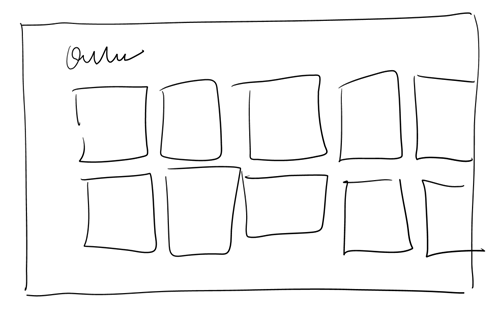 

In this illustration, the ENTIRE image shows content. This means that instead of remembering how to use your app, users are far more focused on the content of your app. This is part of the conversation we're going to have today. This article will be divided into several sections, and each section talks about a different part of user interface creation. Here's the topics we'll cover:

* Content Before Chrome
* Using The Windows 8 Silhouette
* Navigation Patterns
* Fluid Motion
* Make Touch a Priority 

That's a ton of topics, so let's get right to it.

# Content Before Chrome

In this section, I want to focus on one of the most important lessons in this entire article:

> STOP MAKING BUTTONS.

The focus of every screen of your application should be about the content. If you're adding buttons, you're likely doing it wrong. Here's a very common scenario:

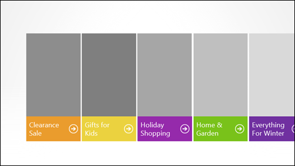 

We have several sections to our application, and we want to provide an interface for our users to get to each section. In general, most people would say that there's absolutely nothing wrong with this interface (except that maybe those giant gray boxes should have photos in them.) The key lesson to remember is that the entire colored block IS the button. There's no reason to add the circled arrow icons. Instead, consider this:

 

By removing the circled arrows, we've made the interface cleaner by removing the clutter, we've provided the user with a larger touch target for their fingers on touch devices, and given ourselves less to worry about on the page. "One button to rule them all"," if you will.

When you desperately feel the need to add a button to the screen, ask yourself:

> Could this live in an application bar?

If it can, do it. [For more on the application bar, check out Day #4](http://www.jeffblankenburg.com/2012/11/04/31-days-of-windows-8-day-4-new-controls). In short, let the user tap the content instead of creating another button for them to click. If an action can be taken on more than one item at a time, use the App Bar to provide contextual actions when multiple items are selected.

# Using the Windows 8 Silhouette

It would be a dreary, boring world if every app looked exactly the same. That considered, it is also difficult for users to learn a new interface with every application that they use. This is where the idea of a silhouette comes into play. Take a look at the four different application examples below. They all present very different content in very different ways, but there's a uniform experience about them that makes it very obvious to the user where the important content lives.

 

There are many ways to utilize this familiar silhouette, here are just a few examples:

 
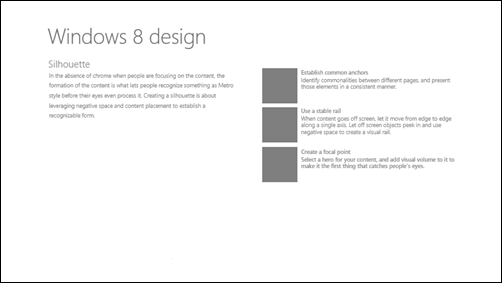 
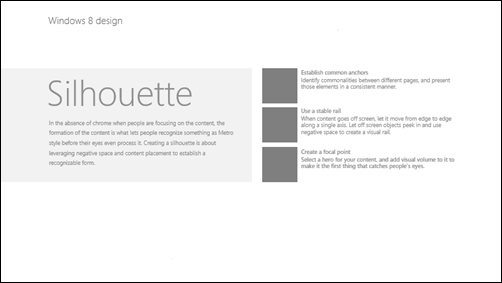 
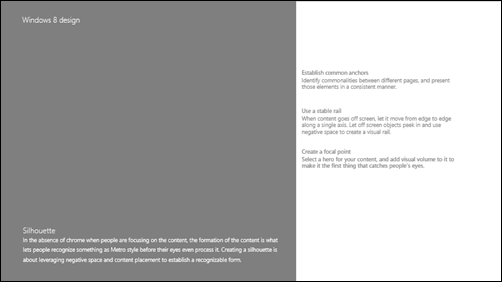 

All of the previous images follow a familiar format, which makes it easy for the user to figure out how to use your application, while still looking diverse enough to make your app visually unique. The reason for all of this is because there will be learned behaviors your users will acquire simply from using Windows 8. They'll start to rely on the Charms bar. They'll start to expect that right-clicking brings up an AppBar with more options. They'll try pinching the screen to zoom. Taking advantage of these silhouettes is another example of the expectations users will have about your application.

# Navigation Patterns

As developers, we have a tendency to try to accommodate our users' needs, almost to a fault. One example of this that is rampant in both desktop applications as well as the web is this idea:

> We need to allow the user to get TO any page, FROM any page.

You do **NOT** need to do this. When we provide this type of functionality, we limit the amount of space that can actually be used for the purpose of the app. Here's an example of an RSS reader app that practices the "everywhere navigation" pattern (click to enlarge).

[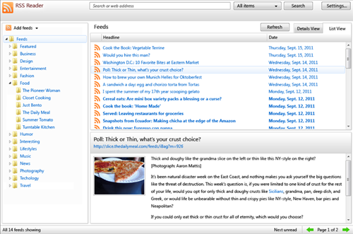](http://csell.net/wp-content/uploads/2012/11/31-XAML-RSS.png) 

As you can see, an app that is dedicated to reading only uses about 30% of the screen for _actual content._ We need to think about our application in a navigational scheme that makes sense for our content, which will almost always be hierarchical or flat.

# Hierarchical Navigation

In this style of navigation, we work in a hub-and-spokes model, where the users' choices move them further and futher from the home page, and using the back button allows them to return backwards through their path before choosing another branch of the tree to travel down. Like this:  

We build pages with a master/detail structure so that navigation is intuitive and simple to use. The user should always know where they are in the app, without having to lay an elaborate trail of breadcrumbs for them. They should be diving into deeper and deeper detail about the original choice they made. The default News application in Windows 8 is a great example of this hierarchy.

On the home page of the app, I can scroll to the right to see a few articles from each section (Entertainment and Sports are currently shown):

[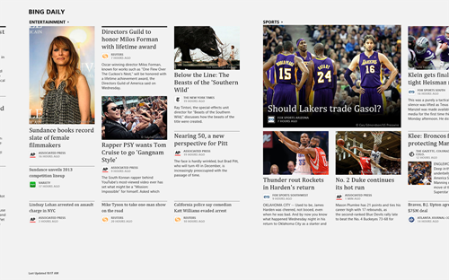](http://csell.net/wp-content/uploads/2012/11/31-XAML-News1.png) 

Using Semantic Zoom, the user can easily see all of the categories, and jump to the one they want to read more about.

 

If I tap on one of the section headers on the main page (like the word Entertainment above the large photo of the woman, Lynn Shelton), I am taken to a new page that contains only Entertainment news.

[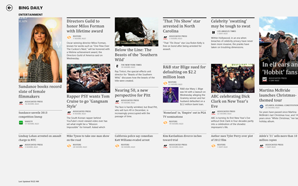](http://csell.net/wp-content/uploads/2012/11/31-XAML-News3.png) 

Finally, and this can be done from anywhere in the app that I see an article, when I tap on a specific article, I am taken to a detail page for that item.

[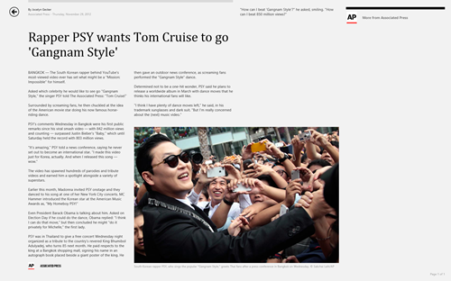](http://csell.net/wp-content/uploads/2012/11/31-XAML-News4.png) 

In each instance, there is the presence of a back button which will take me back through my previous choices. What you don't see, however, is the ability to jump from an Entertainment news article over to a Sports article. In fact, there's not even a way to get to the Sports category without using the back button. That is, until you take a look at the AppBar for this app.

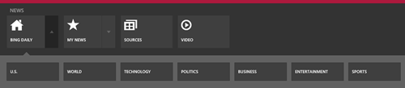 

There, you'll see that they succumbed to the need to let the user navigate quickly between sections without cluttering up the screen with all of this navigation. The AppBar is a great way to provide some of these navigation mechanisms without taking away from the visual appearance of your application.

This is a hierarchical navigation pattern. Learn to use it. It will be your friend, and clear your screen of all of the navigation elements you would need otherwise.

# Flat Navigation

Flat navigation is something that you see every day in your web browser. You also see it in instant messaging apps, and other places that have similarly formatted, but somewhat unrelated content. A picture would look like this:

 

When we navigate a website, we're using this flat navigation style. We can move forwards and backwards, but there is really no concept of branches in this format. Since you're likely using a web browser to view this article, I'm going to assume you know what I'm talking about.

# Fluid Motion

Motion is one of those things that we never think about as developers. We tend to focus on the important topics, like data, and never really consider how much nicer our app would look if it incorporated a little animation.

When I talk about animation, however, I'm not talking about it for visual adornment. It's not a decoration that you slap on your page. Animation should be purposeful. If you can use animation to transition between screens of your app, your user will perceive load times to be shorter, and feel that your app is faster and more responsive than it actually is.

In addition, there are a bunch of animations available to you with minimal effort. [Check out this article on Animating Your UI from MSDN](http://msdn.microsoft.com/en-us/library/windows/apps/xaml/Hh452701(v=win.10).aspx).

# Make Touch A Priority

A "tap" and a "click" in Windows 8 are the same thing. It requires no effort on your part to make touch happen. Making your click targets big enough for a finger, however, does. Always, always, always make anything on your page that is clickable larger than 48 x 48 pixels.

Incorporate gestures where possible. Your users will expect them. It requires minimal extra effort, and it lets your users interact with your app the way they expect to:

 

In addition, it's important to remember that _because_ your users will be touching the screen, this also means that there are optimal places to put your buttons and content. Generally, a user will hold a tablet horizontally, with their thumbs hovering over the two sides of the tablet. This means your primary buttons should probably live in these regions as well. What shouldn't live there is your content. If the user's thumbs are hovering over this region of the screen, this also means they can't see what is happening on that region of the screen. Here's a good rule of thumb:

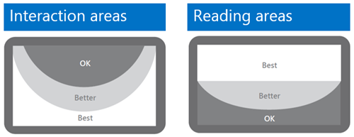 

# Summary

In this article, we covered some of the important things you should be thinking about when you start building, and more specifically designing, your Windows 8 applications. There are tons of additional resources at 

[http://design.windows.com](http://design.windows.com)

and you should definitely make a trip over to the site to check them out. There are additional design patterns, UX guidelines, Adobe Photoshop templates and much more.

This article also puts the finishing touches on this lengthy series, and we want to sincerely thank each of you that have taken the time to read our words. There are many reasons to write an article series like this, but our primary reason is that it's an amazing excuse to dive deep into a technology stack and really understand it. My second reason, however, is you, the reader. [Jeff](http://jeffblankenburg.com)  and I have made our best effort to understand each of these topics thoroughly, and explain them in a "no assumptions, start from the beginning" manner. You, our readers, bring us comments and questions that we hadn't anticipated, and for that, we truly are thankful.

Please leave comments and questions on our articles. These will continue to live on as excellent learning resources for developers looking to build Windows 8 apps, and your contributions only make them that much better.

~ Clark