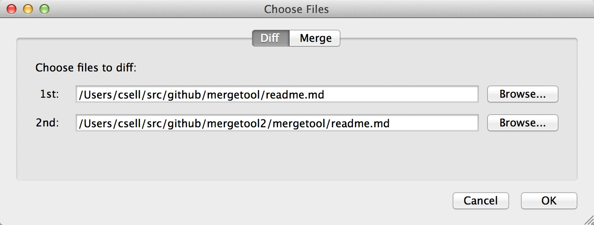
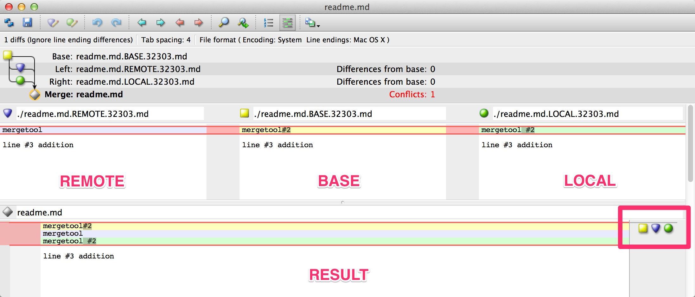

Ok, look. When it comes to diff and merge tools you have a choice in fact a lot of choices. There are plenty of tools and people before me who have documented on how to do just that. **Yet**, it seems I still find people who haven't actually haven't taken the leap and just complain every time the blasted merge conflict happens.

So that's exactly what we're going to do here. Consider this a little reinvestment in yourself and the tools you use or maybe just a refresher.

[git](http://git-scm.com/) out of the box doesn't have anything wired up. To demonstrate all of this lets create a simple repo on [github](http://github.com/) that we can mess around with and try to break a few things.

	mkdir mergetool
	cd mergetool
	touch readme.md

	git init
	git add readme.md
	git commit -m "first commit"
	git remote add origin https://github.com/csell5/mergetool.git
	git push -u origin master

At this point we have a local repo that is in sync with [github](https://github.com/csell5/mergetool). We need this such that we can fake a merge conflict between two parties. Before we go trying to break things let's open a terminal and see where things currently stand. 

Type *[git mergetool](http://git-scm.com/docs/git-mergetool)*. Chances are you might see the following:

	This message is displayed because 'merge.tool' is not configured.
	See 'git mergetool --tool-help' or 'git help config' for more details.
	'git mergetool' will now attempt to use one of the following tools:
	opendiff tortoisemerge emerge vimdiff
	No files need merging

We have few things here to take note of:

1. No merge tool configured.
2. git will try to use some default tool; opendiff tortoisemerge emerge vimdiff.
3. Nothing that needs to be merged.

Simple enough. Let's go and create some conflicts. To do so, I need to clone my repo in another directory such that I have two repos where I can make conflicts.

	mkdir mergetool2
	git clone https://github.com/csell5/mergetool.git

Make sure when you create the second directory you're not doing that in your original repo. I now have *mergetool* and *mergetool2* as peers of one another.

Now let's open *readme.md* in each repo and change the first line.

* ./mergetool/readme.md I added 'hi from mergetool'
* ./mergetool2/readme.md I added 'hi from mergetool2'

Then I committed both from their repo:

* git commit -a -m 'mergetool added one line mod'
* git commit -a -m 'mergetool2 added one line mod'

Let's commit the changes in *mergetool*, then push them to github. Then we will do the same with *mergetool2* except this time when we try to push we get the following:

	! [rejected]        master -> master (fetch first)
	error: failed to push some refs to 'https://github.com/csell5/	mergetool.git'
	hint: Updates were rejected because the remote contains work 	that you do
	hint: not have locally. This is usually caused by another 	repository pushing
	hint: to the same ref. You may want to first integrate the remote changes
	hint: (e.g., 'git pull ...') before pushing again.
	hint: See the 'Note about fast-forwards' in 'git push --help' for details.

Rejected, *WAT*? After looking closer we see that the remote is actually ahead of us. Right, of course it is since we pushed from the *mergetool* repo first. Lets *get pull*.

	remote: Counting objects: 5, done.
	remote: Total 3 (delta 0), reused 3 (delta 0)
	Unpacking objects: 100% (3/3), done.
	From https://github.com/csell5/mergetool
	f49972d..bdf3366  master     -> origin/master
	Auto-merging readme.md
	CONFLICT (content): Merge conflict in readme.md
	Automatic merge failed; fix conflicts and then commit the result.

*Automatic merge failed*. Now lets dig into what happened. Clearly this was something we did on purpose as we intentionally changed the same line. Open up our *readme.md* file, we will now see git has managed to modify the file like such.

	<<<<<<< HEAD
	hi from mergetool2
	=======
	hi from mergetool
	>>>>>>> bdf33664f8e410fdbad9204687151c8f8483b9e7

Rather than editing it by hand. Let's run *git mergetool*

	This message is displayed because 'merge.tool' is not configured.
	See 'git mergetool --tool-help' or 'git help config' for more details.
	'git mergetool' will now attempt to use one of the following tools:
	opendiff tortoisemerge emerge vimdiff
	Merging:
	readme.md

	Normal merge conflict for 'readme.md':
  	{local}: modified file
  	{remote}: modified file
	Hit return to start merge resolution tool (opendiff): 

If we do what git tells us to do and hit return in my case this will open up opendiff as it was a default.

So, here we have a 2 pane tool which is less than stellar. What we really want is a tool where we can 

# P4Merge Download and Setup 

There are plenty tools out on the market today here are just a few of the more popular ones:

* [P4Merge](http://www.perforce.com/product/components/perforce-visual-merge-and-diff-tools) - free
* [KDiff3](http://kdiff3.sourceforge.net/) - free
* [Beyond Compare](http://www.scootersoftware.com/) -  $30 and up
* [Semantic Merge](http://www.semanticmerge.com/) - $3.99 month

I was recently turned onto P4Merge and to be honest so far I am really digging it especially for something that is in fact free. Thank you [Perforce](http://perforce.com/).

Installation is as you would expect and all you need is the P4Merge as other things are bundled with the download. 

If you're on Windows watch those installation options.

With things installed, out of the box we get a nice diff and merge tool that we can use as a stand alone app. Let's just diff our two files.

Now that looks just goofy. Since git has stepped in here and modified our file, things are a bit wonky but rest assured. Awesome is coming. 

# Configuration

The real power comes in when we have it all wired up together. While there are a few ways to do that, let's just modify the config for git, aka *.gitconfig*. You can find that file here:

	OSX:  /Users/[csell]/.gitignore
	Windows: c:/users/[csell]/.gitconfig

**Windows** 

	[diff]
		tool = p4merge
	[merge]
		tool = p4merge
	[mergetool "p4merge"]
		path = "C:/Program Files/Perforce/p4merge.exe"
		keepBackup = false
		trustExitCode = false

**OSX**

	[diff]
		tool = p4merge
	[merge]
		tool = p4merge
	[mergetool "p4merge"]
		path = "/Applications/p4merge.app/Contents/MacOS/p4merge"
		keepBackup = false
		trustExitCode = false

# Conflict Beware

If we stage another conflict

* **Base** : Common ancestor of the local and remote.
* **Local** : Is what you changed too.
* **Remote** : Is what is on the remote.
* **Result** : This is what the file will end up as.

~ Clark
